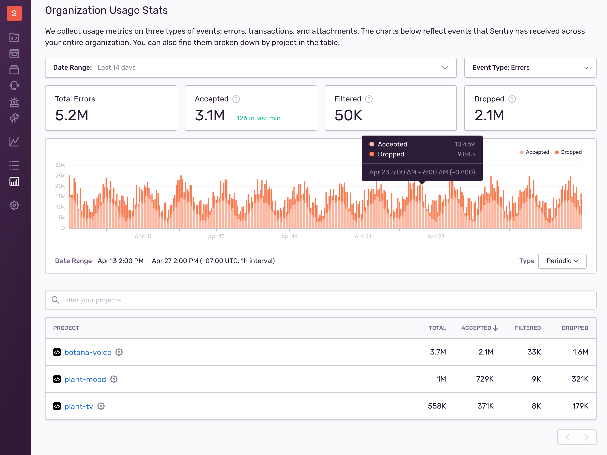

The **Organization Stats** page allows you to check your organization's event usage while also providing a high-level overview of how different projects are using Sentry. The page reflects events the system has received across your entire organization along with a list of all projects and their consumption of errors, transactions, and attachments. Events fall into one of three categories: _Accepted_, _Filtered_, or _Dropped_. Filtered events are events that were blocked due to your [inbound data filter](/product/data-management-settings/filtering/) rules. Dropped events are ones the system dropped or discarded due to rate limits, quotas, spike protection, or because of invalid data.

You can see which projects have had a recent spike or are the most active and may need more attention. On this page, you can also control the date range that’s displayed, allowing you to focus on a smaller period of time or zoom out for a longer view. The page is designed for org admins, but is available to all team members. This is helpful if a team member who isn't an admin is tasked with reviewing these statistics. Also, this allows team members associated with specific projects to use this page to investigate why their events are being dropped.

With the dropdowns at the top of the page, you can set whether the page displays stats for errors, transactions, or attachments, as well as the date range. With the date selector, the time period can be set from an hour to a maximum of 90 days, and all of the page elements change dynamically when you update this setting.

<Note>

This page does not include data about sessions because they are not a billable event type.

</Note>

## Usage Cards

The cards on the page provide high-level usage stats about events, including the total number of events for the period, as well as which ones were accepted, filtered, or dropped.

## Summary Chart

The chart on this page displays a breakdown of events over the selected date range. Depending on the date range that you set the chart to display, each bar in the chart represents a different amount of time or interval. For example, if you set the chart to display seven days, each bar in the chart represents one hour, but if you set it to display 90 days, each bar represents one day. You can also use the “Type” dropdown to set whether the chart shows a cumulative count of events or a daily (or hourly) count.

When you set a date range that results in intervals of one day or more, the time zone is displayed in UTC to ensure consistency for users across different time zones. For time periods with intervals of less than 24 hours, the time zone is based on your "Timezone" setting in **User Settings > Account Details**.

## Project Usage Stats Table

The “Project Usage Stats” table provides insight into per-project usage of your errors, transactions, and attachments over time. The table shows you the total errors, transactions, or attachments. Those events are further broken down into the accepted, filtered, and dropped categories.

Each project in the table has individual settings, which you can access from by clicking the settings icon (gear wheel) next to the name of the project. For instance, you might want to go to the project settings so you can limit the quota consumed by its DSNs. Clicking the name of the project takes you to the **Project Details** page.

The table displays only the projects of the teams that you belong to, unless you have permissions to see all projects.
