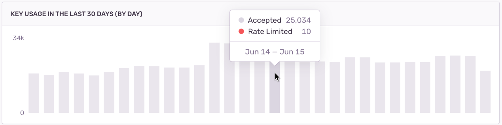

<Include name="business.mdx" />

Rate limiting allows you to set the maximum volume of error events a project key will accept during a period of time. For example, if you have a project in production that generates a lot of noise, a rate limit allows you to set the maximum amount of data, such as “500 events per minute”. Additionally, you can create a second key for the same project for your staging environment, which is unlimited, ensuring your QA process is still untouched.

## How to Set Up Rate Limits {#6-rate-limiting}

In **[Project] > Settings > Client Keys (DSN)**, click "Configure", and you can create multiple DSN keys per project and assign different (or no) rate limits to each key. This will allow you to dynamically allocate keys (with varying thresholds) depending on release, environment, and so on.

Once you've set the limit, events dropped because of rate limiting generate a 429 error code.

While rate limiting is quite useful for managing your monthly event quota, keep in mind that once a defined threshold is crossed, subsequent events will be dropped. Therefore, you shouldn't constantly be hitting your rate limit; rather, it should act as a ceiling intended to protect you from unexpected spikes.

### Setting Useful Rate Limits {#-how-to-set-proper-rate-limits}

A good way to set a project rate limit is by figuring out the expected event volume based on your average traffic. Here's how to do that:

1. Go **[Project] > Settings > Client Keys (DSN)** and open the project DSN key configuration under by clicking "Configure".
1. In the "KEY USAGE IN THE LAST 30 DAYS" graph, look for the highest point, or the maximum daily rate. In the example below, the maximum daily rate in the last month is less than 34K:
   
   <!-- image notes: Sentry, airflow, Santry, app-frontend -->
1. Based on the rate, choose a **daily** maximum value or ceiling. In this example, we calculated a daily maximum of approximately 35K, which is around 1458 events an **hour**, or about 24 events a **minute**.
1. Set a daily, hourly, or minute-based rate limit. We recommend using a minute-based rate to avoid situations where a random event spike might exhaust your daily or hourly quota and leave you without event data for a long period.

You should periodically go back and check the graph to see the number of events dropped due to rate limiting and, if needed, revisit your settings.

