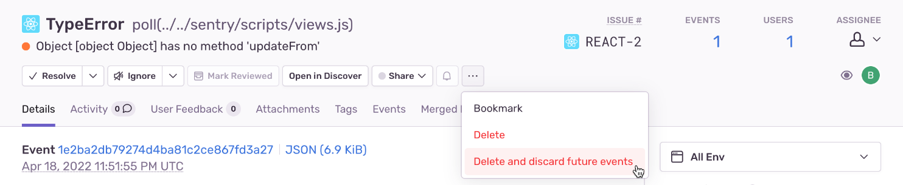

The following rules apply for error event repetition and your quota:

- If you previously resolved an issue, a new error event counts toward your quota because it may represent a regression in your code.
- If you have chosen to ignore alerts about error events with the same fingerprint, a new event counts toward your quota because the event is still occurring.
- If you ["Delete & Discard"](#delete--discard) an issue, then **future** error events with the same fingerprint will not count toward your quota.

### Delete & Discard {#5-applying-workflows}

<Include name="business.mdx" />

If there is an irrelevant, reoccurring issue that you are unable or unwilling to resolve, you can delete and discard it from the **Issue Details** page by clicking "Delete and discard future events". This will remove the issue and event data from Sentry and filter out future matching events.

You can find a list of deleted and discarded issues in the "Discarded Issues" tab in **[Project] > Settings > Inbound Filters**. From here, you can un-discarded any of these issues to receive future events.

Once you've identified a set of discarded issues, it might make sense to go back to your SDK configuration and add the related errors into your `beforeSend` client-side filtering.
