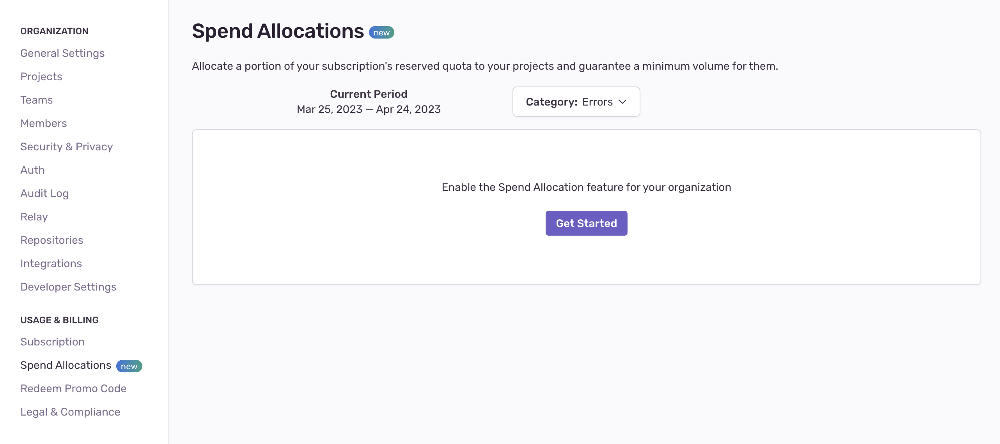
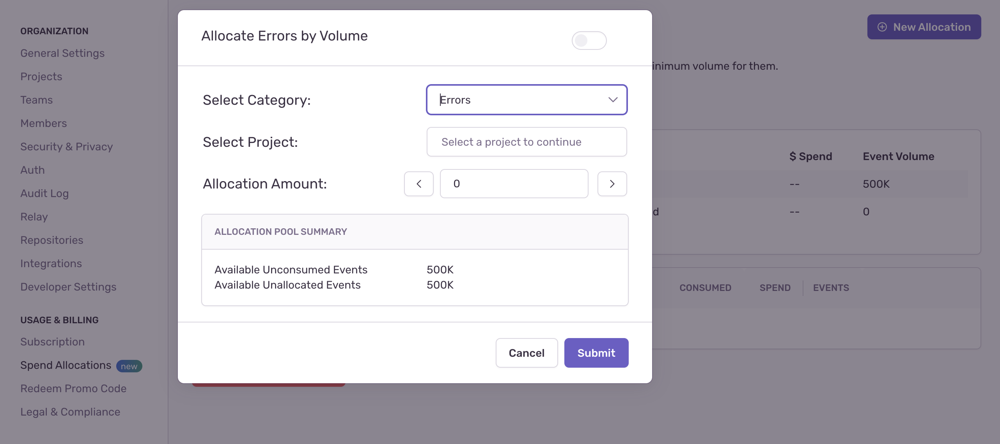
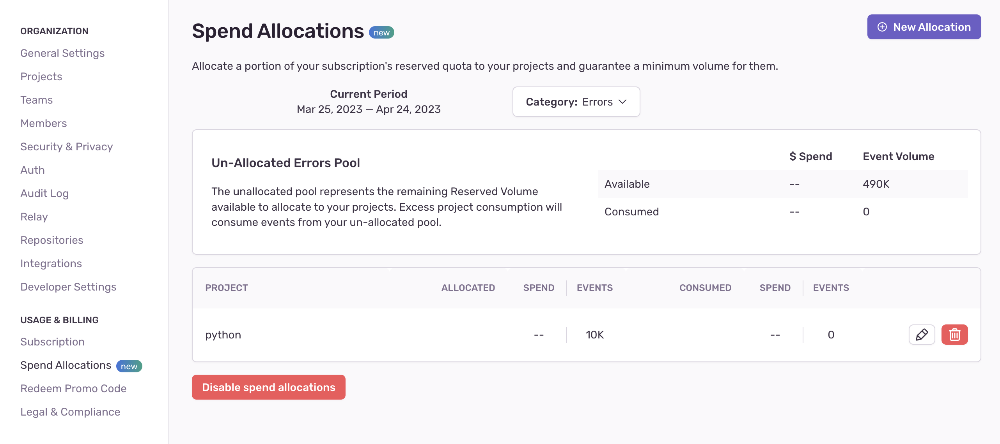

<Note>

This feature is only available to organizations with a Business or Enterprise plan.

</Note>

Spend Allocation gives you the ability to prioritize your most important projects, (or make sure that smaller projects don't get ignored). You can do this by setting aside a set amount of reserved volume, (errors, transactions, and attachments), to be used by those projects each month. This ensures that all the projects that are important to you are always monitored, regardless of the volume other projects consume.

<Note>

The per-project allocation you set is the **minimum** not the **maximum** number of events each project will get.

</Note>

## How Spend Allocation Works

To get started with Spend Allocation, look at your total reserved volume and decide how much of it you'd like to allocate to the projects you want monitored. For example, if your total reserved volume is 1M events, and you have two important projects, you can decide to allocate 300K events to project 1, 250k events to project 2, and leave the remaining unallocated pool of 450k events for all other projects.

For each project, you'll need to specify how much of your allocation goes to errors, to transactions, and to attachments.

<Note>

With Spend Allocation, excess event consumption may come from your [on-demand budget](/product/accounts/pricing/#on-demand-capacity), <b>even if you still have reserved volume available.</b>

</Note>

Once all your monthly volume has been consumed, any additional events will be dropped.

Team members with **Manager, Billing, or Owner-level permissions** will be notified via email when 80% of your Spend Allocation for each project has been consumed, and then again when 100% has been used up.

The allocations you've made will stay the same from billing period to billing period unless you choose to adjust them.

## How to Enable Spend Allocation

To enable spend allocation for your Org, you have to have **Manager, Billing, or Owner-level permissions**.

1. Go to **Settings > Spend Allocations > New Allocation**.

2. Select the project, the event category (errors, transactions, or attachments), and the allocation amount you'd like to set aside for that project. You can choose your allocations by volume or spend. Repeat the process for each event type you'd like to allocate to.

The "Spend Allocations" panel shows both the consumed and the available event volume you have, broken out by event type. You can also see your spend allocation per project. You can make adjustments to your existing allocations in the current billing period if there are enough un-allocated events left to cover your request.

## Use Cases for Spend Allocation

Adding Spend Allocation ensures that the projects you want to pay attention to get the monitoring they need. You can get a sense of how much volume various projects use by going to the **Stats** page. There are several use cases where having Spend Allocation makes a lot of sense:

**For small-service projects -** If you have projects for small services in your app that aren't getting the monitoring they need because larger projects are consuming all your event volume.

**For main, user-facing projects -** If you've identified your most important, user-facing projects and want to dedicate the bulk of your volume to monitoring them.
