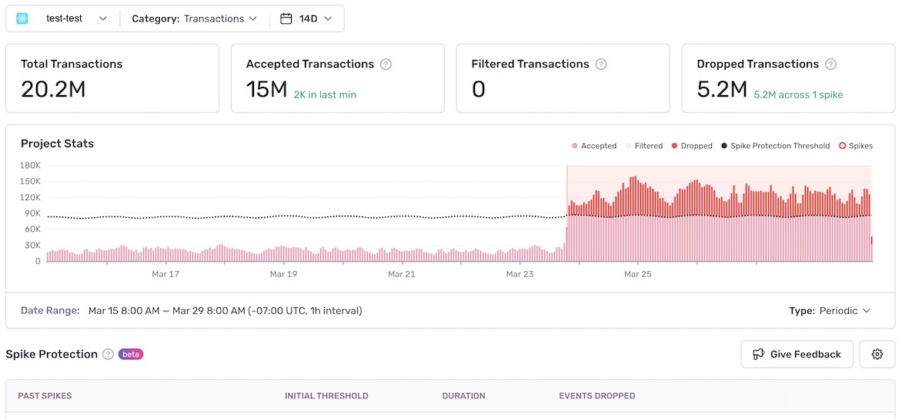
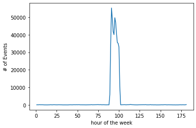
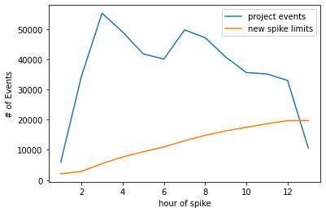
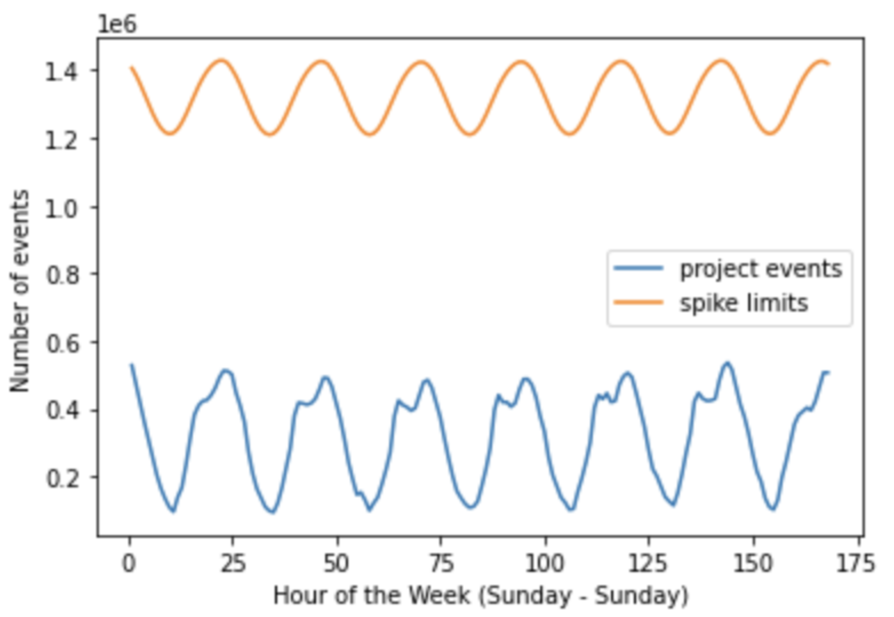
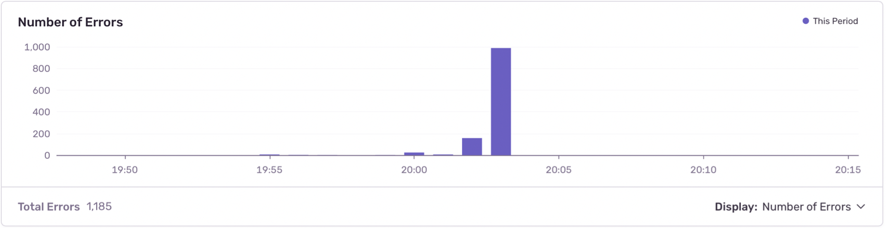

A spike is a significant, temporary increase in your event volume. Because Sentry bills based on the number of events sent monthly, spikes can quickly consume your quota for an entire month. Spike Protection guards against this by establishing a spike threshold for the average number of events each of your projects sends and then dropping them after that threshold is reached.

Spike Protection currently applies to errors, transactions, and attachments.

<Note>

Notifications for Spike Protection are turned off by default to avoid excessive noise for users. Read the [notification](/product/accounts/quotas/spike-protection/#notifications) section below to learn how to turn them on for key projects.

</Note>

## How Spike Protection Works {#spike-protection}

Spike Protection can be enabled on a per-project basis for your organization by any team member with **Manager, Billing or Owner-level permissions**. To select which project to set it up for, go to **Settings > Spike Protection**. You'll be able to toggle it on for individual projects or click “Enable All” to set it up for all your projects at once.

<Note>

If you're an existing Sentry user with Spike Protection enabled on an org level, you'll be automatically switched to the new per-project level Spike Protection. All your projects will have Spike Protection enabled by default, but you can make adjustments at any time.

</Note>

## How Sentry Detects Spikes {#how-to-detect}

Sentry uses an algorithm to establish a spike threshold for each project. When this threshold is reached, a spike is flagged. Sentry then applies a dynamic rate limit to your project and begins discarding events to keep your quota from being consumed too quickly. This protects you from short-term spikes. But because of the algorithm's dynamic nature, if the event volume continues to be high for a sustained period of time, it'll become your new baseline and you may quickly run through your quota.

Spike Protection will automatically deactivate once the spike event passes, until the next time a spike is detected.

### A Dynamic Algorithm

In order to adjust for certain patterns in the number of events your application sends, Sentry's algorithm evaluates your per-project hourly spike threshold by accounting for daily and hourly seasonality. It's based on the higher of two calculations: One, determined by the minimum number of events that would be considered a spike based on your quota. The second, a weighted projection based on your usage over the last 168 hours (7 days).

It's done this way so that new projects without 7 days' worth of data can benefit from spike protection. Additionally, the minimum event calculation can be used to minimize false positives in smaller or newer projects so that spikes aren't flagged incorrectly. Read on to learn about our Spike Protection algorithm in detail.

## Notifications {#notifications}

While Spike Protection notifications are turned off by default, you can turn them on for key projects you want to monitor in two ways:

- By adding the email “Notification Actions”. This will notify users with Owner, Manager, and Billing roles who are connected with that project via email.

- By adding Slack or Pagerduty “Notification Actions” (if you have these integrations installed). This will notify users who are connected with the project via Slack or Pagerduty.

## Managing a Spike {#managing-spikes}

We recommend taking the following steps to manage your spikes:

- Check to see which issues are [consuming your quota](https://sentry.sentry.io/stats/).
- Set [rate limits](/product/accounts/quotas/manage-event-stream-guide/#6-rate-limiting) on the DSN keys for the projects related to the spike.
- Set up [metric alerts](/product/alerts/alert-types/#metric-alerts) for the number of events in a project.
- If a specific release version has caused the spike, add the version identifier to the project's [inbound filters](/product/accounts/quotas/manage-event-stream-guide/#3-inbound-data-filters) to avoid accepting events from that release.
- Set up an [on-demand budget](/product/accounts/quotas/manage-event-stream-guide/#on-demand-budget) to make sure you have time to adjust your volume in the event of a future spike.
- Set up [spend allocations](/product/accounts/quotas/#spend-allocation) to ensure your critical projects are guaranteed a portion of your reserved volume, even if there are spikes in other projects.

To review the events that were dropped to save your quota with Spike Protection, go to the "Usage Stats" tab of the **Stats** page for your Sentry org and select the desired event in the "Category" dropdown. You can see project-level details of your stats by using the project selector. Sentry can show the spike threshold for a time duration greater than 6hrs and less than 30 days.

## How the Spike Protection Algorithm Works

As mentioned above, our Spike Protection Algorithm is based on the higher of two calculations: a minimum event calculation and a usage-based calculation. Read on to learn the details of how it works.

### Minimum Event Calculation

This calculation, which is the first step of our algorithm, identifies a minimum number of events, using your quota as a guide. This number takes the maximum of either 500 events or the result of the following formula `(3 \* your quota)/(720 \* number of projects)`. The equation represents your project using up three times your overall quota in 30 days if events are continually ingested at this hourly rate, thus flagging the project for a potential spike.

### Usage-Based Calculation

This calculation, which is the second step of our algorithm, calculates hourly data from the past seven days to determine spike limit projections for the next seven days. This data is used to calculate weighted averages, which takes into account weekly and hourly seasonality. For example, the weighted average calculated for Monday at 3 pm is more heavily influenced by data points on Monday or the hours around 3 pm. This weighted average is then multiplied by a multiplier that is `5` times the overall standard deviation of the past week — this multiplier is bounded between `3` and `6`.

### Example

In this example, the project usually ingests 100-200 events per hour. There's been a spike that's reached 50,000 events, as shown in the graph below:

In the following graph, we can see a zoomed in perspective of the 12-hour period of the spike, along with a line indicating the spike limit as it's being recalculated over the course of the spike:

Throughout the spike, the recalulating limit has the following effect:

- 1st hour: 6k events ingested, limit is recalculated to 2083, 3917 events dropped
- 2nd hour: 34k events ingested, limit is recalculated to 2873, 31217 events dropped
- 3rd hour: 55k events ingested, limit is recalculated to 5452, ~49k events dropped
- 4th hour: 49k events ingested, limit is recalculated to 7628, ~41k events dropped
- 5th hour: 41k events ingested, limit is recalculated to 9371, ~31k events dropped

For this particular example:

- Org quota: 500k
- Events ingested during the spike: ~478k
- Events accepted overall: ~157k

Here's an example of spike limit projections for a week, taking into account seasonality:

These regular differences in event ingestion don't cause a spike to occur.

### Bursty Projects

There may be instances where a project routinely accepts a high volume of events in a very short period of time by design — for example projects that orchestrate cron/Airflow jobs or task runners. The screenshot below shows an example of this kind of behavior:

If this is expected behavior for a given project in your organization, you may want to consider turning off spike protection in the project settings to ensure necessary events aren't dropped.
