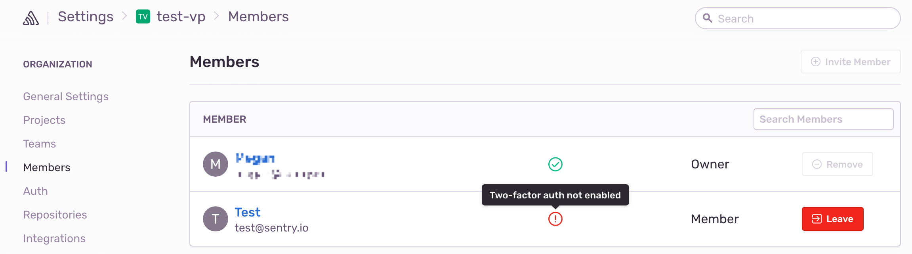
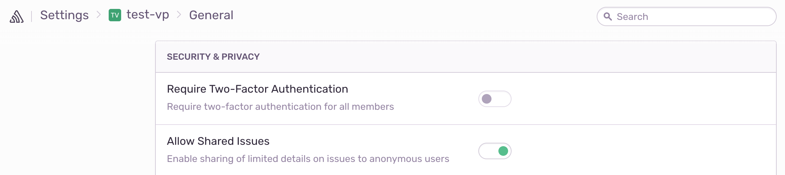
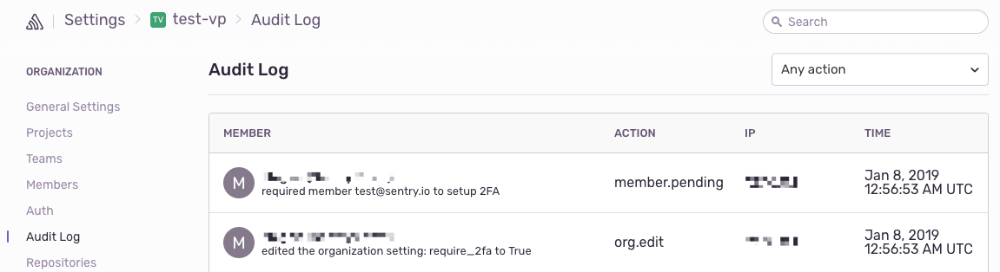
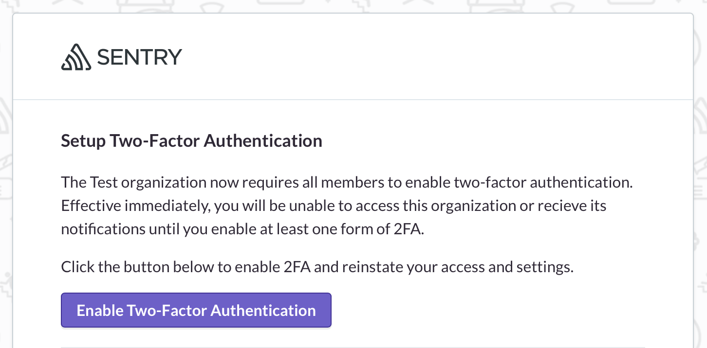
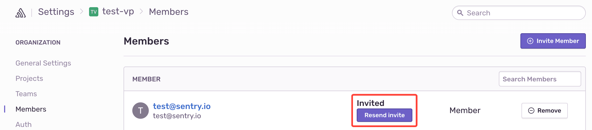
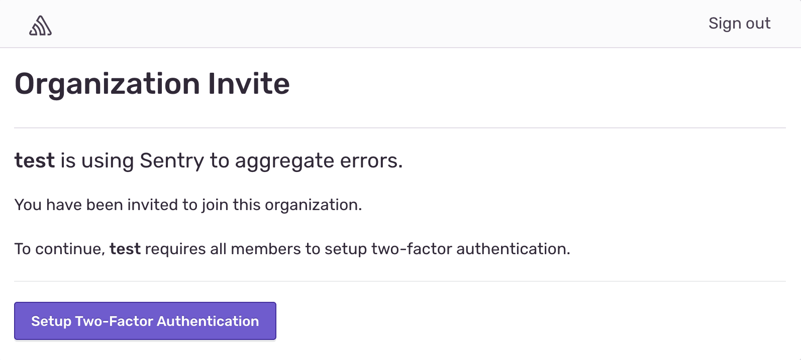
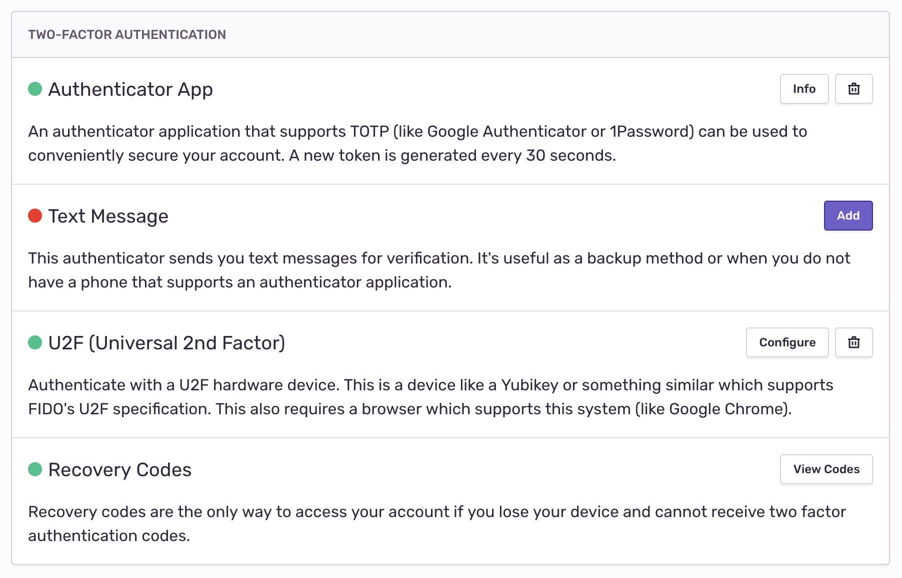

For an added layer of security, you can require your organization members to sign in to Sentry with two-factor authentication (2FA).

## Preface

Sentry owner permissions are required to enforce two-factor authentication across your organization.

1. Before you can require organization members to use 2FA, you must [enable two-factor authentication](https://sentry.io/settings/account/security/) for your own user account.
2. We recommend notifying your organization members, and asking them to setup 2FA for their accounts before requiring two-factor authentication. You can see which members are enrolled on your organization's members page.

   

## Setup Require 2FA

When you require two-factor authentication, members who are not enrolled in 2FA will be removed from your organization. They will lose access to your organization's projects and notifications, and will be sent an email to setup 2FA. They can reinstate their access and settings within three months of their removal from your organization.

1. Go to **Organization Settings** >> General Settings.
2. Under Security & Privacy, toggle the **Require Two-Factor Authentication** switch.

   

3. Click **Confirm**.

## View Removed Members

To view members who were removed from your organization for 2FA non-compliance, you can look at your organization's audit log.

1. Go to **Organization Settings** >> Audit Log.

   

2. You can filter for action **member.pending** to see removed organization members, and action **org.edit** to see when the require_2fa organization setting was changed.

## Require 2FA and SSO

Require 2FA is currently not available with Single Sign-On (SSO), so you would need to require two-factor authentication with your identity provider.

## Steps to Rejoin an Organization

<Alert>
  To reinstate your access and previous settings, you need to setup 2FA within
  three months of being removed from your organization.
</Alert>

If you were removed from an organization due to 2FA non-compliance, follow these steps to rejoin the organization and reinstate your access and settings:

1. Look in your inbox for an email from Sentry titled **Mandatory: Enable Two-Factor Authentication**.

   

2. Click the **Enable Two-Factor Authentication** button.
3. If you can't find the email, ask an organization Owner or Manager to go to the **Organization Settings** >> Members page and resend your invite.

   

4. After clicking through the email, you will be prompted to **Setup Two-Factor Authentication** before rejoining the organization.

   

5. This will take you to your **Account Settings** >> [Security](https://sentry.io/settings/account/security/) page where you need to setup at least one form of two-factor authentication.

   

6. Once you've enrolled in 2FA, remember to save your recovery codes in a safe place and consider adding a backup phone number.
7. Then use the left sidebar to navigate to your organization.
