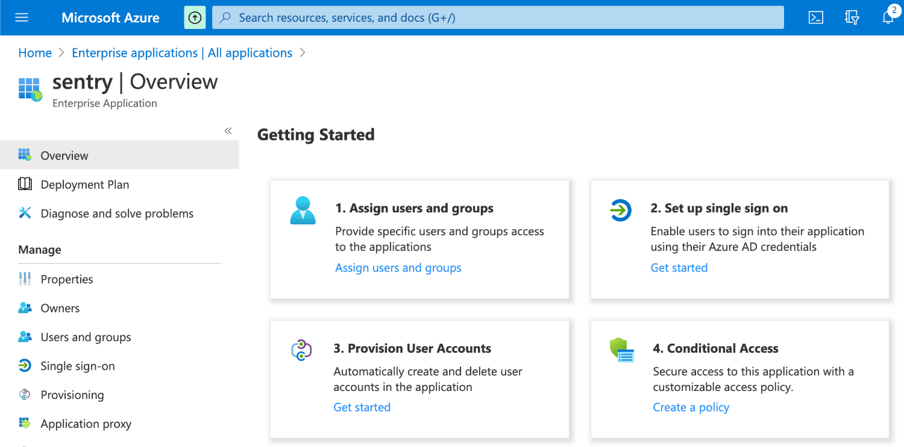
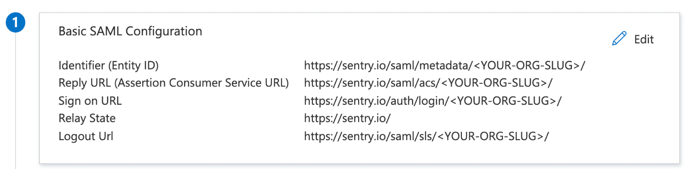
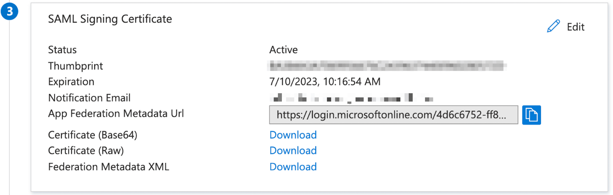
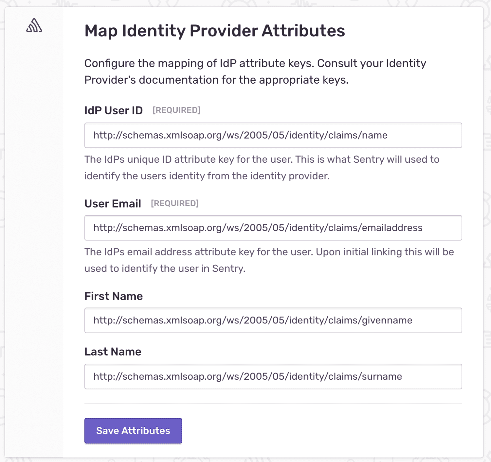

## Installation

1. Log in to the [Azure portal](https://portal.azure.com/).

2. (If you don't require a permission group for Sentry, skip to Step 4.) Under Manage Azure Active Directory (the shield picture), click "View", which takes you to the Organization Overview page. Now, proceed to Step 3.

3. In the search bar, search for "Groups" and navigate to "Groups." From there, create a new group, add an owner, and members to the group. Set "Group type" to Office 365. For more details about group creation, see the [Azure docs](https://docs.microsoft.com/en-us/azure/active-directory/fundamentals/active-directory-groups-create-azure-portal).

4. Return to the Overview page. In the search bar, search for "Enterprise Applications" and navigate to "Enterprise Applications." Click "+ New application". Then, select "Non-gallery application" and create a non-gallery application for Sentry. Once created, you'll be directed to "Sentry - Overview.

   

5. Click on `1. Assign users and groups`, with "+ Add user" add yourself and the group you've created to the Sentry app. Click "Assign".

6. Navigate back to "Overview," click on `2. Set up single sign-on` and then select SAML as your single sign-on method.

7. For Section (1) labeled as `Basic SAML Configuration`, enter the following data in each line and save your changes.

   - Identifier (entity ID): `https://sentry.io/saml/metadata/YOUR-ORG-SLUG/`

   - Reply URL (Assertion Consumer Service URL): `https://sentry.io/saml/acs/YOUR-ORG-SLUG/`

   - Sign on URL: `https://sentry.io/auth/login/YOUR-ORG-SLUG/`

   - Relay State: `https://sentry.io/`

   - Logout URL: `https://sentry.io/saml/sls/YOUR-ORG-SLUG/`

   

8. In Section (3) labeled as `SAML Signing Certificate`, copy the `App Federation Metadata URL`.

   

9. Navigate to your **Org Settings > Auth > Azure** (or go to `https://sentry.io/settings/<YOUR-ORGANIZATION-SLUG>/auth/`) and click on "Configure" for Active Directory.

10. Paste the App Federation Metadata URL and click "Get metadata".

11. In the following page, enter these to map the values from AzureAD to Sentry.

    - IdP User ID: `http://schemas.xmlsoap.org/ws/2005/05/identity/claims/name`

    - User Email: `http://schemas.xmlsoap.org/ws/2005/05/identity/claims/emailaddress`

    - First Name: `http://schemas.xmlsoap.org/ws/2005/05/identity/claims/givenname`

    - Last Name: `http://schemas.xmlsoap.org/ws/2005/05/identity/claims/surname`

For more details about mappings for custom configs, see [The Role of Claims](https://docs.microsoft.com/en-us/windows-server/identity/ad-fs/technical-reference/the-role-of-claims).

