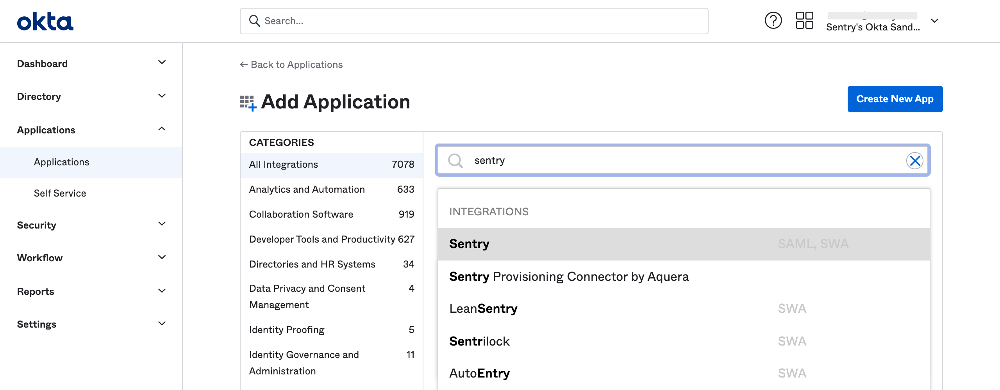
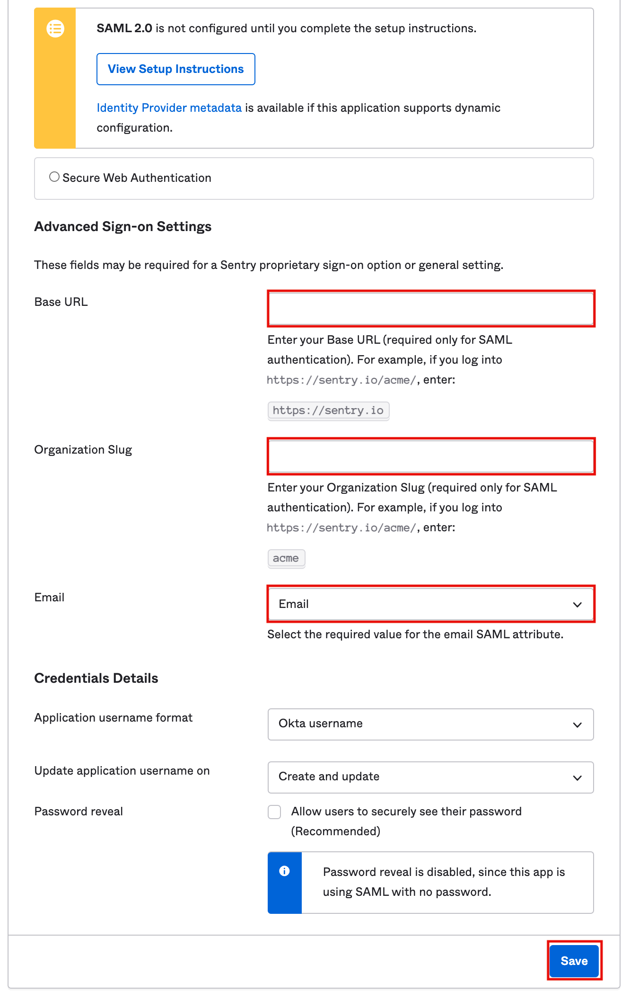
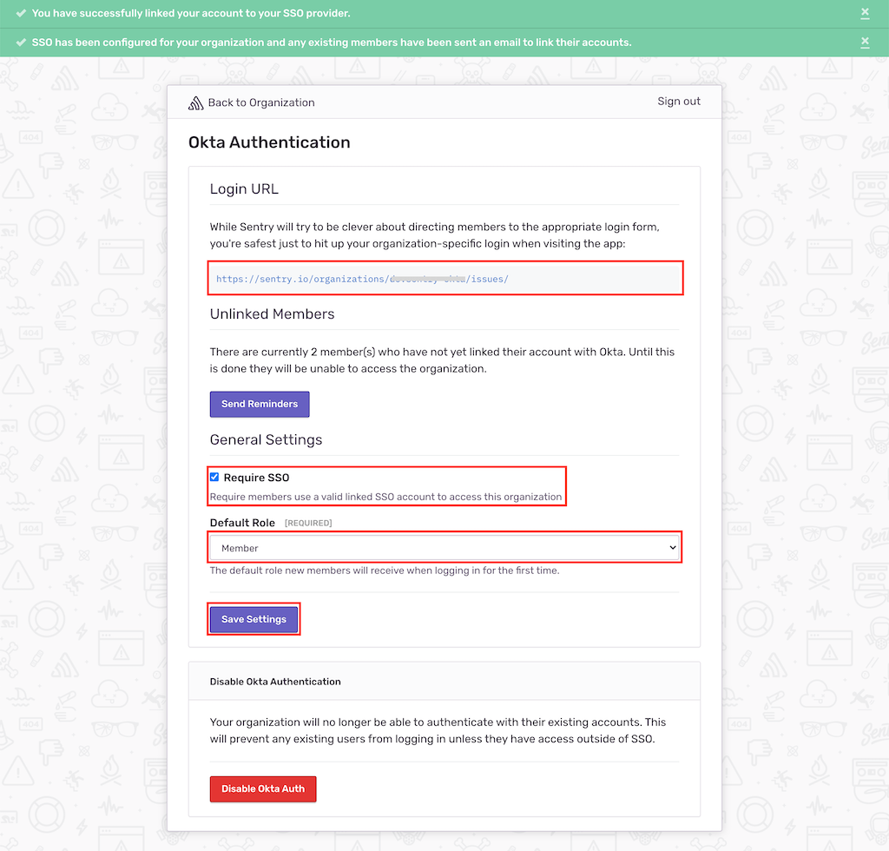
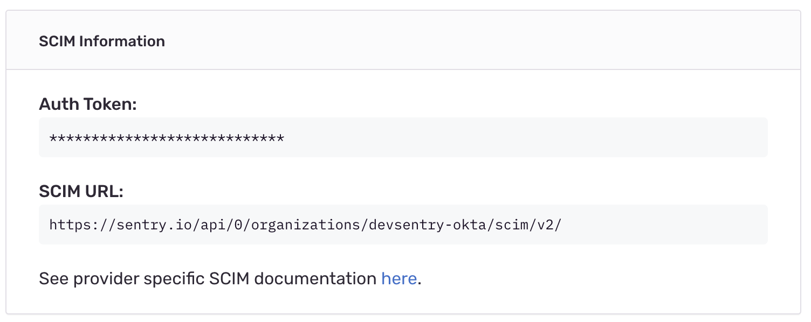

## Installation

1. Sign in to your Okta organization with your administrator account.

1. From the admin console's sidebar, click **Applications > Applications**, then click on "Add Application".

1. Search for `Sentry`, then click "Add" to be brought to the setup wizard.

   

1. Provide the settings. Note that for "1. General Settings", you will not need to provide any special settings. For "2. Sign On Options", provide the following:

   - Base URL: `https://sentry.io` <Alert level="warning">Ensure that the Base URL does not have a trailing slash or whitespace at the end as they will break the redirect from Okta to Sentry.</Alert>

   - Organization Slug: *YOUR_ORG_SLUG*

      - You can find your organization slug in the URL: `https://sentry.io/organizations/YOUR_ORG_SLUG/`

   - Email: `Email`

   

1. Click "Save" to create the Sentry app.

1. Click "Sign On" to the app settings page to which you are redirected. When the settings displayed in Step 5 appear, select "View Setup Instructions" in the bright yellow card to open a new tab.

1. Copy the "Metadata URL" in the set up instructions.

   

1. Sign in to Sentry. Select **Settings > Auth > Configure Okta**.

   

1. Paste the Metadata URL from Step 8, then click "Continue".

   

Sentry will attempt to authenticate and link your account with Okta. After successful authentication, you'll be redirected to Sentry's SSO configuration page, where you can:

   - Share the "Login URL" value, which will be used for SP-initiated SSO, with the users in your organization.

   - Scroll down to the bottom and ensure that "Require SSO" is checked if you want to enforce logging in with Okta.

   - Set a "Default Role" for new SSO users. Selecting "Member" should cover most use cases.

If you make any changes, click "Save Settings" to complete your set up.

   

## SCIM Integration
<Note>

This feature is available only if you're in the Early Adopter program. Features available to Early Adopters are still in-progress and may have bugs. We recognize the irony.

If you’re interested in being an Early Adopter, you can turn your organization’s Early Adopter status on/off in General Settings. This will affect all users in your organization and can be turned back off just as easily.

</Note>
Sentry users can manage provisioning using Okta with SCIM. You'll need to have Okta SSO set up and configured for your organization already. Sentry supports the following operations:

- Create users
- Deactivate users
- Group push
- Import groups

### Sentry Configuration

1. Sign in to [sentry.io](https://sentry.io). Select **Settings > Auth**
   
1. Under General Settings select "Enable SCIM", then "Save Settings"
   
Sentry will display "SCIM Information" that contains your Auth Token and SCIM Base URL.
   

### Okta Configuration

1. Sign in to your Okta organization with your administrator account. From the admin console's sidebar, select Applications > Applications, then select the existing Sentry application.

1. Select the "Provisioning" tab, then "Configure API integration".
   

1. Select "Enable API Integration", provide the SCIM URL from the auth settings page as the Base URL field. For the API Token, copy the Auth Token value from the auth settings page, including `Bearer` in the value you copy.

1. Select "Test API Credentials", and confirm the message "the app was verified successfully" displays:
   
   

1. Select "Save" to be directed to SCIM App settings:
   

1. On the Provisioning page, select "To App", then "edit":
   

1. Enable both "Create Users" and "Deactivate Users", then "Save" your changes.

As a result of these changes, users who are assigned will be sent an invitation email. When a user is un-assigned, their membership object in Sentry will be deleted.

You can use "Push Groups" to sync and assign groups in Okta; they will be reflected in Sentry teams.
