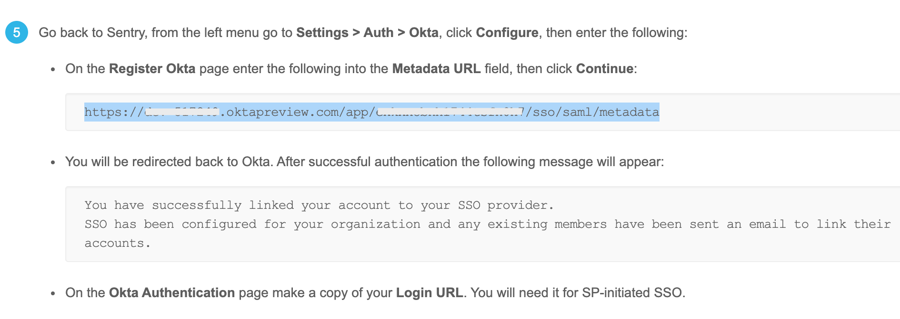

## Installation

1. Sign in to your Okta organization with your administrator account.

1. From the Admin Console side-navigation, click **Applications > Applications**. Click on **Add Application**.

1. Search for "Sentry", and click **Add** and you will be brought to the setup wizard.
   
   
   
1. For `1. General Settings`, no special settings is needed. 

1. For `2. Sign On Options`. Fill in the following
   
   - Base URL: `https://sentry.io`
      
      - There should not be a trailing slash at the end of the URL as it will break the redirect from Okta to Sentry.
      
   - Organization Slug: *YOUR_ORG_SLUG*
   
      - You can find your organization slug on the URL: `https://sentry.io/organizations/YOUR_ORG_SLUG/`
      
   - Email: `Email`
   
   
   
1. Click on **Save** and the Sentry app will be created. 

1. You'll be redirected to the app settings page. Click on **Sign On**, and you'll be brought back to the same settings in Step 5. This time, click on **View Setup Instructions** and it will open a new tab.  

1. In the new tab, look for the **Metadata URL** on the setup instructions and copy it.

   

1. Sign in to Sentry. Click **Settings > Auth >> Configure Okta**.
      
   
   
1. Paste the Metadata URL from Step 8, and click **Continue**.

   
   
1. After successful authentication, you'll be redirected to the configuration page for Okta.

   - The `Login URL` will be used for SP-initiated SSO.
   
   - If you want to enforce logging in with Okta, ensure that `Require SSO` is checked. 
   
   - Set a `Default Role` for new SSO users. Selecting `Member` should cover most use-cases.
   
   - If you made changes, click **Save Settings** and you're done!
   
   
