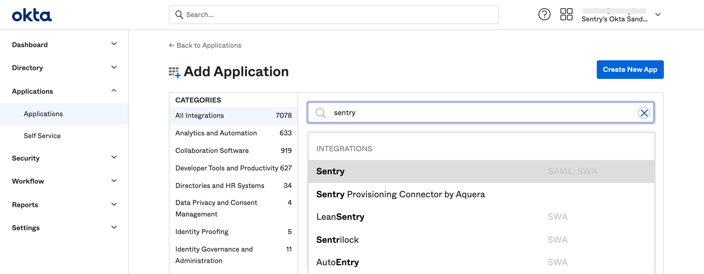
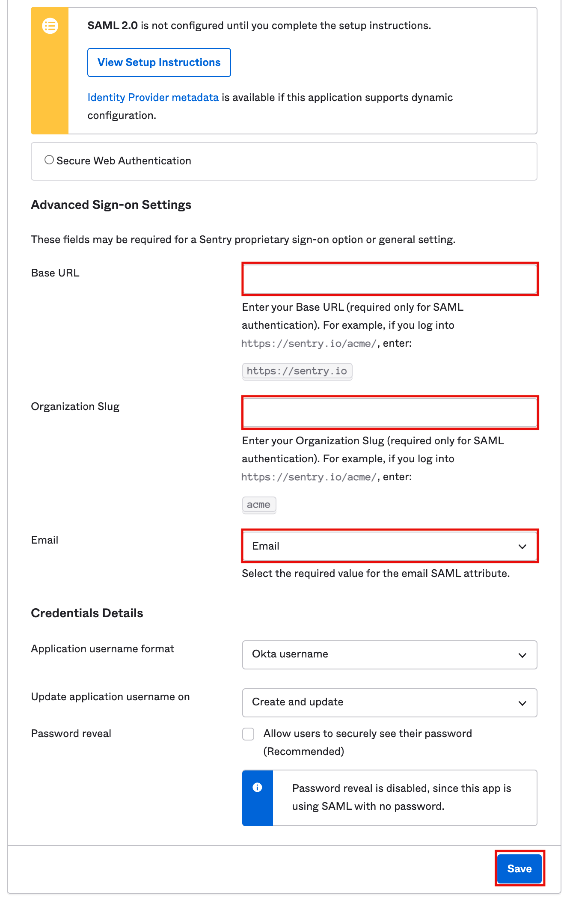
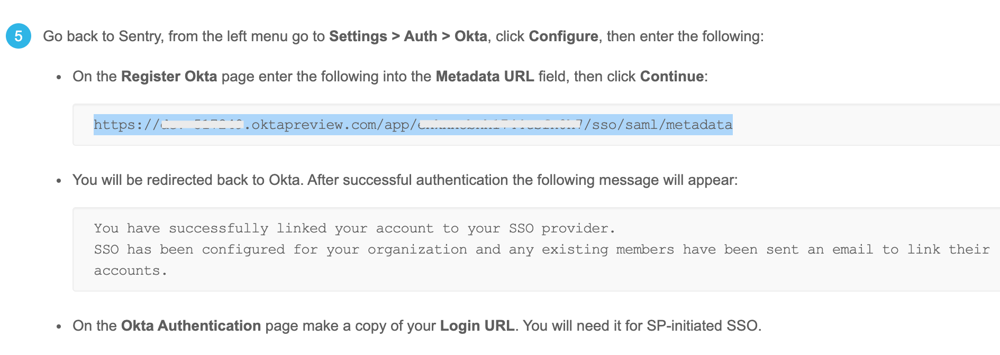
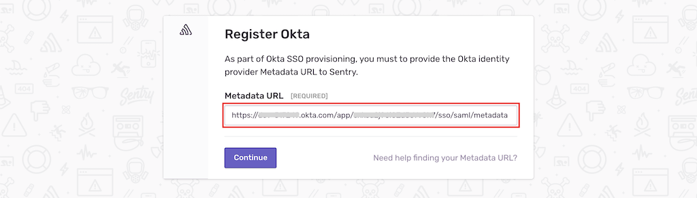
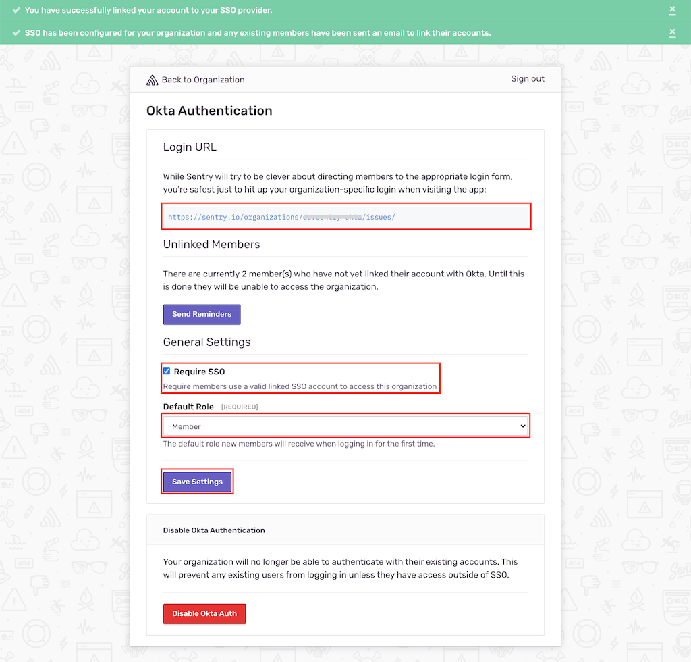

## Installation

<Alert level="warning">

If you change your organization slug, you'll need to make the same update in the steps where you enter the SAML configuration values.

</Alert>

1. Sign in to your Okta organization with your administrator account.

1. From the admin console's sidebar, click **Applications > Applications**, then click on "Browse App Catalog" (or "Add Application" for the old interface).

1. Search for `Sentry`, then click "Add" to be brought to the setup wizard.

   

1. Provide the settings. Note that for "1. General Settings", you will not need to provide any special settings. For "2. Sign On Options", provide the following:

   - Base URL: `https://sentry.io` <Alert level="warning">Ensure that the Base URL does not have a trailing slash or whitespace at the end as they will break the redirect from Okta to Sentry.</Alert>

   - Organization Slug: _YOUR_ORG_SLUG_

     - You can find your organization slug in the URL: `https://sentry.io/organizations/YOUR_ORG_SLUG/`

   - Email: `Email`

   

1. Click "Save" to create the Sentry app.

1. Click "Sign On" to the app settings page to which you are redirected. When the settings displayed in Step 5 appear, select "View Setup Instructions" in the bright yellow card to open a new tab.

1. Copy the "Metadata URL" in the set up instructions.

   

1. Sign in to Sentry. Select **Settings > Auth > Configure Okta**.

   

1. Paste the Metadata URL from Step 8, then click "Continue".

   

Sentry will attempt to authenticate and link your account with Okta. After successful authentication, you'll be redirected to Sentry's SSO configuration page, where you can:

- Share the "Login URL" value, which will be used for SP-initiated SSO, with the users in your organization.

- Scroll down to the bottom and ensure that "Require SSO" is checked if you want to enforce logging in with Okta.

- Set a "Default Role" for new SSO users. Selecting "Member" should cover most use cases.

If you make any changes, click "Save Settings" to complete your set up.

## SCIM Integration

- See [Okta SCIM Provisioning](okta-scim).
