<Note>

This feature is only available if your organization is on a Business or Enterprise plan.

</Note>

<Alert level="warning">

If you change your organization slug, you'll also need to update it in the "Auth" section of your "Organization Settings" in Sentry.

</Alert>

### Supported Features

- Create users
- Deactivate users
- Push groups
- Import groups
- Configure organization-level roles
- Update user attributes (organization-level roles only)

### Requirements

Okta SCIM provisioning requires:

- A subscription to Sentry Business Plan or higher.
- Configuration of SAML SSO for Okta [as documented here](/product/accounts/sso/okta-sso/), or use the Okta sign-on tab in your Sentry Okta application to configure SAML.
- **Selection of Email for the Application username format** in the Sign On application tab in Okta.
  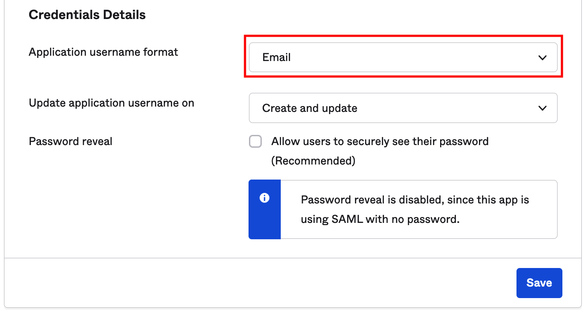

### Sentry Configuration

1. Sign in to [sentry.io](https://sentry.io). Select **Settings > Auth**
   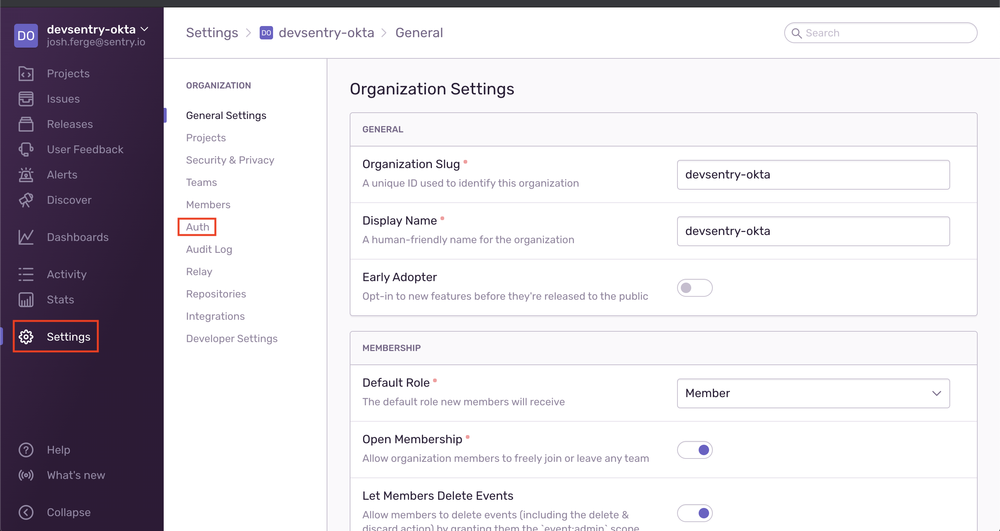
1. Under General Settings select "Enable SCIM", then "Save Settings"
   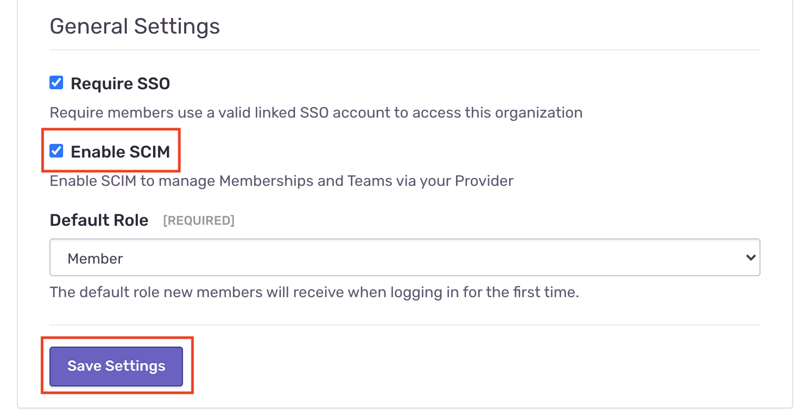
   Sentry will display "SCIM Information" that contains your Auth Token and SCIM Base URL.
   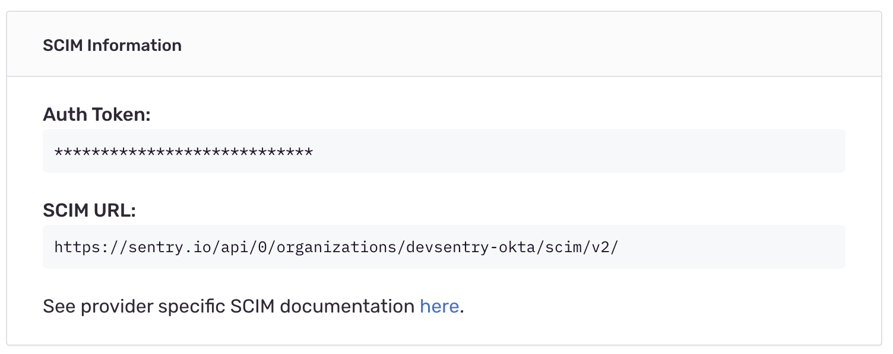

### Okta Configuration

1. Sign in to your Okta organization with your administrator account. From the admin console's sidebar, select Applications > Applications, then select the existing Sentry application.

2. Select the "Provisioning" tab, then "Configure API integration".
   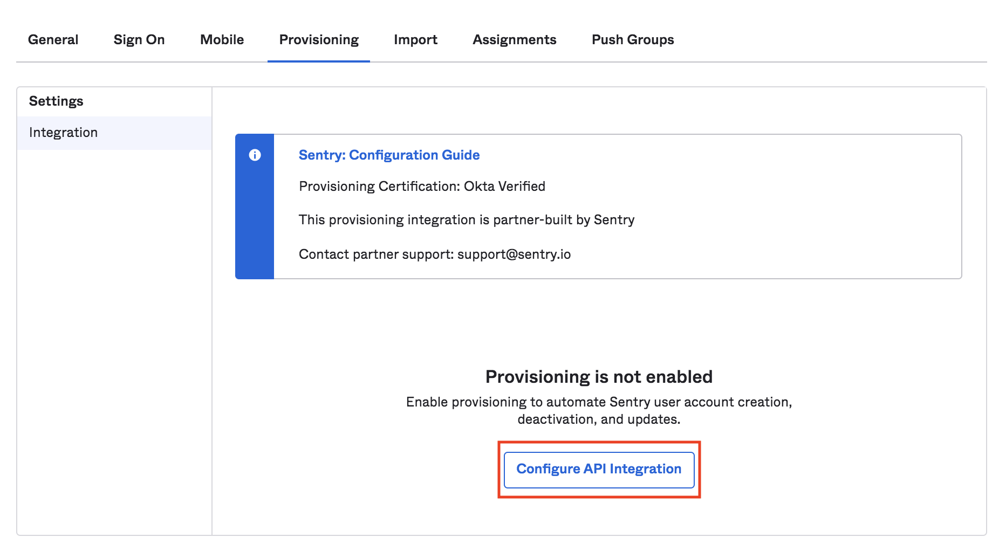

3. Select "Enable API Integration", then enter the SCIM URL from the auth settings page as the Base URL field.

4. For the API Token, copy the Auth Token value from the auth settings page.

5. Select "Test API Credentials". You should see a "the app was verified successfully" message appear.

6. Select "Save" to be directed to SCIM App settings.

7. On the Provisioning page, select "To App", then "edit":
   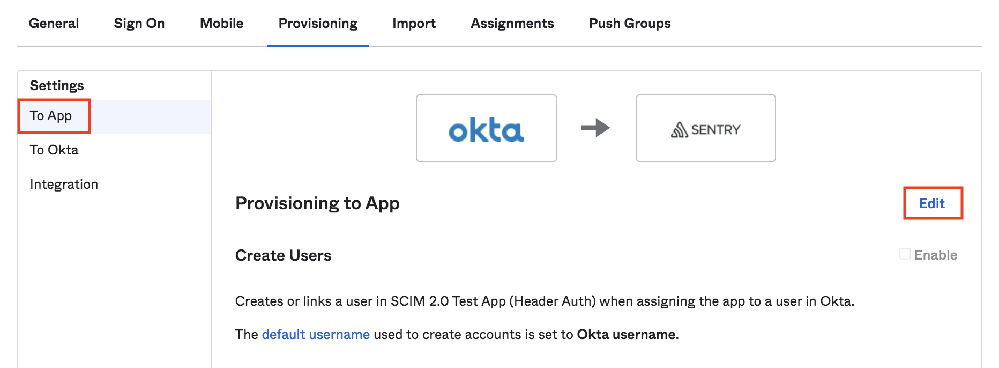

8. Enable both "Create Users" and "Deactivate Users", then click the "Save" button.
   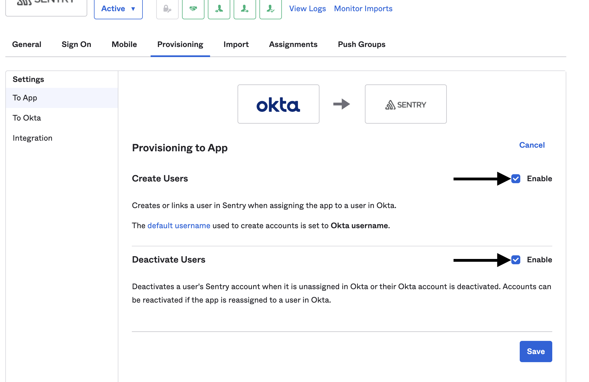

Once these changes have been made, newly assigned users will be sent an invitation email. If a user gets un-assigned, they'll be removed from their organization in Sentry.

You can use "Push Groups" to sync and assign groups in Okta; they'll be mirrored in Sentry teams.

<Alert level="note">

If you use Okta to assign organization membership, you’ll be unable to make membership changes through Sentry and will need to continue using Okta. To remove these users, deprovision them in Okta.

</Alert>

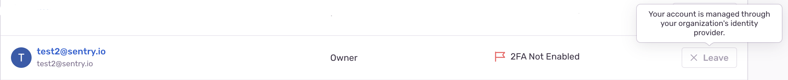

### Configuring Organization-level Roles

Here's how to assign an organization-level role to an Okta group:

1.  Add a new custom attribute to your Okta application profile

    1. Navigate to your application settings in Okta

    2. Under the "Provisioning" tab, select "Go to Profile Editor"
       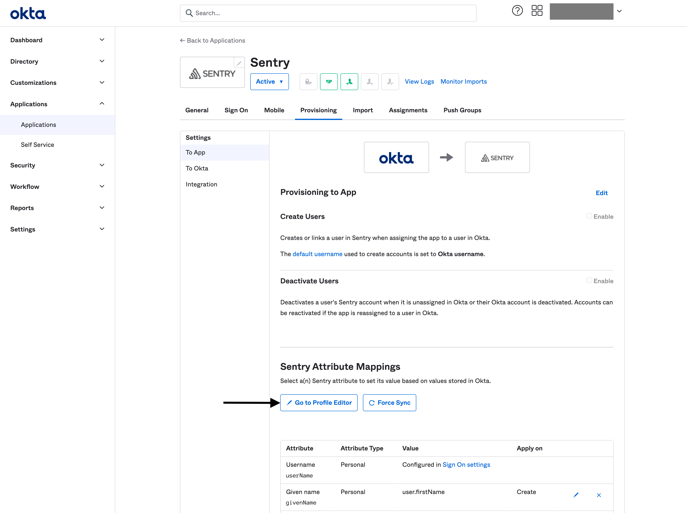

    3. Select "+ Add Attribute"
       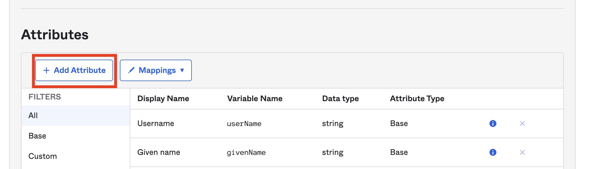

    4. Fill out the form with the following settings (You can set whatever value you want for any setting not listed below.):

       - Data Type: `string`
       - Display Name: `Org Role`
       - Variable Name: `sentryOrgRole`
       - External name: `sentryOrgRole`
       - External namespace: `urn:ietf:params:scim:schemas:core:2.0:User`
       - Attribute type: `Group`

       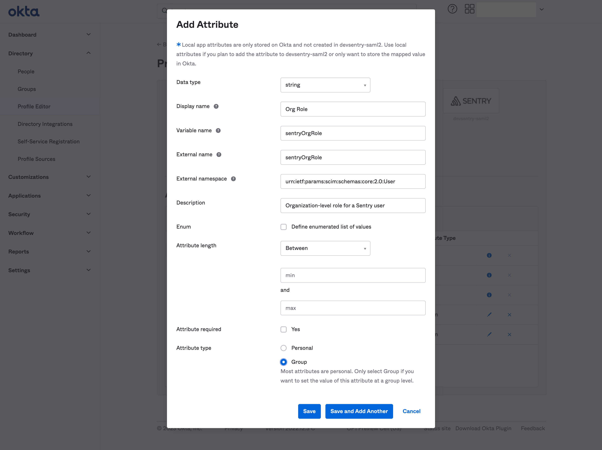

2.  Assign a group to your okta application
    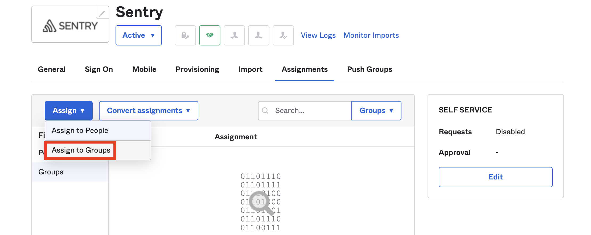

3.  In the form, enter the string for the org-level role
    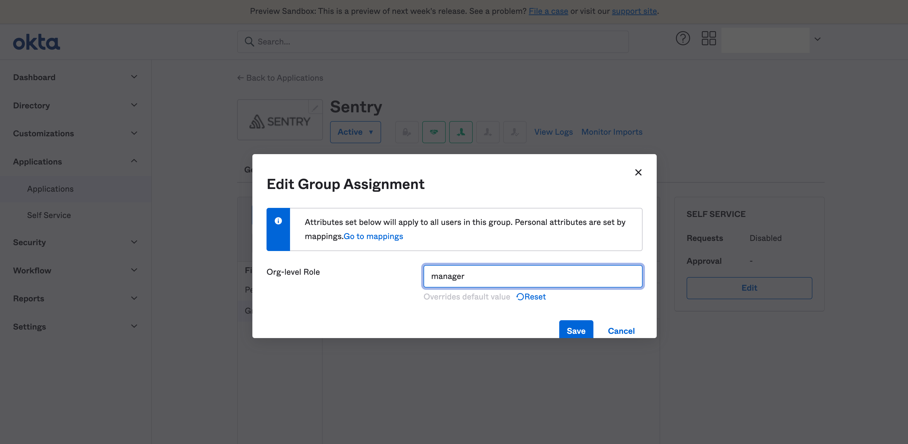

- If the `sentryOrgField` field is left blank, group members will be provisioned with the default organization-level role. This default role can be configured in Sentry, under Settings -> Organization -> Auth. Otherwise, the role must be one of the following:
  - Admin
  - Manager
  - Billing
  - Member
- Invalid role names will prevent group members from being provisioned. To try again, you'll need to remove the group first.
- For security reasons, the "Owner" role cannot be provisioned through SCIM. However, you <i>can</i> deprovision users who have the "Owner" role in Sentry, but aren't provisioned through SCIM.
  - For self-hosted users with custom roles, this extends to any role with the `org:admin` permission

<Alert level="note">

If a user is a member of multiple Okta groups, only the attributes set by the first group will be used.

</Alert>

<Alert level="note">

If you use Okta to assign organization-level roles, you’ll be unable to make membership changes through Sentry and will need to continue using Okta. To change a user's organization-level role, you will need to deprovision and then reprovision them with the new role.

</Alert>

Users who've had their roles assigned via Okta will only be able to make membership changes via Okta.

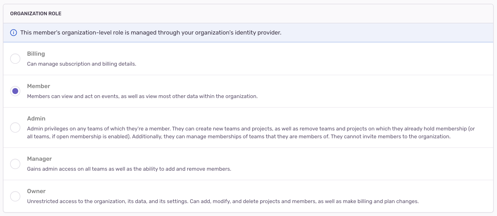

### Updating User Attributes

Currently, Sentry only supports the ability to update user attributes for organization-level roles. You'll be able to edit the attribute for users assigned to your application once you've added the `sentryOrgRole` attribute to your Okta application profile.

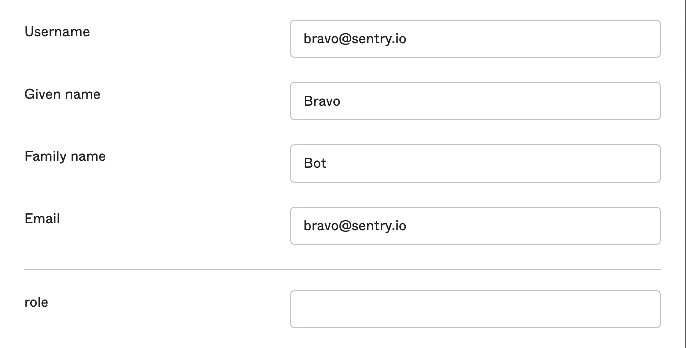

The user's role in Sentry will reflect their organization role in your Auth settings. This means that if you change a user's attribute to blank, their organization-level role will be removed from Sentry.

## Troubleshooting

### I get a "Matching user not found" error in Okta when provisioning a user.

Make sure that `Create User` and `Deactivate User` are enabled in the "Provisioning" tab of your Sentry application in Okta [(see Okta Configuration step 7)](#okta-configuration).

### I assigned Sentry to a group but no team was created.

Assigning Sentry to a group in Okta is the same as assigning Sentry to every member of that group. Functionally, this
provisions every group member within Sentry, but doesn't create a team. To create a team, push the group to Sentry from the `Push Groups` tab of your Sentry application in Okta.

### I pushed a group to Sentry but the team is empty.

Pushing a group via Okta tells Sentry to create a new team with the same name as the Okta group. Only those users who've already been provisioned as members of that group will be added to the Sentry team. Make sure that your group in Okta contains the appropriate users and that they've already been provisioned.

### I’m unable to use the Sentry application to remove a member whose membership is managed by an identity provider.

When team membership is managed by an identity provider (such as Okta), it can only be updated or revoked via that identity provider.

### I’m unable to use the Sentry application to add or remove members from my team.

If you use Okta to assign members to a team, you’ll be unable to make membership changes through Sentry and will need to continue using Okta.

### I used Okta to remove a user from Sentry, but they’re still showing up in my Sentry organization.

Make sure that `Deactivate User` is enabled in the "Provisioning" tab of your Sentry application in Okta. Re-provision the user, then remove them again.

### How do I remove the organization-level role for a user that I set via Okta?

Change the user's role attribute to blank.

## Known Issues

- The Import Users feature isn't currently supported because Sentry's SCIM API doesn't support the user `name` attribute fields: `firstName` and `lastName` at this time. For compatibility purposes, they're returned as `N/A` values.
- If the `active` field is set to `false` for any given user, their organization member record gets deleted.
- The only filter operation supported for resources is `eq`.
- When provisioning a new team, Sentry will both normalize and convert the team `displayName` uppercase to lowercase, and convert spaces to dashes.
- The GET /Groups endpoint cannot return more than 10000 members in a group, see [SCIM API documentation](/api/scim/) for more information.
