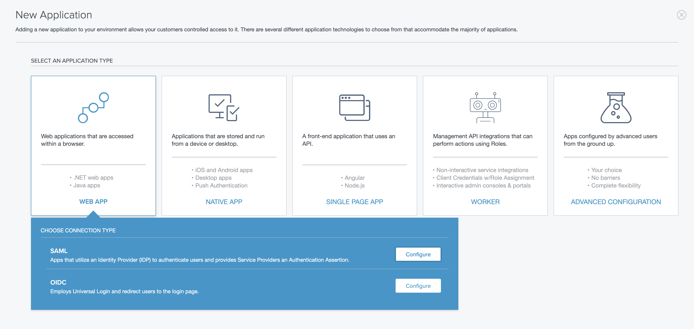
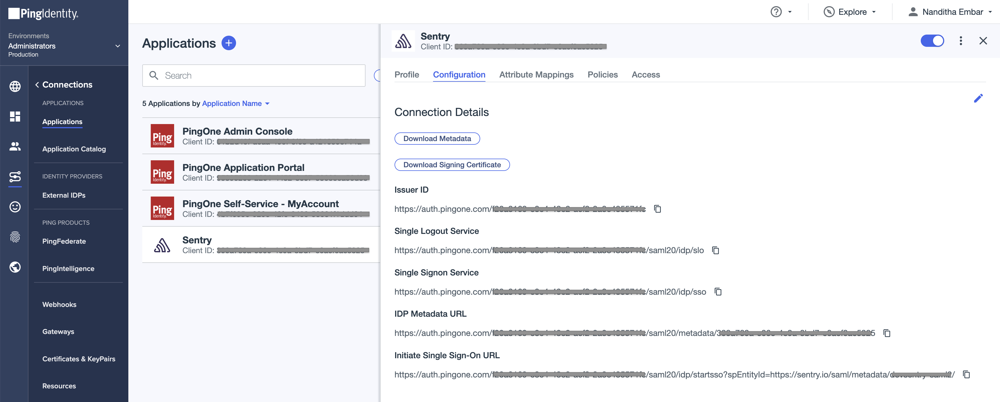

## Installation

<Alert level="warning">

If you change your organization slug, you'll need to make the same update in the steps where you enter the SAML configuration values.

</Alert>

1. Log in to [Ping Identity](https://www.pingidentity.com/en/account/sign-on.html).

1. Go to the "Adminstrators" environment for your organization.

1. If you don't require a permission group for Sentry, skip to step 5.

1. In the sidebar, click on "Identities", then "Groups", and navigate to it. From there, create a new group and add yourself and other members to it. For more details about group creation, see the [Ping ID docs](https://docs.pingidentity.com/bundle/pingone/page/vdz1610472224361.html).

1. In the sidebar, click on "Connections", then "Applications". Click on "+ Application" and for the application type, select "Web App" and "SAML".

   

1. For section (1), labeled "Create App Profile", you can get the Sentry logo from [here](https://sentry.io/branding/).

1. For section (2), labeled "Configure SAML", select "Manually Enter". Enter the following data in each line and save your changes.

   - Assertion Consumer Service (ACS) URL: `https://sentry.io/saml/acs/YOUR_ORG_SLUG/`

   - Entity ID: `https://sentry.io/saml/metadata/YOUR_ORG_SLUG/`

   - Single-Logout (SLO) Endpoint: `https://sentry.io/saml/sls/YOUR_ORG_SLUG/`

   - Target Application URL: `https://sentry.io/organizations/YOUR_ORG_SLUG/`

1. In section (3), labeled "Attribute Mappings", for "Application Attribute" ← "Outgoing Value", use:

   - `saml_subject` ← `Email address`

   - `email` ← `Email address`

   - `first_name` ← `Given Name`

   - `last_name` ← `Family Name`

     You can use custom key values, but you will need to amend the steps below. For more details about advanced attribute mappings for custom configs, see [this guide from Ping ID](https://support.pingidentity.com/s/article/PingOne-Using-Advanced-Attribute-Mapping).

1. Once the application is created, click on the Sentry application and navigate to "Configuration" and copy "IDP Metadata URL". This URL will be used in the subsequent step on Sentry.

   

1. Go back to [Sentry](https://sentry.io). Navigate to **Settings > Auth** (or go to `https://sentry.io/settings/YOUR_ORG_SLUG/auth/`) and click on "Configure" for SAML2.

1. Paste the IDP Metadata URL from above and click "Get Metadata".

1. On the next page, enter the following keys in their respective fields to map the Ping ID attributes to Sentry, and then save them:

   - IdP User ID: `saml_subject`

   - User Email: `email`

   - First Name: `first_name`

   - Last Name: `last_name`

1. Sentry will attempt to authenticate and link your account with Ping Identity. After successful authentication, you'll be redirected to Sentry's SSO configuration page, where you can take the following actions:

   - You can share the "Login URL" value, which will be used for SP-initiated SSO, with the users in your organization.

   - Scroll down to the bottom and ensure that "Require SSO" is checked if you want to enforce logging in with Ping.

   - Set a "Default Role" for new SSO users. Selecting "Member" should cover most use cases.

   - If you made changes, click "Save Settings" to complete your setup.
