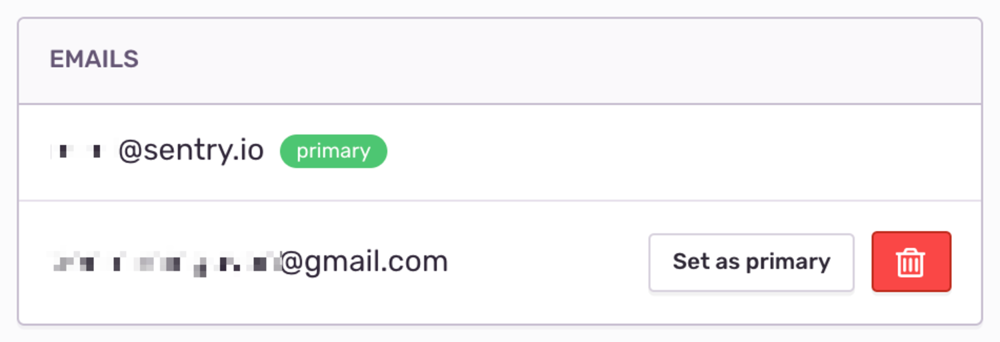

[Account preferences](https://sentry.io/settings/account/details/) help you customize your Sentry experience. Manage your account by selecting "User settings" from the dropdown under your organization’s name. On this page, you can control the frequency of your [email notifications](#notifications), [change your primary email](#emails), and update your security settings.

## Security Settings

Security Settings include options to reset a password, sign out of all devices, and enable two-factor authentication.

### Two-Factor Authentication

After setting up your two-factor authentication codes, click "View Codes" to download, print, or copy your codes to a secure location. If you cannot receive two-factor authentication codes in the future, such as if you lose your device, use your recovery codes to access your account.

<Note>
<markdown>
Clicking "Sign out of all devices" will end your sessions with any device logged in to Sentry using your account.
</markdown>
</Note>

## Notifications

Sentry emails you a notification when an issue state changes, a release deploys, or there's a spike in your quota. Fine-tune notifications per project by navigating to [Workflow Notifications](https://sentry.io/settings/account/notifications/workflow/). For more details about Notifications, see our [full documentation on Alerts & Notifications](/product/alerts-notifications/).

### Email Routing

[Email Routing](https://sentry.io/settings/account/notifications/email/) controls the email address to which notifications are sent for each project. These notifications default to the email address provided when you set up your Sentry account. You can route emails to an alternative email address when, for example, you want to notify only the team associated with a specific project.

### Weekly Reports

Sentry generates [Weekly Reports per project](https://sentry.io/settings/account/notifications/reports/) and sends these reports once a week on Mondays. For example:

## Emails

The email address used to log into your Sentry account is, by default, your primary email address. Add an alternative email address in the [Add Secondary Emails](https://sentry.io/settings/account/emails/) section. After verifying your secondary email, you can set it to become your primary email.

## Close Account

<Alert level="warning">Warning: Deleting your account cannot be undone.</Alert>

Closing your Sentry account automatically [removes all data](https://sentry.io/security/#data-removal) associated with your account after a 24-hour waiting period to prevent accidental cancellation. If your account is the sole owner of an organization, this organization will be deleted. Organizations with multiple owners will remain unchanged. For details about termination of service, see [Term, Termination, and Effect of Termination](https://sentry.io/terms/#term-termination-and-effect-of-termination).
