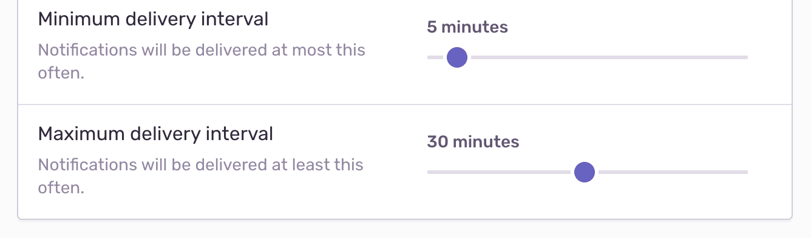
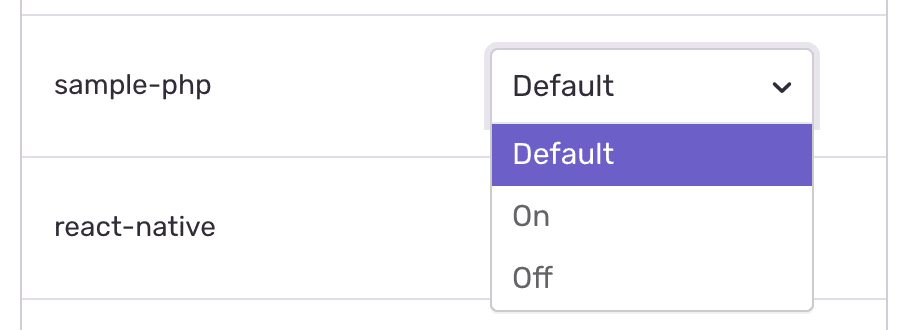

Configure alerts to your team's needs with alert rules and settings. Create new alerts, view alerts, and designate the recipient(s) of each alert.

## Rules

Alert Rules shows all of your project's alerts, their type, name, triggers, and actions. Use this page to create new alerts, determine if a component of your project needs alerting, or recognize unnecessary alerts. Copying an alert rule to another project will be available in a future release.

## Settings

Alerts have default settings and options to customize alerts to your personal needs.

### Alert Settings

Alert settings can only be edited by users with the organization owner, manager, or admin role. With alert settings you can configure alert email templates and set minimum/maximum delivery intervals for alerts. Access alert settings by navigating to **Settings > [Organization] > [Project] > Alerts**.

#### Digests

The digests feature works only for **issue alert emails** and limits alerts across issues within a project. This project-level setting allows you to batch issue alerts to limit the total number of emails you receive for that project. Use the sliders to control the frequency.

### Personal Alert Settings

Review your personal alert settings in **User Settings > Account > Notifications**. Use the "default project alerts" setting to set your default preference across all projects; subscribed or unsubscribed. Note: this setting does not affect alerts you've configured to send to your email explicitly.

After selecting the appropriate alert setting, selectively change it by project in **User Settings > Account > Fine tune alerts by project**. Each project has three options: Default, On, or Off. Selecting default uses your default preference from the previous step.

