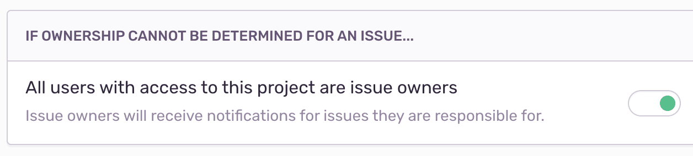

Sentry users with admin permissions or higher can create alerts. To confirm or set admin permissions, navigate to **Project Settings > Alerts > New Alert**.

## Metric Alerts

Metric alerts are typically used when you need to know about events such as detecting a spike in the overall number of errors in a project, or a triggered performance metric like [latency](/product/performance/metrics/#latency), [Apdex]((/product/performance/metrics/#apdex)), [failure rate](/product/performance/metrics/#failure-rate), and [throughput](/product/performance/metrics/#throughput-total-tpm-tps).

### Alert Builder

The alert builder sets the metric alert's triggers: Critical (required) and Warning (optional). The warning trigger's threshold must be breached before the critical trigger will set in motion. Triggers are evaluated approximately every minute from the highest severity to lowest.

Sentry creates an alert with the severity of the matched trigger (warning or critical). If an alert is already active, its status is updated. If no resolution threshold is specified, the alert will automatically resolve when it's no longer violating the critical or warning conditions. You can also resolve alerts manually by navigating to **Project Settings > Alerts**.

An alert occurs when it is initially triggered or if it changes status. Afterward, the alert will perform a configured action, such as:

- Send an email (to a member or team). If sent to a member, the member's personal project alert opt-out settings are overridden.
- Send a [Slack](/product/integrations/slack/) notification.
- Send a [PagerDuty](/product/integrations/pagerduty/) incident.
- Send a request to a webhook (via [internal integrations](/product/integrations/integration-platform/#internal-integrations)).

### Alert Stream

The Alert Stream displays your metric alerts along with visual graphs, associated projects, and the last time the alert was triggered. Access alerts via the **Alerts** sidebar item.

### Alert Details

The Alert Details page provides specifics on a single instance of an alert from its creation to its resolution, or the current time if the alert is still active. The "subscribe" button subscribes you to workflow notifications for the alert, including status changes and comments.

## Issue Alerts

Issue alerts apply only to event errors, and fire whenever any issue in the project matches the specified criteria, such as a resolved issue re-appearing or an issue affecting many users.

### Conditions

Conditions are evaluated for an issue alert **each time** the issue receives a new event, subject to [rate limits](/product/alerts-notifications/alerts/#rate-limit). Each condition is **evaluated independently** of other conditions. For example, the following alert will never trigger:

In the example, the alert will not fire because an event **cannot satisfy both** of these conditions simultaneously: Sentry detects/creates a new issue, _and_ the issue has happened ten times.

For a complete list of conditions, see [Alert Conditions](/product/alerts-notifications/alerts/alert-conditions).

### Actions

Actions are the configurations that determine what will happen when an alert is triggered. The following actions are available:

- Send an email to either [Issue Owners](/product/error-monitoring/issue-owners/), Team, or [Member](/accounts/membership/#member).
- Send a notification to an [integration](/product/integrations/), which includes [PagerDuty](/product/integrations/integrations/pagerduty/), [Slack](/product/integrations/integrations/slack/), and [Microsoft Teams](/product/integrations/integrations/msteams/). If no legacy integrations or integrations built using the integration platform are enabled, this option is hidden.

### Rate Limit

The rate limit determines how frequently an issue alerts. After an issue triggers an alert, Sentry won't check the conditions and won't execute the actions for that issue until the rate limit period passes. The limit is set to perform the action according to one of these intervals:

- minutes: 5, 10, 30, 60
- hours: 3, 12, 24
- one week or 30 days

For example, if an issue violates alert conditions multiple times in a 30-min period, but your frequency threshold is 30 minutes, you’ll only get one alert.

### Environment

Environment control allows you to specify which environment qualifies for your issue alert:

- All Environments
- Any of your defined (and not hidden) environments.

If you select "All Environments", Sentry checks individually for each environment, rather than combined events across environments.

### Digests

The digests feature works only for **issue alert emails** and limits alerts across projects. This project-level setting allows you to batch issue alerts to limit the total number of emails you receive for that project. Use the sliders to control the frequency.

## Alert Rules

Alert Rules shows all of your project's alerts, their type, name, triggers, and actions. Use this page to create new alerts, determine if a component of your project needs alerting, or recognize unnecessary alerts.

## Alert Subscription

### Issue Owners

By default, [issue owners](/product/error-monitoring/issue-owners/) receive alert emails. If an issue owner is not configured or not found, the email will either not send or send to all project members as defined in **Project Settings > Issue Owners**.

### Ignore

When an issue is set to ignore, Sentry mutes the alerts for that issue. You can also ignore an issue until certain conditions are met. For example, "ignore for 30 minutes." Keep in mind; an ignored issue **will still count towards your quota**.

### Personal Alert Settings

Review your personal alert settings in **User Settings > Account > Notifications**. Use the "default project alerts" setting to set your default preference across all projects; subscribed or unsubscribed. Note: this setting does not affect alerts you've configured to send to your email explicitly.

After selecting the appropriate alert setting, selectively change it by project in **User Settings > Account > Fine tune alerts by project**. Each project has three options: Default, On, or Off. Selecting default uses your default preference from the previous step.

