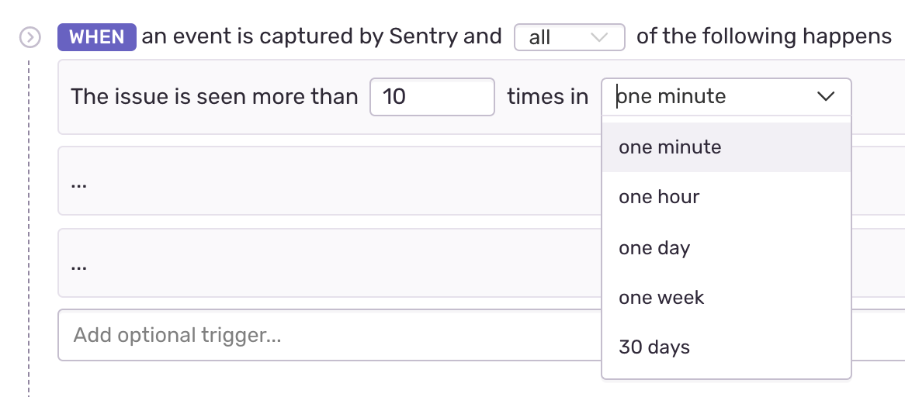

Issue alerts apply only to error events, and trigger whenever any issue in the project matches the specified criteria, such as a resolved issue re-appearing or an issue affecting many users. Sentry users with admin permissions or higher can create alerts. To confirm or set admin permissions, navigate to **Project Settings > Alerts > New Alert**. To change the frequency of your alerts, configure your [Alert Settings](/product/alerts-notifications/alert-settings/).

## Conditions

Conditions are evaluated for an issue alert **each time** the issue receives a new event, subject to [rate limits](/product/alerts-notifications/issue-alerts/#rate-limit). Alert conditions have three parts:

- Triggers ("When...")
- Filters ("If...")
- Actions ("Then...").

Triggers specify what type of activity you'd like monitored. Filters help control noise by filtering down the triggered alerts to only those matching specific criteria. Actions specify what should happen when the alert passes the filters.

## Actions

Actions are the configurations that determine what will happen when an alert is triggered. The following actions are available:

- Send an email to either [Issue Owners](/product/error-monitoring/issue-owners/), Team, or [Member](/product/accounts/membership/#member).
- Send a notification to an [integration](/product/integrations/), which includes:

  - [PagerDuty](/product/integrations/pagerduty/)
  - [Slack](/product/integrations/slack/)
  - [Microsoft Teams](/product/integrations/msteams/)
  - Legacy integrations
  - Integrations built on the [Integration Platform](/product/integrations/integration-platform/)

  If no legacy integrations or integrations built using the integration platform are enabled, this option is hidden.

To change the frequency of issue alert emails, update your alert settings [digests](/product/alerts-notifications/alert-settings/#digests).

### Issue Owners

By default, [issue owners](/product/error-monitoring/issue-owners/) receive alert emails. If an issue owner is not configured or not found, the email will either not send or send to all project members as defined in **Project Settings > Issue Owners**.

## Rate Limit

The rate limit determines how frequently an issue alerts. After an issue triggers an alert, Sentry won't check the conditions and won't execute the actions for that issue until the rate limit period passes. The limit is set to perform the action according to one of these intervals:

- minutes: 5, 10, 30, 60
- hours: 3, 12, 24
- one week or 30 days

For example, if an issue violates alert conditions multiple times in a one minute period, but your frequency threshold is one minute, you’ll only get one alert.

## Environment

Environment control allows you to specify which environment qualifies for your issue alert:

- All Environments
- Any of your defined (and not hidden) environments.

If you select "All Environments", Sentry checks individually for each environment, rather than combined events across environments.

## Ignoring Issues

When an issue is set to ignore, Sentry mutes the alerts for that issue. You can also ignore an issue until certain conditions are met. For example, "ignore for 30 minutes." Keep in mind; an ignored issue **will still count towards your quota**.

## Delete & Discard Issues

Delete, and Delete & Discard are two different statuses for issues.

Delete

: Deleting an issue deletes all data associated with it, and creates a new issue if an event with the same fingerprint happens again. Alerts and workflow notifications for this new issue behave just like notifications for any new issue.

Delete & Discard

: When you delete and discard an issue, all notifications for the issue will stop.
