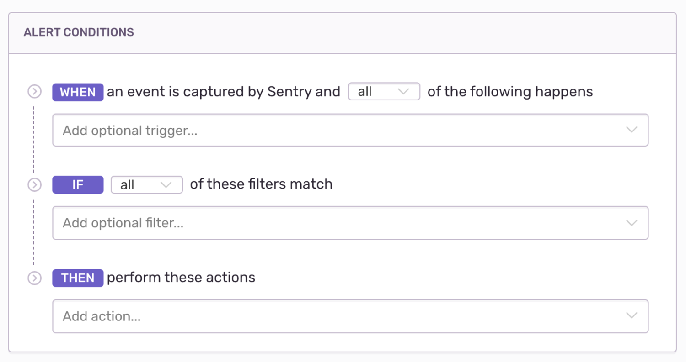

Issue alerts apply only to error events, and trigger whenever any issue in the project matches the specified criteria, such as a resolved issue re-appearing or an issue affecting many users. Sentry users with admin permissions or higher can create alerts. To confirm or set admin permissions, navigate to **Project Settings > Alerts > New Alert**. To change the frequency of your alerts, configure your [Alert Settings](/product/alerts-notifications/alert-settings/).

## Conditions

Conditions are evaluated for an issue alert **each time** Sentry receives a new event, subject to [rate limits](/product/alerts-notifications/issue-alerts/#rate-limit). Alert conditions have three parts:

- [Triggers](#triggers) ("When...")
- [Filters](#filters) ("If...")
- [Actions](#actions) ("Then...").

### Triggers

Triggers specify what type of activity you'd like monitored. The following triggers are available:

- The issue is first seen.
- The issue changes state from `resolved` to `unresolved`.
- The issue changes state from `ignored` to `unresolved`.
- The issue is seen more than {**value**} times in {**interval**}. **Value**: a positive integer. **Interval**: one min, one hour, one day, one week, or 30 days.
- The issue is seen by more than {**value**} users in {**interval**}. **Value**: a positive integer. **Interval**: one min, one hour, one day, one week, or 30 days.

### Filters

Filters help control noise by filtering down the triggered alerts to only those matching specific criteria. The following filters are available:

- The issue is older or newer than {**value**} {**interval**}. **Value**: a positive integer. **Interval**: minute(s), hour(s), day(s), week(s).
- The issue has happened at least {**X**} times. **X**: a positive integer.
- The issue is assigned to {no one/team/member}.
- The event from the latest release.
- The event's {**attribute**} value {**match**} {**value**}. **Attribute**: `message`, `platform`, `environment`, `type`, `exception.type`, `exception.value`, `user.id`, `user.email`, `user.username`, `user.ip_address`, `http.method`, `http.url`, `stacktrace.code`, `stacktrace.module`, `stacktrace.filename`, or `stacktrace.abs_path`. **Match**: equals, does not equal, starts with, ends with, contains, does not contain, is set, or is not set. **Value**: any attribute's value.
- The event's tags match {**key**} {**match**} {**value**}. **Key**: any tag. **Match**: equals, does not equal, starts with, ends with, contains, does not contain, is set, or is not set. **Value**: any key's value.
- The event's level is {**match**} {**level**}. **Match**: equal to, less than or equal to, or greater than or equal to. **Level**: fatal, error, warning, info, debug, or sample.

### Actions
Actions specify what should happen when the alert is triggered and passes the filters. The following actions are available:

- Send an email to either [Issue Owners](/product/error-monitoring/issue-owners/), Team, or [Member](/product/accounts/membership/#member).
- Send a notification to an [integration](/product/integrations/), which includes:

  - [PagerDuty](/product/integrations/pagerduty/)
  - [Slack](/product/integrations/slack/)
  - [Microsoft Teams](/product/integrations/msteams/)
  - Legacy integrations
  - Integrations built on the [Integration Platform](/product/integrations/integration-platform/)

  If no legacy integrations or integrations built using the integration platform are enabled, this option is hidden.

#### Issue Owners

[Issue owners](/product/error-monitoring/issue-owners/) can receive alert emails. If an issue owner is not configured or not found, the email will either not send or send to all project members as defined in **Project Settings > Issue Owners**.

## Rate Limit

The rate limit controls how often the alert rule can be triggered for a particular issue. If alert conditions match an issue, actions are only executed if they hadn't already been executed within the rate limit period. For example, if an issue violates alert conditions multiple times in a one minute period, but your frequency threshold is one minute, you’ll only get one alert. The rate limit is set to perform the action according to one of these intervals:

- minutes: 5, 10, 30, 60
- hours: 3, 12, 24
- one week or 30 days

## Environment

Environment control allows you to specify which environment qualifies for your issue alert:

- All Environments
- Any of your defined (and not hidden) environments.

If you select "All Environments", Sentry checks individually for each environment, rather than combined events across environments.

## Ignoring Issues

When an issue is set to ignore, Sentry mutes issue alerts for that issue. You can also ignore an issue until certain conditions are met. For example, "ignore for 30 minutes." Keep in mind; an ignored issue **will still count towards your quota**.

## Delete & Discard Issues

Delete, and Delete & Discard are two different actions for issues.

Delete

: Deleting an issue deletes all data associated with it, and creates a new issue if an event with the same fingerprint happens again. Alerts and workflow notifications for this new issue behave just like notifications for any new issue.

Delete & Discard

: When you delete and discard an issue, all notifications for the issue will stop.
