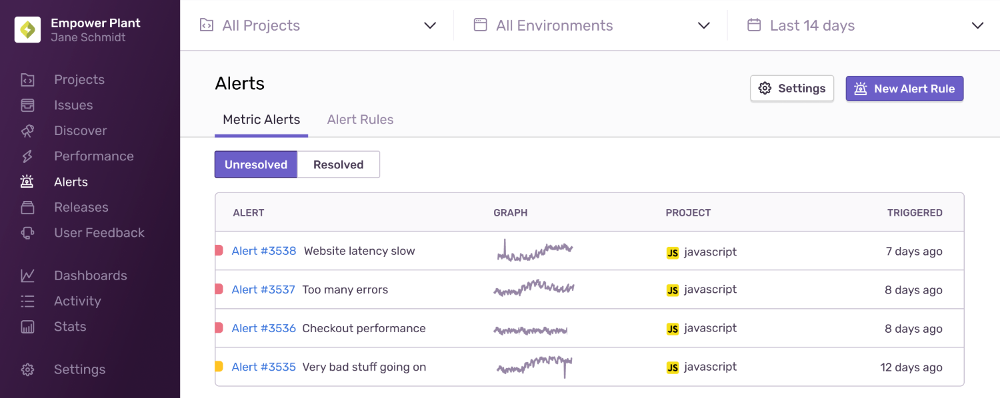
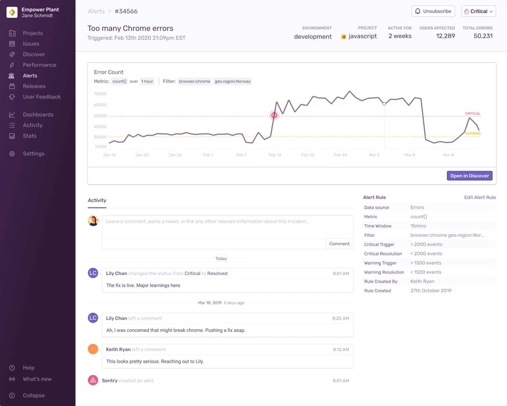

test

Sentry users with admin permissions or higher can create alerts. To confirm or set admin permissions, navigate to **Project Settings > Alerts > New Alert**.

## Metric Alerts

Metric alerts are typically used when you need to know about events such as detecting a spike in the overall number of errors in a project, or a triggered performance metric like [latency](/product/performance/metrics/#latency), [Apdex]((/product/performance/metrics/#apdex)), [failure rate](/product/performance/metrics/#failure-rate), and [throughput](/product/performance/metrics/#throughput-total-tpm-tps).

### Alert Builder

The alert builder sets the metric alert's triggers: Critical (required) and Warning (optional). The warning trigger's threshold must be breached before the critical trigger will set in motion. Triggers are evaluated approximately every minute from the highest severity to lowest.

Sentry creates an alert with the severity of the matched trigger (warning or critical). If an alert is already active, its status is updated. If no resolution threshold is specified, the alert will automatically resolve when it's no longer violating the critical or warning conditions. You can also resolve alerts manually by navigating to **Project Settings > Alerts**.

An alert occurs when it is initially triggered or if it changes status. Afterward, the alert will perform a configured action, such as:

- Send an email (to a member or team). If sent to a member, the member's personal project alert opt-out settings are overridden.
- Send a [Slack](/product/integrations/slack/) notification.
- Send a [PagerDuty](/product/integrations/pagerduty/) incident.
- Send a request to a webhook (via [internal integrations](/product/integrations/integration-platform/#internal-integrations)).

### Alert Stream

The Alert Stream displays your metric alerts along with visual graphs, associated projects, and the last time the alert was triggered. Access alerts via the **Alerts** sidebar item.

### Alert Details

The Alert Details page provides specifics on a single instance of an alert from its creation to its resolution, or the current time if the alert is still active. The "subscribe" button subscribes you to workflow notifications for the alert, including status changes and comments.

## Alert Rules

Alert Rules shows all of your project's alerts, their type, name, triggers, and actions. Use this page to create new alerts, determine if a component of your project needs alerting, or recognize unnecessary alerts.

## Alert Subscription

### Issue Owners

By default, [issue owners](/product/error-monitoring/issue-owners/) receive alert emails. If an issue owner is not configured or not found, the email will either not send or send to all project members as defined in **Project Settings > Issue Owners**.

### Ignore

When an issue is set to ignore, Sentry mutes the alerts for that issue. You can also ignore an issue until certain conditions are met. For example, "ignore for 30 minutes." Keep in mind; an ignored issue **will still count towards your quota**.

### Personal Alert Settings

Review your personal alert settings in **User Settings > Account > Notifications**. Use the "default project alerts" setting to set your default preference across all projects; subscribed or unsubscribed. Note: this setting does not affect alerts you've configured to send to your email explicitly.

After selecting the appropriate alert setting, selectively change it by project in **User Settings > Account > Fine tune alerts by project**. Each project has three options: Default, On, or Off. Selecting default uses your default preference from the previous step.

