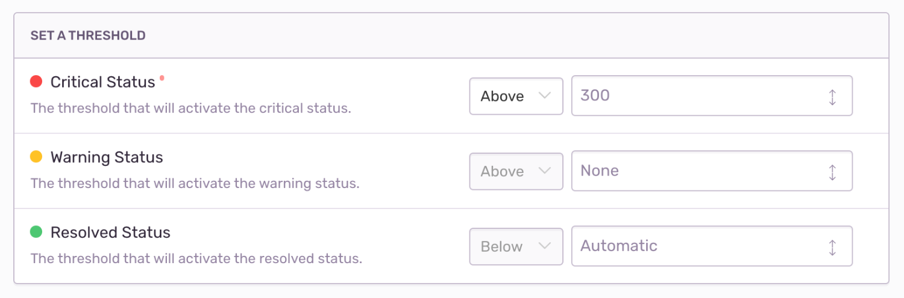

Metric alerts tell you when a metric breaches a threshold, such as a spike in the number of errors in a project, or a change in a performance metric like [latency](/product/performance/metrics/#latency), [Apdex](/product/performance/metrics/#apdex), [failure rate](/product/performance/metrics/#failure-rate), and [throughput](/product/performance/metrics/#throughput-total-tpm-tps).

The minimum role required to create alerts is member. Sentry users with manager or owner permissions can change the minimum role requirement in **Settings > General Settings > Let Members Create and Edit Alerts**.

## Alert Builder

The alert builder sets the metric alert's triggers: Critical (required) and Warning (optional). The warning trigger's threshold must be breached before the critical trigger. Triggers are evaluated approximately every minute from the highest severity to lowest.

Sentry creates an alert with the severity of the matched trigger (warning or critical). If an alert is already active, its status is updated. If no resolution threshold is specified, the alert will automatically resolve when it's no longer violating the critical or warning conditions. You can also resolve alerts manually.

When Sentry creates an alert or an existing alert changes status, the trigger's actions are executed. Possible actions are:

- Send an email (to a member or team). If sent to a member, the member's personal project alert opt-out settings are overridden.
- Send a [Slack](/product/integrations/slack/) notification.
- Trigger a [PagerDuty](/product/integrations/pagerduty/) incident.
- Send a request to a webhook (via [internal integrations](/product/integrations/integration-platform/#internal-integrations)).

## Alert Stream

The Alert Stream displays your metric alerts along with visual graphs, associated projects, and the last time the alert was triggered. Access alerts via the **Alerts** sidebar item.

## Alert Details

<Note>

The function of this page has changed for Early Adopter users. Learn about these changes in [Early Adopter Features](#early-adopter-features).

</Note>

The **Alert Details** page shows you when a single alert was triggered. On this page, you can see what might have caused the alert to be triggered, and then open the alert in the **Discover** page to find more information. 

The page provides specifics on a single instance of an alert, from its creation to its resolution, or the current time if the alert is still active. The "Subscribe" button subscribes you to notifications for status changes and comments.

### Early Adopter Features

<Note>

This feature is available only if you're in the Early Adopter program. Features available to Early Adopters are still in-progress and may have bugs. We recognize the irony.

If you’re interested in being an Early Adopter, you can turn your organization’s Early Adopter status on/off in General Settings. This will affect all users in your organization and can be turned back off just as easily.

</Note>

The **Alert Details** page shows you the history of an alert rule. The page includes details such as, the alert rule conditions, the current status of the alert, and a graph showing the historical trend of the metric being measured. The page includes a summary of how much time the alert spent in each state (Critical, Warning, or Resolved), which is displayed as percentages, and details of each time the alert was triggered. It also includes a list of suspect issues or transactions related to the metric, to help pinpoint the root problem more quickly.
