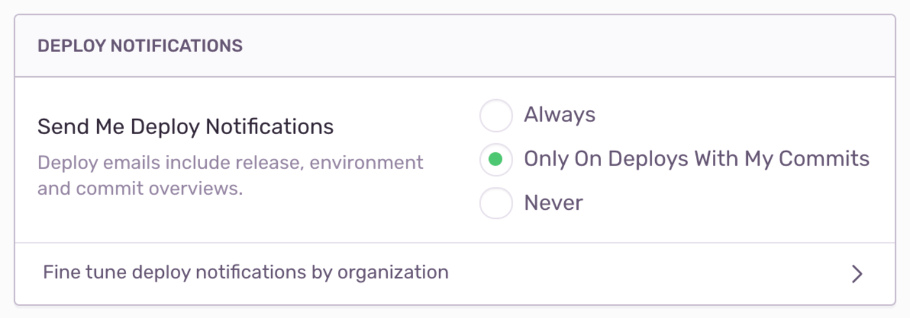

Aside from Alerts, Sentry has Workflow, Deploy, and Quota notifications. All notifications are sent through email.

## Workflow

Workflow emails are sent for [issue state](#issue-states) changes. Workflow relates to activity involving user actions and state changes on issues and alerts. This includes things like resolution, assignment, comments, and regressions.

By default, Sentry subscribes you to issues based on signals, such as:

- Subscription to the issue or all workflow emails in the project
- Involvement in a commit related to the issue
- Commenting on or bookmarking the issue
- Mention of you or your team in the issue or assigned to the issue

### Issue States

An issue can be in one of the following three states:

| Issue State       | Description                        |
| ----------------- | ---------------------------------- |
| Unresolved | The default state when an issue is added to the system. |
| Resolved | Resolve an issue to indicate that no more events are expected. If another event is seen in the issue, the issue will revert to unresolved. This is called a **regression**. An issue is marked as resolved in one of three ways: 1. When an individual resolves it by manually changing the state on the issue page UI 2. Submitting a fix with the associated issue ID 3. When the project’s auto-resolve feature is configured. Auto-resolve is located in **Project Settings > General Settings**. For more details about submitting a fix, see documentation on [resolving issues](/product/releases/#after-associating-commits). |
| Ignored | Ignored issues suppress alerts for the issue, and by default, are hidden from your project’s issue stream. Search the issue stream for `is:ignored` to view them. Keep in mind; **an ignored issue will still count towards your quota.**

## Deploy

Deploy emails are sent to users who have committed to the release that was deployed. For more details, see [deploy documentation](/workflow/releases/#create-deploy).

## Quota

Sentry sends all owners of the organization emails when:

- The event volume is approaching or has exceeded the quota
- On-demand is activated
- Spike protection is activated or deactivated

For more details, see the [full documentation on Quotas](/accounts/quotas/).

## Notification Subscription

You can configure your personal workflow and deploy notifications [in your account settings](https://sentry.io/settings/account/notifications/). You **cannot configure** quota notifications.

### Workflow Notification

After selecting the appropriate alert setting, selectively change it by project in **User Settings > Account > Fine tune alerts by project**.

Each project has three options: Default, On, or Off. Selecting default uses your default preference from the previous step.

#### Unsubscribe

To opt-out of workflow notifications for a specific issue, click "Unsubscribe" at the bottom right of the issue’s page.

### Deploy Notifications

Deploy notification settings are located in **Setting > Account > Notifications**.

