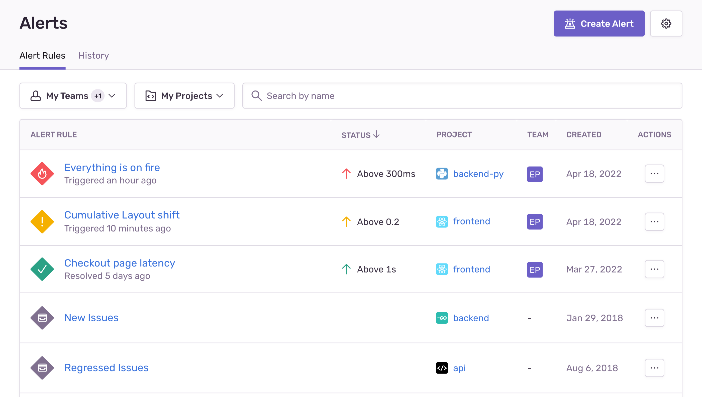

You can create two types of alerts:

1. **Issue alerts**: Trigger when an issue (a grouped set of error events) matches a specific criteria.
2. **Metric alerts**: Trigger when macro-level metrics for error or transaction events cross specific thresholds.

## Issue Alerts

Issue alerts trigger whenever any issue in a project matches the specified criteria. These criteria might be, for example, a resolved issue re-appearing or an issue affecting many users.

In the “Alert Rules” tab, these alerts are identified by the issues icon, and by default, they are displayed at the bottom of your list of alerts. (If you have several metric alerts, this may push your issue alerts off the first page of the list.)

In issue alerts, Sentry evaluates the conigured alert conditions each time it receives a new event. Alert conditions have three parts:

1. [Triggers](/product/alerts/create-alerts/issue-alert-config/#when-conditions-triggers) specify what type of activity you'd like monitored, or **When** an alert should be triggered.
2. [Filters](/product/alerts/create-alerts/issue-alert-config/#if-conditions-filters) help control noise by triggering an alert only **If** the issue matches the specified criteria.
3. **Then**, [Actions](/product/alerts/create-alerts/issue-alert-config/#then-conditions-actions) specify what should happen when the trigger conditions are met and the filters match.

## Metric Alerts

Metric alerts tell you when a [metric](/product/performance/metrics/) crosses a threshold, such as a spike in the number of errors in a project, or a change in a performance metric, like [latency](/product/performance/metrics/#latency), [Apdex](/product/performance/metrics/#apdex), [failure rate](/product/performance/metrics/#failure-rate), or [throughput](/product/performance/metrics/#throughput-total-tpm-tps).

Metric alerts monitor macro-level metrics for both error and transaction events. A metric takes a set of events and computes an aggregate value using a function, such as `count()` or `avg()`, applied to the event properties over a period of time. When you create a metric alert, you can filter events by attributes and <PlatformLink to="/enriching-events/tags/">tags</PlatformLink>, which is particularly useful for aggregating across events that aren't grouped into single issues.

These alerts use *Critical* and *Warning* triggers to measure severity. An alert’s current status is the highest severity trigger that is active, which can be one of three values: Warning, Critical, or Resolved. Sentry notifies you whenever an alert's status changes.

When you create an alert, all the displayed alert types (except “Issues”) may be used to create a metric alert:

- Number of Errors
- Users Experiencing Errors
- Throughput
- Transaction Duration
- Apdex
- Failure Rate
- Largest Contentful Display
- First Input Delay
- Cumulative Layout Shift
- Custom Metric

<Note>

Metric alerts aren’t affected by [ignored issues](/product/issues/states-triage/#ignore), so events from those issues are counted if they match the filters of your metric alert rule.

</Note>

### Alert Details

The **Alert Details** page shows you the history of a metric alert rule for the last 24 hours by default, though can modify the time period using the "Display" dropdown. When an alert is triggered, clicking the notification you receive takes you to this page, which displays the period when the alert was active. The page also includes details such as the alert rule conditions, the current status of the alert, and a summary of how much time the alert spent in each state (Critical, Warning, or Resolved).

The **Alert Details** page also includes a list of suspect issues or transactions related to the metric, to help pinpoint the root problem more quickly. You can see what might have caused the alert to be triggered, and then open the metric in **[Discover](/product/discover-queries)** to find more information. 
