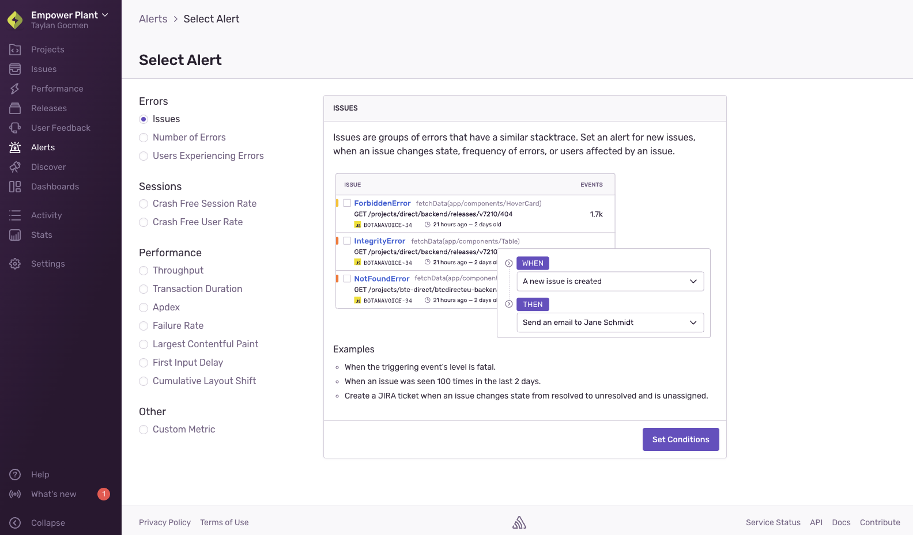

<Note>

The minimum role required to create alerts is member. Sentry users with manager or owner permissions can change the minimum role requirement in **Settings > General Settings > Let Members Create and Edit Alerts**.

</Note>

To create alerts:

1. Navigate to **Alerts** and click "Create Alert Rule".
1. Choose what you want to be alerted about. Selecting “Issues” creates an [issue alert](/product/alerts/alert-types/#issue-alerts), while selecting any other option creates a [metric alert](/product/alerts/alert-types/#metric-alerts).
   

1. Click "Set Conditions".
1. On the alert configuration page, set the conditions of the alert:
   - [Issue Alert Configuration](/product/alerts/create-alerts/issue-alert-config/)
   - [Metric Alert Configuration](/product/alerts/create-alerts/metric-alert-config/)

## Duplicate Alerts

You can also create an alert by duplicating an existing issue or metric alert rule. To do so, navigate to **Alerts** and click "Duplicate" in the context menu (under "Actions") on the row with the alert rule you want to copy:

