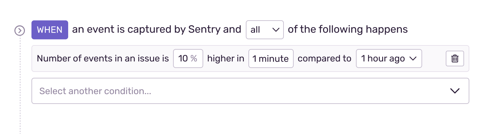
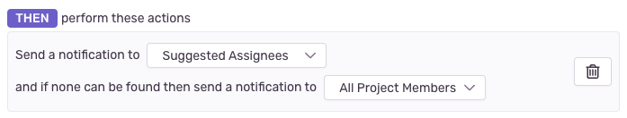

Sentry provides several configuration options to create an issue alert based on your organization's needs.

## Environment

Specify which <PlatformLink to="/configuration/environments/">environment(s)</PlatformLink> will use this particular alert rule. This control filters on the `environment` tag in your events. This filter is helpful because the urgency and workflows you apply to production alerts might differ from those you apply to alerts originating from your QA environment, for example.

The “Environment” dropdown list here has the same environments that are available for the selected project in the common “Environment” filter dropdown (this does not include hidden environments). Selecting "All Environments" is equivalent to having no environment filter.

## Project

Specify which project will use this particular alert rule. The created alert rule will only process events from this project.

## "When" Conditions: Triggers

"When" conditions, or triggers, specify what type of activity you'd like monitored for the issue:

- New issue is created
- Changes state from `resolved` to `unresolved`
- Changes state from `ignored` to `unresolved`
- The number of events in an issue is more than a certain number or has a higher [percent change](#change-alerts) in an interval
- The number of unique users is more than a certain number or has a higher [percent change](#change-alerts) in an interval
- An issue affects more than [{X} percent of sessions in {time}](#percent-based-alerts)

Triggers are optional. If you don’t select a trigger, the "When" conditions are considered met by default. That is, _all_ events will meet this condition.

Learn more about issue states in [Issue States & Triage](/product/issues/states-triage/).

### Change Alerts

<Note>

This feature is available only if your organization is on either a Business or Trial plan.

</Note>

When you select the number of events or users affected by an issue as a trigger, you have the option to set that trigger based on percent change. Percent change triggers are useful for alerting you when the number of errors in an issue or the number of unique users affected is significantly different from normal.

For example, an alert can be triggered when an issue is affecting 10% more unique users in an hour compared to a week ago. Another example would be when the number of events in an issue is 40% higher this week than it was 30 days ago.

### Percent-Based Alerts

You can set a trigger for when an issue affects more than {X} percent of [sessions](/product/releases/health/#session) in {time}.

_Percent of sessions affected_ is an approximation that's calculated by taking the number of sessions in the last hour and scaling it to the alerting window appropriately. For example, if the alert is configured to look at the last five minutes, the number of sessions is approximated by taking the number of sessions in the last hour and dividing it by 12.

Percent-based alerts will only trigger if the number of sessions in the last hour exceeds 50.

## "If" Conditions: Filters

Sentry checks "if conditions", or filters, after “When” conditions are met, and these help control noise by filtering out issues that don’t match your specified criteria. You can filter on issue or event properties. If an event filter is specified, it checks only the event that triggered the alert, such as:

- The issue is older or newer than a certain duration.
- The issue has happened at least {X} times.
- The issue is assigned to {no one/a team/a member}.
- The event is from the latest release.
- The event's {attribute} {matches} {value}. Match types: equals, does not equal, starts with, ends with, contains, does not contain, is set, or is not set.
- The event's {tag} {matches} {value}. Match types: equals, does not equal, starts with, ends with, contains, does not contain, is set, or is not set.
- The event's level {matches} {level}. Match types: equal to, less than or equal to, or greater than or equal to.

Learn more about and <PlatformLink to="/enriching-events/tags/">tags</PlatformLink> and [event attributes](/product/sentry-basics/search/searchable-properties/#event-properties).

## “Then” Conditions: Actions

"Then conditions", or actions, specify what should happen when trigger and filter conditions are met:

- Send a notification to either [Suggested Assignees](#suggested_assignees), a team, or a member.
- Send a notification to an integration, which can include these options, depending on which integrations you have installed:
  - Send a [Slack](/product/integrations/notification-incidents/slack/) notification
  - Send a [PagerDuty](/product/integrations/notification-incidents/pagerduty/) notification
  - Send a [Microsoft Teams](/product/integrations/notification-incidents/msteams/) notification
  - Send a notification to all legacy integrations.
  - Send a notification using an [integration](/product/integrations/) built on the [integration platform](/product/integrations/integration-platform/)
- Create an issue for an [integration](/product/integrations/), which includes:
  - [Jira](/product/integrations/issue-tracking/jira/)
  - [Azure DevOps](/product/integrations/source-code-mgmt/azure-devops)

Learn more about [routing alerts with integrations](/product/alerts/create-alerts/routing-alerts/).

### Suggested Assignees

Suggested Assignees are people who have either been assigned as [owners of an issue](/product/issues/ownership-rules/) or have been identified as authors of the commit and pull request in which a [suspect commit](/product/issues/suspect-commits/) was made. When an alert is triggered, they can choose to be notified via email or Slack, (depending on their [notification settings](/product/alerts/notifications/notification-settings/).

If a suggested assignee hasn't been configured or found, the notification will be sent to the teams or members specified in the fallback notification setting, as shown below:

The following members will be notified based on the option selected and their notification settings:

- **All Project Members:** Every team member who has access to the project will be notified. This could potentially notify a large number of people. If two teams have access to the project, every member of both teams will be notified.
- **Recently Active Members:** The 20 most recently logged-in members, who have access to the project.
- **Nobody:** No one will be notified.

### Team Slack Notifications

Teams can configure a Slack channel to receive alert notifications. This can be done by typing `/sentry link team` in the desired Slack channel. To view a team's associated Slack channel in [sentry.io](https://sentry.io), navigate to **Settings > Teams > [Team] > Notifications**.

### Notification Tests

Notification tests allow you to test if your integrations are working properly. Sending a test notification creates a dummy event and sends a notification to all of the selected integrations.

## Action Interval (Rate Limit)

The action interval, or rate limit, controls how often the alert rule can be triggered for a particular issue. If alert conditions match an issue, Sentry executes the actions only if they haven't already been executed for that issue within the rate limit period. For example, if an issue meets alert conditions multiple times in a one-minute period, but your frequency threshold is one minute, you’ll only be alerted once.

The available intervals are:

- Minutes: 5, 10, 30, 60
- Hours: 3, 12, 24
- Days: 7, 30

## Alert Preview

The preview displays a list of issues that would have triggered the alert and the last time they would have triggered it.

Rules with any of following can't be previewed:

- The issue is assigned to {no one/a team/a member}.
- The event is from the latest release.
- An issue affects more than [{X} percent of sessions in {time}](#percent-based-alerts)
- No ["When" conditions](#when-conditions-triggers)
- Both [issue frequency](#change-alerts) conditions and [event filters](#if-conditions-filters) (filters that start with "The event")

## Alert Name

Give your alert a descriptive name, such as the team affected and the topic of the alert. For example, "Frontend Latency", "Backend Failure Rate", or "Billing Apdex".

## Team

You can choose a team to associate with an alert so that members of that team can edit the alert. Note that you can only make this association if you are a member of the team. If no team is selected, anyone can edit the alert.

## Project-Level Alert Settings

In **[Project] > Settings > Alerts**, you can configure alert email subject templates and digest settings. Sentry users with owner, manager, or admin permissions and above can change these default notification settings.

### Digests

The digests feature only works for issue alert emails (not notifications sent through integrations), and unlike the [action interval](#action-interval-rate-limit), limits the total number of alert emails sent for the project. This project-level setting allows you to control the minimum and maximum delivery intervals for alerts.

