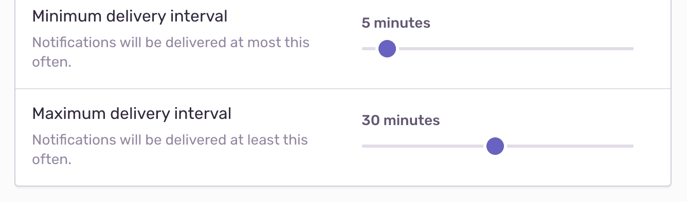

Sentry provides several configuration options to create an issue alert based on your organization's needs.

## Environment

Specify which <PlatformLink to="/configuration/environments/">environment(s)</PlatformLink> will use this particular alert rule. This control filters on the `environment` tag in your events. This filter is helpful because the urgency and workflows you apply to production alerts might differ from those you apply to alerts originating from your QA environment, for example.

The “Environment” dropdown list here has the same environments that are available for the selected project in the global “Environment” dropdown (this does not include hidden environments). Selecting "All Environments" is equivalent to having no environment filter.

## Team

You can choose a team to associate with an alert so that members of that team can edit the alert. Note that you can only make this association if you are a member of the team. If no team is selected, anyone can edit the alert.

## Alert Name

Give your alert a descriptive name, such as the team affected and the topic of the alert. For example, "Frontend Latency", "Backend Failure Rate", or "Billing Apdex".

## "When" Conditions: Triggers

"When" conditions, or triggers, specify what type of activity you'd like monitored for the issue:

- First seen
- Changes state from `resolved` to `unresolved`
- Changes state from `ignored` to `unresolved`
- Seen more than a certain number of times in an interval
- Seen by more than a certain number of unique users in an interval
- An issue affects more than {X} percent of [sessions](/product/releases/health/#session) in {time}
  - Percent of sessions affected is an approximation, calculated as the ratio of the issue’s frequency to the number of sessions in the project
  - Percent-based alerts will only trigger if the number of sessions in the last hour exceeds 50

Triggers are optional. If you don’t select a trigger, the "When" conditions are considered met by default. That is, _all_ events will meet this condition.

Learn more about issue states in [Issue States & Triage](/product/issues/states-triage/).

<Note>
This feature is available only if your organization is on either a Business or Trial plan.
</Note>

When selecting the number of events or users affected by an issue, and if you’re on the Business plan, you’ll have the option to set a dynamic threshold. For example, an alert can be triggered when an issue is affecting 10% more unique users in an hour compared to a week ago. Or when the number of events in an issue is 40% higher this week compared to 30 days ago.

## "If" Conditions: Filters

Sentry checks "if conditions", or filters, after “When” conditions are met, and these help control noise by filtering out issues that don’t match your specified criteria. You can filter on issue or event properties. If an event filter is specified, it checks only the event that triggered the alert, such as:

- The issue is older or newer than a certain duration.
- The issue has happened at least {X} times.
- The issue is assigned to {no one/a team/a member}.
- The event is from the latest release.
- The event's {attribute} {matches} {value}. Match types: equals, does not equal, starts with, ends with, contains, does not contain, is set, or is not set.
- The event's {tag} {matches} {value}. Match types: equals, does not equal, starts with, ends with, contains, does not contain, is set, or is not set.
- The event's level {matches} {level}. Match types: equal to, less than or equal to, or greater than or equal to.

Learn more about and <PlatformLink to="/enriching-events/tags/">tags</PlatformLink> and [event attributes](/product/sentry-basics/search/searchable-properties/#event-properties).

## “Then” Conditions: Actions

"Then conditions", or actions, specify what should happen when trigger and filter conditions are met:

- Send a notification to either [Issue Owners](/product/error-monitoring/issue-owners/), a team, or a member.
- Send a notification to an integration, which can include these options, depending on which integrations you have installed:
  - Send a [Slack](/product/integrations/notification-incidents/slack/) notification
  - Send a [PagerDuty](/product/integrations/notification-incidents/pagerduty/) notification
  - Send a [Microsoft Teams](/product/integrations/notification-incidents/msteams/) notification
  - Send a notification to all legacy integrations.
  - Send a notification using an [integration](/product/integrations/) built on the [Integration Platform](/product/integrations/integration-platform/)
- Create an issue for an [integration](/product/integrations/), which includes:
  - [Jira](/product/integrations/project-mgmt/jira/)
  - [Azure DevOps](/product/integrations/source-code-mgmt/azure-devops)

Learn more about [routing alerts with integrations](/product/alerts/create-alerts/routing-alerts/).

### Issue Owners

[Issue owners](/product/issues/issue-owners/) can receive notifications (emails only) when an alert is triggered.

<Note>

For early adopters, these notifications are received by email or Slack depending on the [notification settings](/product/alerts/notifications/notification-settings/) of the issue owner.

</Note>

If an issue owner is not configured or not found, either the notification won’t be sent or it’ll be sent to all project members, depending on the following setting in **[Project] > Settings > Issue Owners**.

### Team Slack Notifications

Teams can configure a Slack channel to receive alert notifications. This can be done by typing `/sentry link team` in the desired Slack channel. To view a team's associated Slack channel in [sentry.io](https://sentry.io), navigate to **Settings > Teams > [Team] > Notifications**.

## Action Interval (Rate Limit)

The action interval, or rate limit, controls how often the alert rule can be triggered for a particular issue. If alert conditions match an issue, Sentry executes the actions only if they haven't already been executed for that issue within the rate limit period. For example, if an issue meets alert conditions multiple times in a one-minute period, but your frequency threshold is one minute, you’ll only be alerted once.

The available intervals are:

- Minutes: 5, 10, 30, 60
- Hours: 3, 12, 24
- Days: 7, 30

## Project-Level Alert Settings

In **[Project] > Settings > Alerts**, you can configure alert email subject templates and digest settings. Sentry users with owner, manager, or admin permissions and above can change these default notification settings.

### Digests

The digests feature only works for issue alert emails (not notifications sent through integrations), and unlike the [action interval](#action-interval-rate-limit), limits the total number of alert emails sent for the project. This project-level setting allows you to control the minimum and maximum delivery intervals for alerts.

