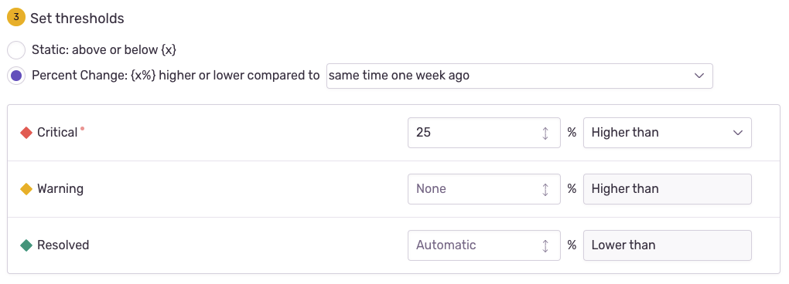

Sentry provides several configuration options to create a metric alert based on your organization's needs.

## Metric (Type + Function + Time Interval)

To create a metric alert you first need to choose a metric type. For some alert types the function is built into the alert and for others you can choose functions and parameters to apply to it. For example, if you select “Users Experiencing Errors”, that translates to the function, `count_unique(user.id)`. Since editing this function would change the nature of the alert, it is not editable and thus hidden. On the other hand, if you select “Largest Contentful Paint” the measurement used is `measurement.lcp`, you also need to choose a function, e.g. `p75()`, for a combined metric function of `p75(measurement.lcp)`.

### Metrics Types for Alerting

#### Errors

- Number of Errors
- Users Experiencing Errors

#### Sessions

- Crash Free Session Rate
- Crash Free User Rate

#### Performance

- Throughput
- Transaction Duration
- Apdex
- Failure Rate
- Largest Contentful Paint
- First Input Delay
- Cumulative Layout Shift

### Functions for Metric Types

- `count()`
- `count_unique(...)`
- `avg(...)`
- `percentile(...)`
- `failure_rate()`
- `apdex(...)`
- `count()`
- `p50()`
- `p75()`
- `p95()`
- `p99()`
- `p100()`

### Time Interval

Choose the time period over which to evaluate your metric. Your choices range between one minute and one day. Sentry evaluates the specified window each minute. For example, if you specify an hour time window, Sentry evaluates:

- At 3:00pm: 2:00pm - 3:00pm
- At 3:01pm: 2:01pm - 3:01pm
- At 3:02pm: 2:02pm - 3:02pm
- ...

## Filters

The following set of filters translates into a [Discover query](/product/discover-queries/) that is displayed in the chart at the top of the alert configuration page.

### Project

Specify which project will use this particular alert rule. Created alert rule will only process events from this project.

### Environment

Specify which <PlatformLink to="/configuration/environments/">environment(s)</PlatformLink> will use this particular alert rule. This control filters on the `environment` tag in your events. This filter is helpful because the urgency and workflows you apply to production alerts might differ from those you apply to alerts originating from your QA environment, for example.

The “Environment” dropdown list here has the same environments that are available for the selected project in the common “Environment” filter dropdown (this does not include hidden environments). Selecting "All Environments" is equivalent to having no environment filter.

### Event Type

For some metric alerts, you can set the event type that you want to be alerted about in the “Events” dropdown:

- `event.type:error` OR `event.type:default`
- `event.type:default`
- `event.type:error`
- `event.type:transaction`

### Tags & Properties

Add filters in the provided input to narrow down what you'll be alerted about, such as URL tags or other event properties. Available properties depend on your alert's event type:

- for **error** events, all error properties are available. See [Searchable Properties](/product/sentry-basics/search/searchable-properties/#event-properties) for a full list
- for **transaction** events, only the following properties are available: `release`, `transaction`, `transaction.status`, `transaction.op`, `http.method`, `http.status_code`, `os.name`, `browser.name` and `geo.country_code`.

#### Invalid Filters

While Sentry won’t allow you to create new alerts with invalid or unavailable properties, any existing alerts with unavailable fields won’t be affected. But if you need to edit or duplicate them, you'll need to remove the unavailable properties.

## Thresholds

There are two threshold types:

- **Static**: A fixed threshold, such as when there are 100 errors in a period of time.
- **Percent change**: A dynamic threshold, such as when there are 10% more errors in a time period compared to a previous period. These are also referred to as [Change Alerts](#change-alerts-percent-change).

By default, metric alerts use a fixed threshold.

### Change Alerts (Percent Change)

<Include name="feature-available-for-plan-trial-business.mdx" />

Change alerts, or alerts that use a percent change threshold, are useful when you want to know if a metric is significantly different from normal. To do this, you’ll need to pick a metric interval (when you're selecting your metric type) and a time against which to compare. One example would be comparing the number of errors in the last hour to the same time period one week ago. If errors are 25% higher in the last hour than they were in the same period a week ago, then an alert will trigger.

### Set Threshold to Trigger Alert

You can set the status of an alert rule when a threshold is met using the labels:

- Critical
- Warning
- Resolved

You must set the “Warning” threshold so that it’s triggered before the “Critical” threshold. When Sentry evaluates an alert, the alert’s status is updated to the highest severity trigger that matches. If you don’t set a “Resolved” threshold, the alert automatically resolves when it's no longer breaching the “Critical” or “Warning” conditions. You can also resolve alerts manually.

### Auto-Resolve

By default, metric alerts are resolved automatically when the specified metric is no longer breaching the “Critical” or “Warning” conditions. However, you can set a different resolution threshold. For example, suppose a normal level of errors for your app is less than 2000/minute, and you want to be alerted when that exceeds 5000/minute. You might want the alert to resolve only if the level of errors goes back below 2000/minute, not 5000/minute. By setting the "Resolved" threshold this way, if the error level comes back down to only 4000/minute, which you’d consider problematic even though it’s below your alert threshold, the alert won't resolve.

## Actions

Actions define how you and your team will be alerted:

- Send an email to a member or team. If sent to a member, the member's personal project alert opt-out settings are overridden.
- Send a [Slack](/product/integrations/notification-incidents/slack/) notification.
- Trigger a [PagerDuty](/product/integrations/notification-incidents/pagerduty/) incident.
- Send a [Microsoft Teams](/product/integrations/notification-incidents/msteams/) notification.
- Send a request using [Sentry integrations](/product/integrations/integration-platform/).

Learn more about [routing alerts with integrations](/product/alerts/create-alerts/routing-alerts/).

## Rule Name

Give your alert a descriptive name, such as the team affected and the topic of the alert. For example, "Frontend Latency", "Backend Failure Rate", or "Billing Apdex". This name must be **unique at the organization level**; that is, no other metric alert created in your org can have the same rule name.

## Team

You can choose a team to associate with an alert so that members of that team can edit this alert. Note that you can only make this association if you are a member of the team. If no team is selected, anybody can edit the alert.
