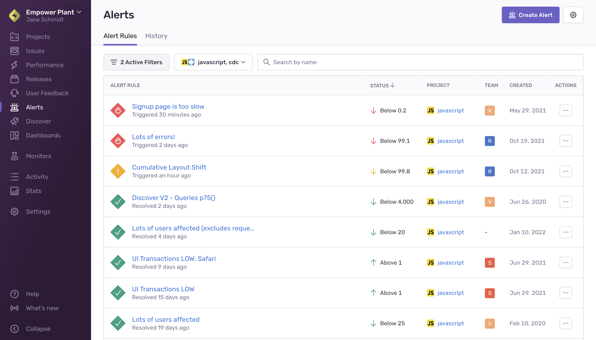

Alerts provide real-time visibility into problems with your code and the impact on your users. There are several types of alerts available with customizable thresholds and integrations.

From the **Alerts** page in [sentry.io](https://sentry.io), you can create new alert rules and manage existing ones. The “Alert Rules” tab displays your existing alert rules, along with their current status, project, team, and creation date. By default, the list is filtered so that only alerts associated with the teams you're a member of, as well as ones that aren't associated with any team, are displayed. You can change this using the filter button.

The **Alerts** page also displays a “History” tab where you can find a list of metric alerts with information like when it was triggered and how long it was active.

## Issue Alerts

[Issue alerts](/product/alerts/alert-types/#issue-alerts) trigger whenever any issue in a project matches specified criteria. You can create alerts for issue-level changes, such as:

- New issues
- Issue frequency increasing
- Resolved and ignored issues becoming unresolved

You can find a full list of issue alert triggers in [Issue Alert Configuration](/product/alerts/create-alerts/issue-alert-config/#when-conditions-triggers).

## Metric Alerts for Errors & Performance

[Metric alerts](/product/alerts/alert-types/#metric-alerts) trigger when a [metric](/product/performance/metrics/) is breached for either error or transaction events. Use metric alerts to monitor a finite and known set of metrics and components you care about, such as error frequency or performance metrics in your entire project, on important pages, or with specific tags.

Create alerts to monitor metrics, such as:

- Total errors in your project
- [Latency](/product/performance/metrics/#latency): min, max, average, percentile
- [Failure rate](/product/performance/metrics/#failure-rate)
- Crash free session or user rate for monitoring release health
- Custom metrics

You can find a full list of available metric alerts in [Metric Alerts](/product/alerts/alert-types/#metric-alerts).

## Creating Alerts

When you create a new project in [sentry.io](https://sentry.io), you can select a default issue alert. However, you can also [create your own alerts](/product/alerts/create-alerts/) to suit your team’s needs, using these [best practices](/product/alerts/best-practices/) as a guide.

## Muting Alerts

Issue alerts can be muted on the alert rule details page by clicking the "Mute" button. This will mute the alert from notifying you until you click "Unmute". If you want to mute the alert from firing entirely, select "Mute for everyone" from the dropdown.

## Notifications

Besides alerts, Sentry sends you notifications about various things like [issue state changes](/product/issues/states-triage/), [release deploys](/product/releases/), and [quota usage](/product/accounts/quotas/). You can fine tune these notifications, as well as your personal alert settings, in **User Settings > Notifications**. Learn more about notifications and adjusting their associated settings in [the full documentation](/product/alerts/notifications/).

## Learn more

<PageGrid />
