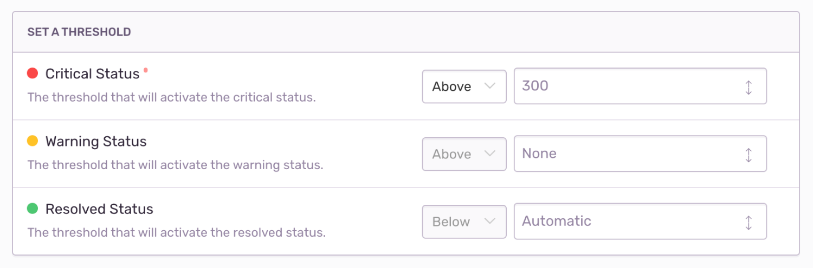

Metric alerts tell you when a metric breaches a threshold, such as a spike in the number of errors in a project, or a change in a performance metric like [latency](/product/performance/metrics/#latency), [Apdex](/product/performance/metrics/#apdex), [failure rate](/product/performance/metrics/#failure-rate), and [throughput](/product/performance/metrics/#throughput-total-tpm-tps).

The minimum role required to create alerts is member. Sentry users with manager or owner permissions can change the minimum role requirement in **Settings > General Settings > Let Members Create and Edit Alerts**.

## Alert Builder

The alert builder sets the metric alert's triggers: Critical (required) and Warning (optional). The warning trigger's threshold must be breached before the critical trigger. Triggers are evaluated approximately every minute from the highest severity to lowest.

Sentry creates an alert with the severity of the matched trigger (warning or critical). If an alert is already active, its status is updated. If no resolution threshold is specified, the alert will automatically resolve when it's no longer violating the critical or warning conditions. You can also resolve alerts manually.

When Sentry creates an alert or an existing alert changes status, the trigger's actions are executed. Possible actions are:

- Send an email (to a member or team). If sent to a member, the member's personal project alert opt-out settings are overridden.
- Send a [Slack](/product/integrations/slack/) notification.
- Trigger a [PagerDuty](/product/integrations/pagerduty/) incident.
- Send a request to a webhook (via [internal integrations](/product/integrations/integration-platform/#internal-integrations)).

## Alert Details

The **Alert Details** page shows you the history of an alert rule. The page includes details such as, the alert rule conditions, the current status of the alert, and a graph showing the historical trend of the metric being measured. The page includes a summary of how much time the alert spent in each state (Critical, Warning, or Resolved), which is displayed as percentages, and details of each time the alert was triggered.

The page also includes a list of suspect issues or transactions related to the metric, to help pinpoint the root problem more quickly. You can see what might have caused the alert to be triggered, and then open the metric in **[Discover](/product/discover-queries)** to find more information. 

