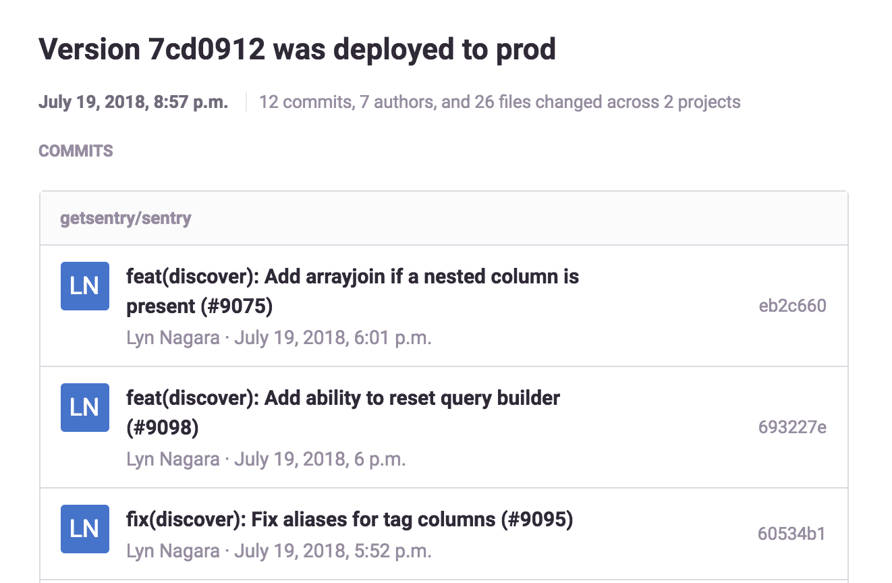
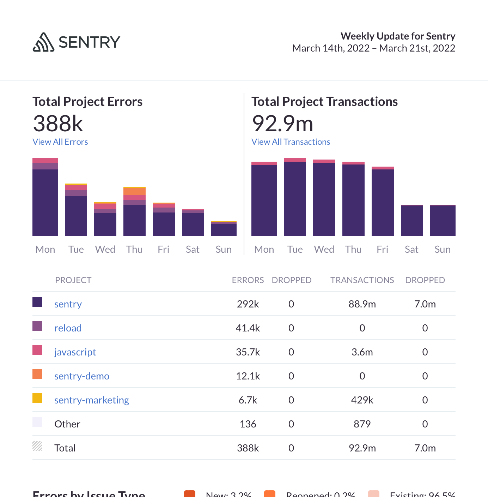

Sentry sends you notifications regarding workflow activities, [release deploys](/product/releases/), and [quota usage](/product/accounts/quotas/), as well as weekly reports. These notifications let you know about:

- [Workflow](#workflow-notifications): Activity involving user actions and state changes on issues. This includes activities such as issue resolution, assignment, comments, and regressions.
- [Deploy](#deploy-notifications): When a release you have commits on is deployed.
- [Quota](#quota-notifications): Approaching quotas, exceeded quotas, and spike protection.
- [Weekly Reports](#weekly-reports): A summary of your organization's Sentry activity.

You can manage these notifications in **User Settings > Notifications**.

## Workflow Notifications

Sentry sends workflow notifications to let you know about [issue state](/product/issues/states-triage/) changes. Workflow relates to actions that help you manage your issues, such as changing an issue’s state or commenting on it. By default, Sentry sends these notifications by email to members who are subscribed to the issue (see below for how subscription is determined). Workflow notifications are sent for:

- **Issue Resolved**: When a new issue is spotted in your code, it's in the Unresolved state. The issue state changes to Resolved when a project team member resolves it, either by manually changing its state in [sentry.io](https://sentry.io)) or by submitting a fix, or because of the project’s auto-resolve feature (if configured).
- **Issue Escalating**: When the number of events an issue has is significantly higher than the previous week, based on the [escalating limit calculation](/product/issues/states-triage/escalating-issues/#escalating-limit-calculation).
- **Regressions**: A regression happens when the state of an issue changes from Resolved back to Unresolved. An email is sent to all project team members.
- **Comments**: When a team member adds a new comment in the “Activity” tab of the detail page for the issue.
- **Assignment**: When an issue is assigned or unassigned.
- **User Feedback**: When an issue has new <PlatformLink to="/enriching-events/user-feedback/">user feedback</PlatformLink>.
- **Event Processing Problems**: When there's a problem with processing error events you've sent to Sentry.

You receive workflow notifications when you’re subscribed to an issue, and you subscribe to issues by:

- Clicking the subscribe bell icon on an issue
- Involvement in a commit related to the issue
- Commenting on or bookmarking the issue
- Mention of you or your team in the issue
- You or your team being assigned to the issue
- Archiving an issue until it escalates

These notifications may have some overlap with alerts that are configured for a project.

## Deploy Notifications

Sentry sends deploy notifications to users who have committed to the release that was deployed. Learn more in the [deploy documentation](/product/releases/setup/#notify-sentry).

## Quota Notifications

Sentry sends quota notifications to all owners of an organization when:

- 80% of the organization's error, transaction, and attachment volume has been depleted.
- Errors or transactions have exceeded the organization's quota, which includes on-demand capacity

You cannot change or disable these notifications. Learn more in the [full Quotas documentation](/product/accounts/quotas/).

## Weekly Reports

Sentry sends weekly reports every Monday, by email. Reports contain a summary of your organization's Sentry activity over the last week.

