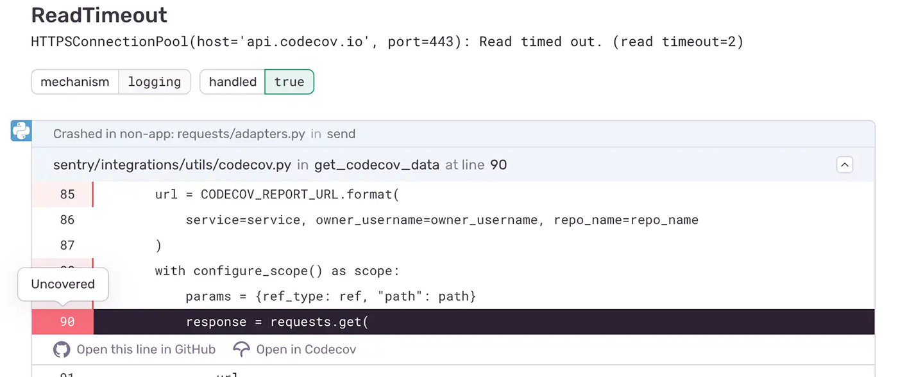

Sentry uses code-mappings to determine the repository and default branch for the stack trace frame to query Codecov's coverage report endpoint. The endpoint gives Sentry the coverage state for each line so that it can be applied to the stack trace in the UI. This makes it possible for users to see the untested code that's causing errors, including whether it's partially or fully covered directly in the stack trace. This helps you avoid similar errors in the future.

