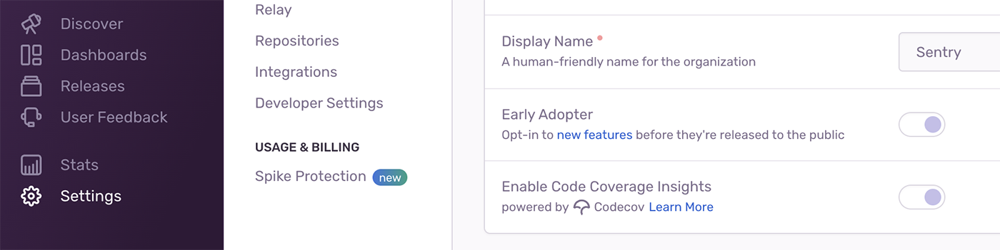

If you're a user of both Codecov and Sentry, you can enable the Codecov integration with 1 click in your **Organization Settings** page in the Sentry app. You'll be able to see whether you have partial or full test coverage for the line of code that's causing an error, directly in your stack trace in Sentry.

## Prerequisites

There are a few prerequisites that have to be fulfilled in order for Codecov to work in Sentry. You have to have:

- Owner or manager-level permissions in Sentry.io.
- The [Github Integration](/product/integrations/source-code-mgmt/github/) installed in Sentry with [Code Mappings](/product/integrations/source-code-mgmt/github/#stack-trace-linking) enabled.

  <Note>
    If you have the Github integration set up correctly, your stack traces will show an
    “Open this line in Github” prompt that will take you to your app's code.
  </Note>

- A [Codecov](https://about.codecov.io/) account with [Source Code Coverage](https://about.codecov.io/product/feature/source-code-coverage/) enabled.

## Enable Codecov Insights

Once the prerequisites have been met, you can enable Codecov by going to the **Settings** page in Sentry and toggling “Enable Code Coverage Insights” to on.

<Note>
  Sentry automatically checks to see if you have your GitHub Org in Codecov every 24
  hours. If Codecov hasn't been enabled and we find that you've met all the prerequisites
  listed above, we'll turn it on for you.
</Note>
