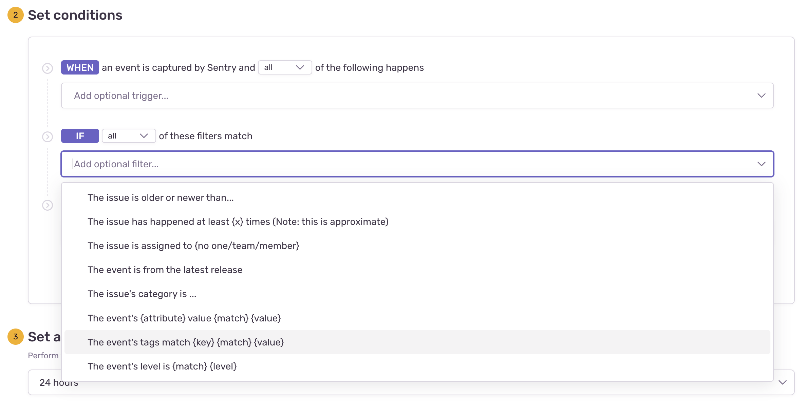
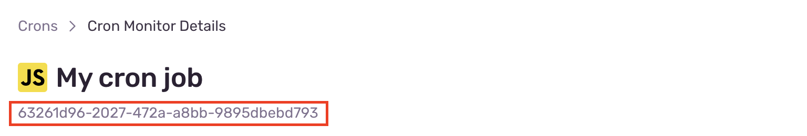
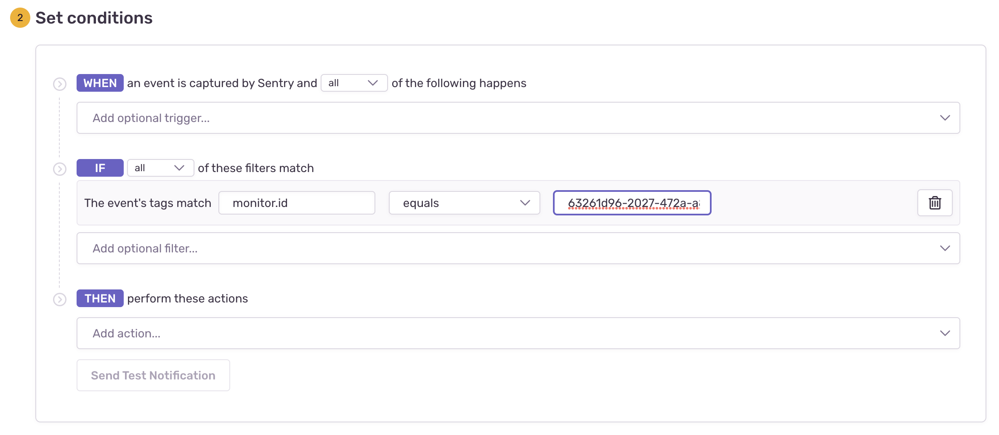

## Overview

When your recurring job fails to check-in on schedule or runs beyond its configured max runtime, Sentry will create an error event with a `monitor.id` tag. To alert on these error events, you can utilize the existing issue alerts feature in Sentry. Here's a brief guide on how to set it up specifically for Cron Monitors.

## Step 1: Set Filters

Navigate to the alerts tab in Sentry and create a new issue alert. You should see the issue alert builder. From here, you can start configuring your cron monitor alert rule. First, select the project corresponding to your cron monitor. Then, in the `IF` section of the alert rule configuration, add a new filter. You'll want to select the filter labeled "The event's tags match {key} {match} {value}".

<Note>

You can use the "Number of events in an issue is" trigger filter to only alert you when the monitor has failed multiple consecutive check-ins.

For example if you're job should run every minute you could use the trigger filter **Number of events in an issue is more than 10 in 15 minutes** to be alerted after it's failed 10 times in that window.

</Note>

Fill in the `key` text field with `monitor.id`, then have it `equal` the id of the cron monitor that you'd like to be alerted on. You'll see your cron monitor's id in the cron monitor's detail page.

After filling in those fields your finished alert rule filter should look something like:

## Step 2: Choose Notification Actions

Finalize your alert rule by adding actions and assigning the alert rule to a team. More information on customizing alert rule actions can be found [here](/product/alerts/create-alerts/issue-alert-config/#then-conditions-actions).

Lastly, save your newly created issue alert rule. You should start getting alerts on new errors created from your cron monitor!
