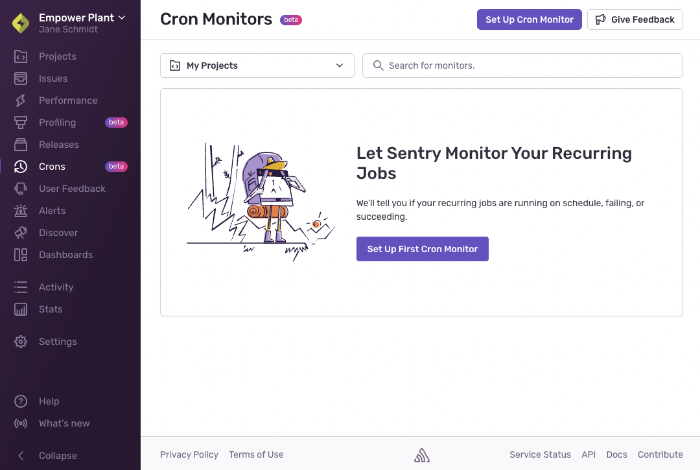
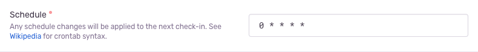
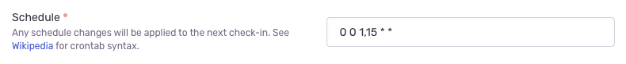
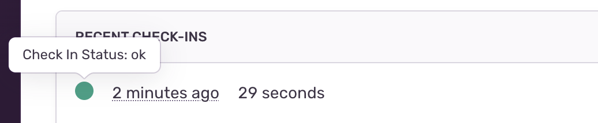

## Step 1: Create a Cron Monitor

Sentry Cron Monitoring allows you to monitor any job running on a scheduled interval. To get started, create a new cron monitoring service for one of your projects:

1. Select **“Crons”** from the sidebar.

2. Click the **"Set Up Cron Monitor"** button.
   

3. In the details section, select the project to which you'd like your Cron Monitor to be attached. That's where you'll see any job execution issues.

4. Name your job. For example, "Generate Daily Invoices".

5. In the configuration section, enter the maximum number of minutes allowed for a job to run before it's considered failed. For example, if you enter 30, any job running for more than 30 minutes will be considered failed and a new issue will be generated.

6. Select whether you'd like to schedule job monitors using Crontab syntax or time intervals:

   - **Crontab:** A Crontab schedule uses Crontab syntax. This works well if your job runs on a very rigorous schedule. Crontab syntax lets you verify if your job has run every day, every hour, or even in smaller increments. _Learn more about the [Crontab syntax](https://en.wikipedia.org/wiki/Cron)._ Crontab examples:
     
     Example of a Crontab for every hour.
     
     Example of a Crontab for every month on the 1st and 15th day.
   - **Interval:** If getting granular with scheduling is less important, the Interval schedule type may be better suited for your needs. It allows you to schedule your job to run every X years, hours, minutes, or anything in-between.

7. Enter the acceptable number of minutes an expected check-in can be late by before it's considered failed, based on the schedule above. For example, if your monitor is configured as a Crontab of `0 * * * *` (every hour at minute 0) and the check-in margin is defined as 10 minutes, your job won't be considered failed as long as it checks in by hour X, minute 10.

8. Click on **"Next Steps"** at the bottom of the page to configure your health checks.

## Step 2: Set Up Health Checks

Sentry monitors your job status via regular health checks emitted by your application. A health check consists of two (2) HTTP "check-in" requests: an initial request emitted before the start of your job execution to create a check-in, and a final update request emitted after your job completes, to update the status of your check-in.

Creating these health checks can be done automatically, using Sentry's CLI, or manually via HTTP. To get started, [install](/product/cli/installation) and [configure](/product/cli/configuration) your CLI, or simply use the example below to construct an HTTP request in your favorite language:

```bash {tabTitle: CLI}
# sentry-cli monitors run <monitor_id> -- <command> <args>

# Example for a Python job:
sentry-cli monitors run 63261d96-2027-472a-a8bb-9895dbebd793 -- python path/to/file.py
```

```python
import requests

headers = {'Authorization': 'DSN ___PUBLIC_DSN___'}
monitor_id = '' # Write your monitor_id here

# Create the check-in
json_data = {'status': 'in_progress'}
response = requests.post(f'https://sentry.io/api/0/monitors/{monitor_id}/checkins/', headers=headers, json=json_data)
checkin_id = response.json()['id']

# Execute your scheduled task code here...

# Update the check-in status (required) and duration (optional)
json_data = {'status': 'ok', 'duration': 3000}
response = requests.put(f'https://sentry.io/api/0/monitors/{monitor_id}/checkins/{checkin_id}/', headers=headers, json=json_data)
```

```bash {tabTitle: curl}
# Create the check-in and save the returned CHECKIN_ID
$ curl -X POST \
    'https://sentry.io/api/0/monitors/{MONITOR_ID}/checkins/' \
    --header 'Authorization: DSN ___PUBLIC_DSN___' \
    --header 'Content-Type: application/json' \
    --data-raw '{"status": "in_progress"}'

# Execute your scheduled task command here...

# Update the check-in status (required) and duration (optional)
$ curl -X PUT \
    'https://sentry.io/api/0/monitors/{MONITOR_ID}/checkins/{CHECKIN_ID}/' \
    --header 'Authorization: DSN ___PUBLIC_DSN___' \
    --header 'Content-Type: application/json' \
    --data-raw '{"status": "ok", "duration": 3000}'
```

### Request Parameters

`monitor_id`:

: **Required.** Your monitor ID can be found on the monitor details page.


`status`:

: **Required.** The status of your job execution and whether it was completed successfully or unsuccessfully. The values accepted are `in_progress`, `ok` or `error`.

`checkin_id`:

: **Required.** The check-in id to use when updating a check-in to mark the completion or failure of a scheduled job. You can also supply "`latest`" for this parameter in order to retrieve the most recent check-in, more info in [the API documentation](/api/crons/update-a-checkin/)

`duration`:

: **Optional.** The runtime of the job in milliseconds. If this value is not provided, a duration will be automatically calculated based on the amount of time elapsed from check-in creation to updating a check-in as successful or failed.

More API docs can be found in [the API documentation](/api/crons/).

Once these health checks are set up, your Cron Monitor is ready to observe and report on future scheduled job executions.

To verify that everything is set up correctly make sure that you are receiving recent check-ins with an "ok" status.



If your own cron monitor isn't producing "ok" check-ins even when running as expected, consult the [troubleshooting](/product/crons/troubleshooting/) section.

## Next Steps

- **[Setup alerting for missed checkins](../alerts/)**
