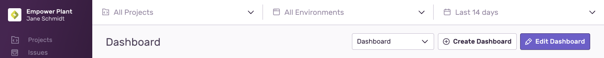
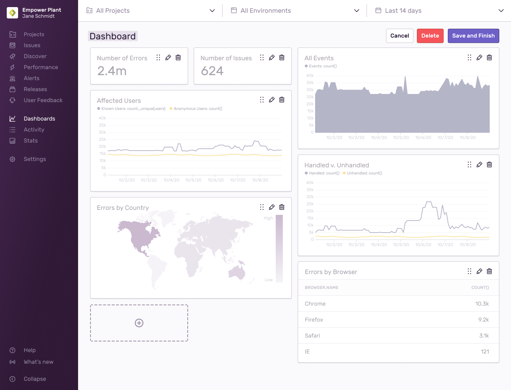
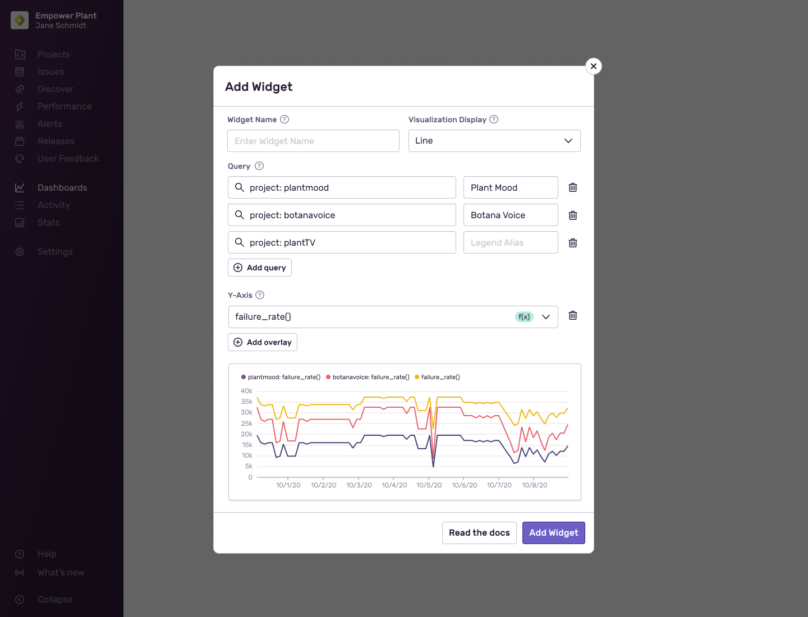

<Note>

This feature is available only if your organization is on either a Business or Trial plan.

</Note>

Custom Dashboards are shared with users across your organization. Once you enable this functionality, users will be able to view each other’s custom dashboards from the dropdown menu in the top right. Note any changes you make in the starting [Default View](/product/dashboards/) will be global, and will appear for users across the entire organization.

Both "Create Dashboard" and "Edit Dashboard" will take you to Edit Mode which will lightly gray out the widgets and present you with several widget and dashboard actions you can take.

### Dashboard Actions

- Cancel - This will undo everything done to this dashboard and any corresponding widgets.
- Delete - The delete button will delete the entire dashboard.
- Save and Finish - This will save and finish any changes you’ve made.

### Widget Actions

- Move a widget - Relocate a widget by dragging the 6-dotted icon
- Edit a widget - Click on the pencil icon to open the [Widget Builder]
- Delete a widget - Click on the trash can icon
- Add a widget - Click on the dashed outline around a + icon to open the [Widget Builder]

## Widget Builder

When you add or edit an existing widget, you’ll be prompted with a form and preview of your widget.

- Widget Name - The name that would appear at the top of each widget
- Visualization Display - A selection between 6 different visualization types
- Query - The search parameters that define what you are investigating. Add additional queries to compare projects, organizations, releases, etc. Each query will have a legend alias you can name to view more easily in any of the time series charts. For more on how to build a query, check out some of the rules we have for our [Discover Query Builder](/product/discover-queries/query-builder/).
- Y-Axis - The attribute of the search parameters you want to map out. By default, count() will be selected. Changing this to a duration will change the Y-Axis to milliseconds or seconds. Adding an overlay will add another set of data to compare. For example, to reflect P50, P75 and P90, you’ll require three overlays. If the units conflict, the charts will always base it off the first line.

## Visualization Types

### Area, Bar, and Line Charts

These visualizations allow you to plot one or more aggregate functions as
a time series. Each chart type allows you to solve different problems:

- Bar charts will group results by day, making them good for daily roll-ups or
  as 'big picture' summaries. An example would be 'count of errors per day'.
- Area charts are ideal for showing results that are cumulative or where you want to
  show a breakdown. An example would be 'count of errors for each major browser'.
- Line charts are a general-purpose visualization. Try to make the Y-Axis units match if you add multiple overlays. Otherwise, mixing count with duration will not yield useful results.

### Table Results

Table results display the top results of a [Discover Query](/product/discover-queries/). This
visualization is well suited to showing key fields and related aggregates. For
example 'duration percentiles for the most frequently visited transaction
names'.

### World Map

Events are queried using the given function and `geo.country_code`. The results are plotted as a density value
on a world map. An example scenario would be 'in which countries are users experiencing the most errors'. You can zoom the map using the mouse wheel, or pan the map by clicking and dragging the map around.

### Big Number

A big number visualization displays the current value of a single function. This visualization is well
suited for high-level aggregates. An example scenario would be 'p95 of all
transactions'.
