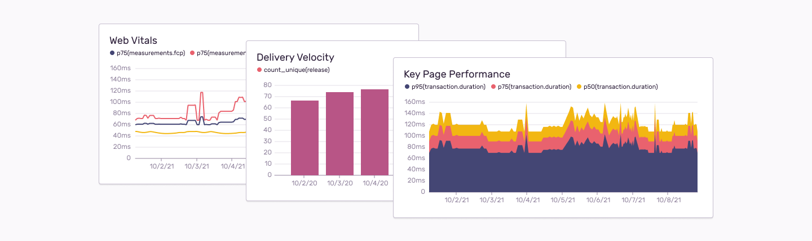

<Note>

This feature is available only if your organization is on either a Business or Trial plan.

</Note>

Custom Dashboards are shared across your organization, and users can view each other’s custom dashboards by selecting them from the dropdown menu in the top right. Note that any changes you make in the [default dashboard](/product/dashboards/) (called Dashboard) are global, and will appear for users across the entire organization.

Clicking either "Create Dashboard" or "Edit Dashboard" will take you into edit mode, which allows you  to edit at both the dashboard and widget level. When you edit an existing dashboard, you can tell that you’re in edit mode because the widgets are lightly grayed out.

At the dashboard level, you can:
- Rename the dashboard
- Add and remove widgets
- Rearrange existing widgets

At the widget level, you can:
- Rename the widget
- Change the queries
- Provide legend aliases
- Change the Y-Axes

## Widget Builder

When you add a widget or edit an existing one, you’ll be prompted with a form and preview of the visualization.

- Widget Name: The name that appears at the top of each widget.
- Visualization Display: The selected [visualization type](#visualization-types).
- Query: The search parameters that define what you are investigating. Add additional queries to compare projects, organizations, releases, and so on. Each query has a legend alias you can name to view more easily in any of the time series charts. For more information on how to build a query, check out some of the rules we have for our [Discover Query Builder](/product/discover-queries/query-builder/).
- Y-Axis: The attribute of the search parameters you want to map out. By default, count() is selected. Changing this to a duration will change the Y-Axis to milliseconds or seconds. Adding an overlay will add another set of data to compare. For example, to reflect P50, P75, and P90, you’ll require three overlays. If the units conflict, the charts will always base it off the first line.

## Visualization Types

### Line, Bar, and Area Charts

Line, bar, and area chart visualizations allow you to plot one or more aggregate functions as a time series.

Each chart type allows you to solve different problems:
- Line charts are a general-purpose visualization. Make sure the Y-Axis units match if you add multiple overlays. Mixing count with duration will not yield useful results.
- Bar charts will group results by day, making them good for daily roll-ups or
  as 'big picture' summaries. An example would be 'count of errors per day'.
- Area charts are ideal for showing results that are cumulative or where you want to
  show a breakdown. An example would be 'count of errors for each major browser'.

### Table Results

Table results display the top results of a [Discover Query](/product/discover-queries/). This
visualization is well suited to showing key fields and related aggregates. For
example 'duration percentiles for the most frequently visited transaction
names'.

### World Map

Events are queried using the given function and `geo.country_code`. The results are plotted as a density value
on a world map. An example scenario would be 'in which countries are users experiencing the most errors'. You can zoom the map using the mouse wheel, or pan the map by clicking and dragging the map around.

### Big Number

A big number visualization displays the current value of a single function. This visualization is well
suited for high-level aggregates. An example scenario would be 'p95 of all
transactions'.
