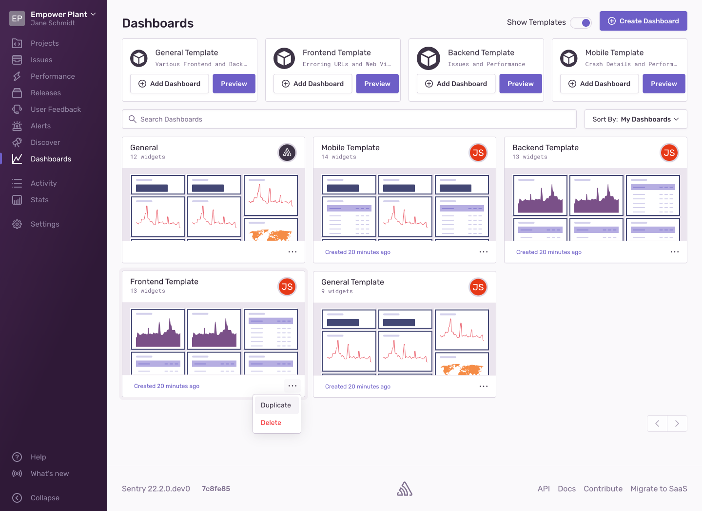
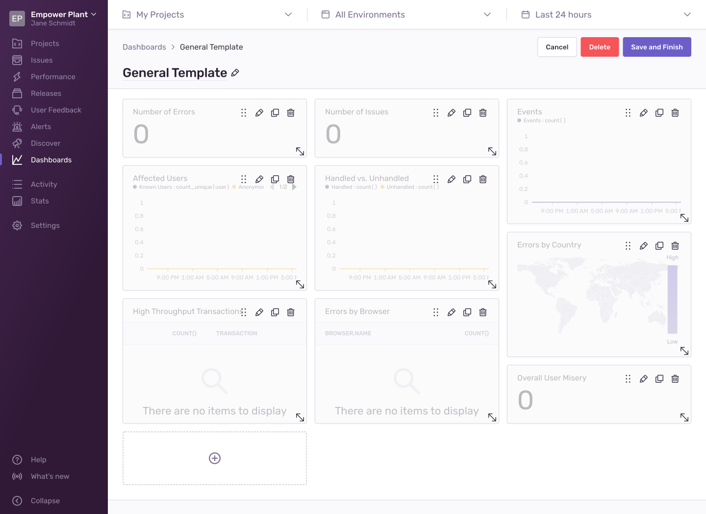

<Note>

This feature is available only if your organization is on either a Business or Trial plan.

</Note>

Custom dashboards are shared across your organization, and users can view each other’s custom dashboards in the management view. Note that any changes you make are global, and will appear for users across the entire organization.

## Manage Dashboards

When you have either a Business or Trial Plan, navigating to **Dashboards** takes you to a view where you can manage dashboards instead of the [default dashboard](/product/dashboards/). From here, you can:

- [Create a dashboard](#create-dashboards)
- [Create a dashboard from a template](#create-dashboards-from-templates)
- Duplicate a dashboard
- Delete a dashboard

### Create Dashboards

Clicking "Create Dashboard" takes you to a new dashboard where you can immediately begin adding widgets. When you're creating a new dashboard or editing an existing one, the widgets are slightly grayed out. From here, you can:

- Rename the dashboard
- Add and remove widgets
- Rearrange existing widgets
- Resize existing widgets

### Create Dashboards From Templates

When the "Show Templates" toggle is enabled, several default dashboard templates are displayed. You can add each template directly to the list of dashboards by clicking "Add Dashboard", or preview it by clicking "Preview". You have to add a template before you can edit the resulting dashboard. You can also duplicate or delete a dashboard created from a template (this does not delete the template).

### Dashboard Filters

Dashboard filters are applied to all the widgets in your dashboard. They consist of [page filters](/product/sentry-basics/search/#page-filters) that allow you to narrow down the widget results to certain projects, environments, and date ranges, and a release filter that restricts the data to certain releases. Changing a dashboard filter will prompt you to "Save" or "Cancel". To persist filter changes to your dashboard, click "Save", or click "Cancel" to discard the changes.

## Widget Builder

When adding a widget or editing an existing one, you will be taken to a new page where you can see the dashboard widget builder. The widget builder has several configuration options that you can use to shape data and add information to your dashboard. Learn more in the [Widget Builder documentation](/product/dashboards/widget-builder/).

## Widget Library

The widget library contains a collection of prebuilt widgets you can add to your [custom dashboards](/product/dashboards/custom-dashboards/). Learn more in the [Widget Library documentation](/product/dashboards/widget-library/).
