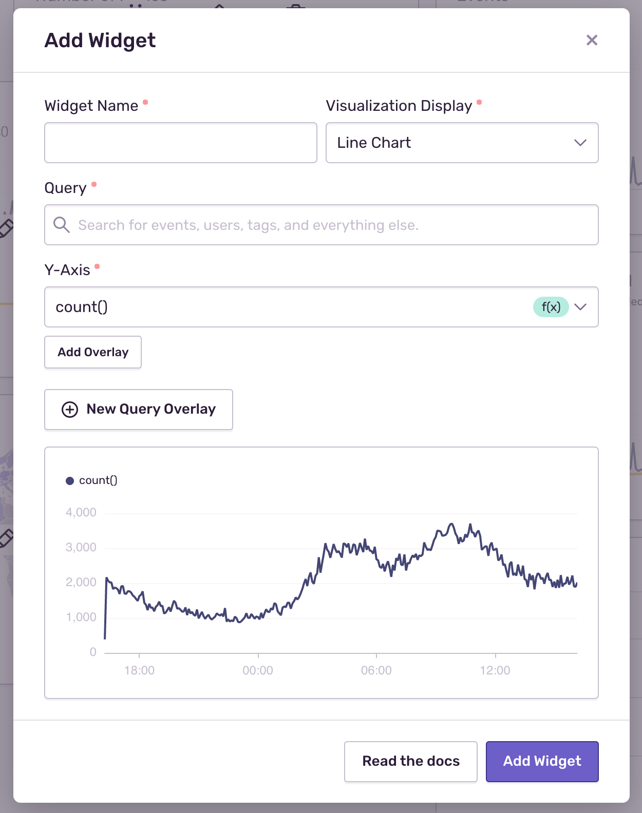

<Note>

Editing dashboards is available only if your organization is on either a Business or Trial plan.

</Note>

When you visit Dashboards for the first time, you'll find a dashboard with a set of pre-built widgets. You can build a new dashboard or edit an existing dashboard by clicking on either "Create Dashboard" or "Edit Dashboard".

Next, you can build or edit widgets:

- Edit an existing widget by clicking the pencil.
- Create a new widget by clicking the widget panel then with the plus icon.

This will open up the widget builder:

A widget is composed of the following components:

- Name of the widget
- Visualization display type
- One or more Discover queries with:
  - Search conditions
  - One or more fields, tags, measurements, or functions

## Visualization Types

- Area chart
- Bar chart
- Line chart
- Table results
- World map
- Big number

### Area, Bar, and Line Charts

These visualizations allow you to plot one or more aggregate functions as
a time series. Each chart type allows you to solve different problems:

- Bar charts will group results by day, making them good for daily roll-ups or
  as 'big picture' summaries. An example would be 'count of errors per day'.
- Area charts are ideal for showing results that are cumulative or where you want to
  show a breakdown. An example would be 'count of errors for each major browser'.
- Line charts are a general-purpose visualization. Make sure that
  all Y-Axis functions are of the same type. Mixing counts and durations will
  yield results that are not useful.

### Table Results

Table results display the top five results of a [Discover query](/product/discover-queries/). This
visualization is well suited to showing key fields and related aggregates. For
example 'duration percentiles for the most frequently visited transaction
names'.

### World Map

Events are queried using the given function and `geo.country_code`. The results are plotted as a density value
on a world map. An example scenario would be 'in which countries are users experiencing the most errors'.

You can zoom the map using the mouse wheel, or pan the map by clicking and dragging the map around.

### Big Number

A big number visualization displays the current value of a single function. This visualization is well
suited for high-level aggregates. An example scenario would be 'p95 of all
transactions'.
