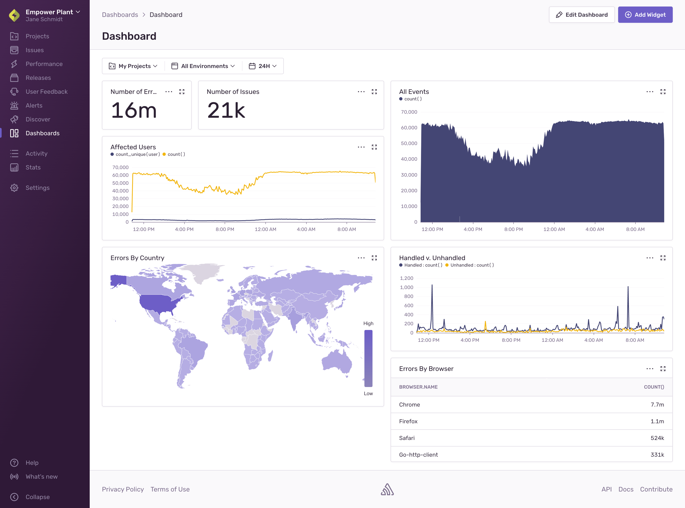
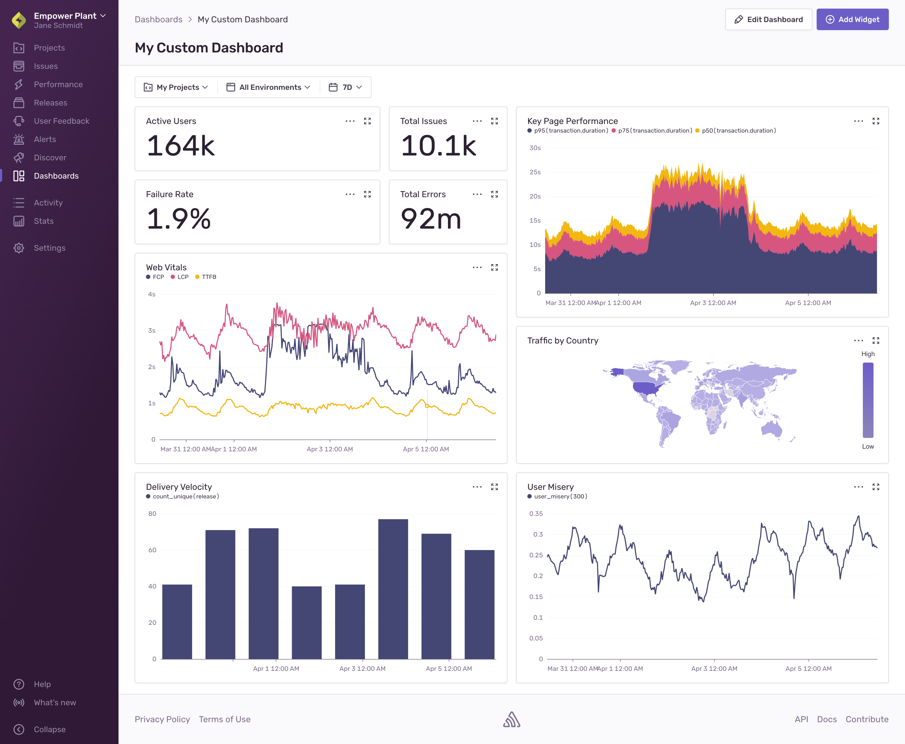

Dashboards provide you with a broad overview of your application’s health by allowing you to navigate through error and performance data across multiple projects. Dashboards are made up of one or more widgets, and each widget visualizes one or more [Discover queries](/product/discover-queries/).

All widgets in the same view reflect the date range indicated in the Global Selection Header and update synchronously if you update that date range. You can also zoom in on any time series visualizations you may want to investigate, and all of the widgets reflect the time period that you’ve zoomed in on.

## Default Dashboard
The default dashboard includes the following widgets:

- Number of Errors: Shows the total numbers of errors you have.
- Number of Issues: Shows the total number of issues you have.
- All Events: Shows all errors, transactions, and more.
- Affected Users: Compares Known Users to Unknown Users.
- Handled v. Unhandled: Compares Handled Errors to Unhandled Errors.
- Errors by Country: Shows a world map of error frequency.
- Errors by Browser: Compares the number of errors by browser name.

## Customization
If you’d like to edit the default dashboard or build out multiple ones, each with their own set of unique widgets, you may want to consider our [Custom Dashboards](/product/dashboards/custom-dashboards/) feature which enables you to create more robust views such as the one below.

