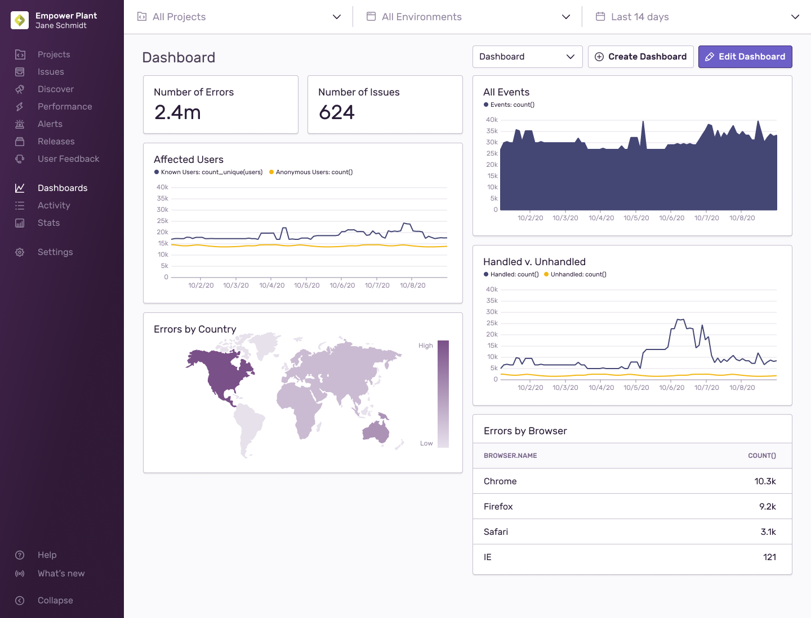
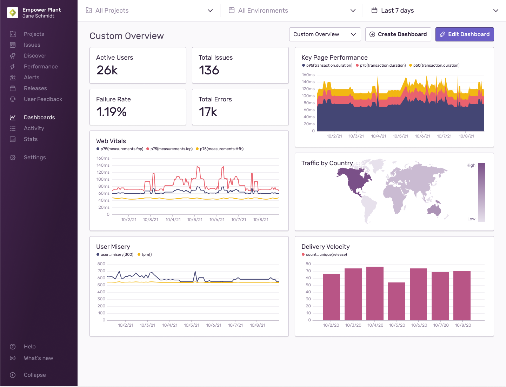

<Note>

Dashboards are available only if you're in the Early Adopter program. Features available to Early Adopters are still in progress and may have bugs. We recognize the irony.

If you’re interested in being an Early Adopter, you can turn your organization’s Early Adopter status on/off in General Settings. This will affect all users in your organization and can be turned back off just as easily.

</Note>

Dashboards will enable you to get a broad overview of your application’s health. You’ll be able to navigate through error and performance data across multiple projects and zoom in on any time series visualizations you may want to investigate. All widgets in the same view will update synchronously to reflect the new date range in the Global Selection Header.

## Default Dashboard
The dashboard view you’ll start out with will contain the following widgets:

- Number of Errors - Shows the total numbers of errors you have.
- Number of Issues - Shows the total number of issues you have.
- All Events - Shows all errors, transactions, CSP, and more.
- Affected Users - Compares Known Users v. Unknown Users.
- Handled v. Unhandled - Compares Handled Errors v. Unhandled Errors.
- Errors by Country - Shows a world map of error frequency.
- Errors by Browser - Compares number of errors by browser name.

## Custom Dashboards
If you’d like to edit the default view or build out multiple dashboards, each with their own set of unique widgets, you may want to consider our [Custom Dashboards](/product/dashboards/custom-dashboards/) feature which enables you to create more robust views such as the one below.

