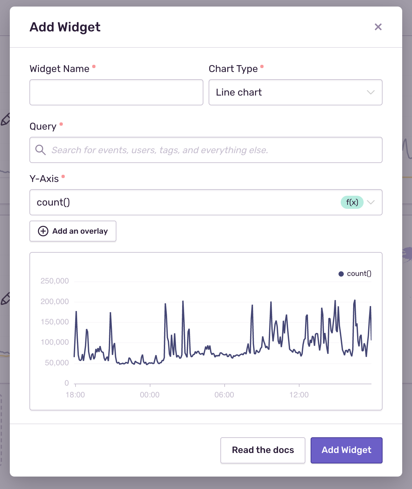

<Alert title="Note" level="info">
  Dashboards are only available if you're in the Early Adopter program. Features available to Early Adopters are still in progress and may have bugs. We recognize the irony. If you’re interested in being an Early Adopter, you can turn your organization’s Early Adopter status on/off in General Settings. This will affect all users in your organization and can be turned back off just as easily.
</Alert>

Dashboards provide the ability to build custom views of your application's health, including the ability to navigate issues and performance across multiple projects.
Dashboards are made up of one or more widgets, and each widget visualizes one or more [Discover queries](/product/discover-queries/).

Dashboards are shared across users of your organization. When visiting Dashboards for the first time, your organization is provided a set of pre-built widgets. You may edit this dashboard, or create additional dashboards to suit your organization's needs.

## Customizing Dashboards

<Alert title="Note" level="info">
  Editing Dashboards is only available if your organization is on either the Business plan or the Trial plan.
</Alert>

You can build a new Dashboard or Edit an existing Dashboard by clicking on either the "Create Dashboard" or the "Edit Dashboard" buttons on the top right-hand corner.

Next, you can build or edit widgets by:

- Click on the pencil icon to edit an existing widget.
- Click on the widget panel with the plus icon to create a new widget.

This will open up the widget builder:

A widget is composed of the following components:

- Name of the widget
- Visualization Type
- One or more Discover queries with:
  - Search conditions
  - One or more fields, tags, measurements, or functions

### Visualization Types

- Area chart
- Bar chart
- Line chart
- World map
- Big number
- Table results

#### Area, Bar, and Line Charts

These visualizations allow you to plot one or more aggregate functions as
a time series. Each chart type allows you to solve different problems:

- Bar charts will group results by day, making them good for daily rollups or
  as 'big picture' summaries. An example would be 'count of errors per day'.
- Area charts are ideal for showing results that cumulative or where you want to
  show a breakdown. An example would be 'count of errors for each major browser'.
- Line charts are a general-purpose visualization. Be mindful to ensure that
  all Y-Axis functions are of the same type. Mixing counts and durations will
  yield results that are not useful.

#### Table Results

Display top five results of a [Discover query](/product/discover-queries/). This
visualization is well suited to showing key fields and related aggregates. For
example 'duration percentiles for the most frequently visited transaction
names'.

#### World Map

Events are queried using the given function and `geo.country_code`. The results are plotted as a density value
on a world map. Example use would be 'in which countries are users experiencing the most errors'.

You can zoom the map using the mouse wheel, or pan the map by click and drag the map around.

#### Big Number

Displays the current value of a single function. This visualization is well
suited for high-level aggregates. Example use would be 'p95 of all
transactions'.

## Filter by Global Selection Header

Once you've created a dashboard, you can specify which projects, environments,
and date range you want to zoom in on at the top of the page. This can also be
found in other parts of Sentry as a top-level filter.

## Filter by Interactive Graph

Time Series visualizations have an interactive graph that allows you to zoom in.
To zoom in, simply click and drag over the area you want to investigate.
