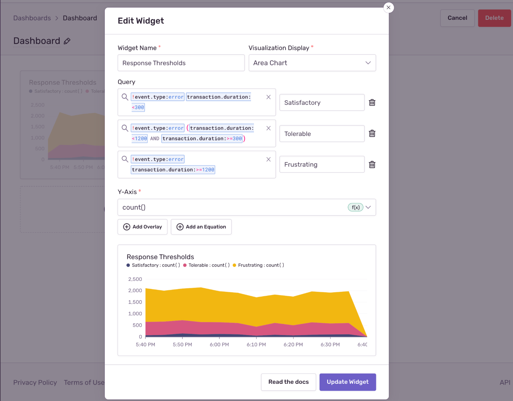

<Note>

This feature is available only if your organization is on either a Business or Trial plan.

</Note>

The widget library contains a collection of prebuilt widgets you can add to your [custom dashboards](/product/dashboards/customize-dashboards/). To access it, click on "Add Widget(s)" and switch to the "Widget Library" tab in the modal that appears.

The library includes the following widgets:

- **Distribution Duration**: A multi-y axis chart visualizing the distribution of transaction duration across various percentiles (p50, p75, and p95)
- **High Throughput Transactions**: The top five transactions with the largest number of events
- **LCP by Country**: World map showing the p75 of page load times for each country
- **Miserable Users**: The total number of unique users who have experienced slow transactions (transaction duration greater than 1200ms)
- **Slow vs Fast Transactions**: Bar chart comparing the percentage of transactions that are over 300ms (slow) and under 300ms (fast)
- **Latest Unresolved Issues**: A table of unresolved issues ordered by the most recently seen issues
- **Top Unhandled Error Types**: The top five most frequently encountered unhandled errors
- **Users Affected by Errors**: A comparison of the total number of errors and the number of unique users affected by the errors

You can change the title, queries, fields, visualization types, and sort order of these prebuilt widgets to suit your use case by clicking the context menu on the widget and selecting "Edit Widget".

## Example Use Cases

### Performance across release versions

To monitor how your app is performing on a certain release, you can modify the "Distribution Duration" widget by adding the release version to the search condition:

- Search condition 1: `!event.type:error release.version:{version}`

To compare performance with another release version, you can add another query by clicking the "Add Query" button and querying for a different release version:

- Search condition 2: `!event.type:error release.version:{another_version}`

You can also compare performance before/and after a certain version with the following conditions:

- Search condition 1: `!event.type:error release.version:<{version}`
- Search condition 2: `!event.type:error release.version:>={version}`

### Response thresholds

The "Distribution Duration" widget shows the spread of transaction duration times. This visualization can be modified to show if transaction durations are within certain target thresholds and present them as "satisfactory", "tolerable", or "frustrating" transactions. To create this type of visualization, change the "Visualization Display" to "Area Chart". Area charts stack results and are more appropriate for results that are cumulative:

- Visualization Display: `Area Chart`

Set one of the y-axis values to `count()` and remove the other two axes:

- Y-Axis: `count()`

To the first query, add the search condition for satisfactory transaction duration (this example uses 300ms as the satisfactory response threshold):

- Search condition 1: `!event.type:error transaction.duration:<300`

Add another query for the tolerable condition by clicking the "Add Query" button. In this example, we're using the [Apdex](/product/performance/metrics/#apdex) definition where tolerable response times are between the satisfactory threshold and four times the satisfactory threshold:

- Search condition 2: `!event.type:error (transaction.duration:<1200 AND transaction.duration:>=300)`

Finally, add a third query for for the frustrating transaction duration:

- Search condition 3: `!event.type:error transaction.duration:>=1200`

The chart now shows cumulative counts at different response time thresholds.

### Top issues

You can track the impact of your issues by counting the error events associated with each unique issue. Modify the "Latest Unresolved Issues" widget by selecting the "All Events" data set. Update the search condition to filter for error events:

- Data Set: `All Events`
- Search condition: `event.type:error`

Update columns to group by `issues` and apply `count()` as the aggregating function. Order count in descending order so the widget displays issues with the most error events:

- Columns: `issue, count(), any(message)`
- Sort by: `count() desc`

### Unique issues by projects

Monitoring the cardinality of issues (the number of unique issues) alongside the total number of errors in your projects can give you a sense of the impact of issues in your project. For example, low cardinality in issues and a high number of total errors indicates you have a few very high impact issues. Modify the "Latest Unresolved Issues" widget by selecting the "All Events" data set. Update the search condition to filter to error events:

- Data Set: `All Events`
- Search condition: `event.type:error`

Update columns to group by `project` and apply `count()` and `count_unique(issue)` as the aggregating functions. Order count in descending order so the widget displays projects with the most error events:

- Columns: `project, count(), count_unique(issue)`
- Sort by: `count() desc`
