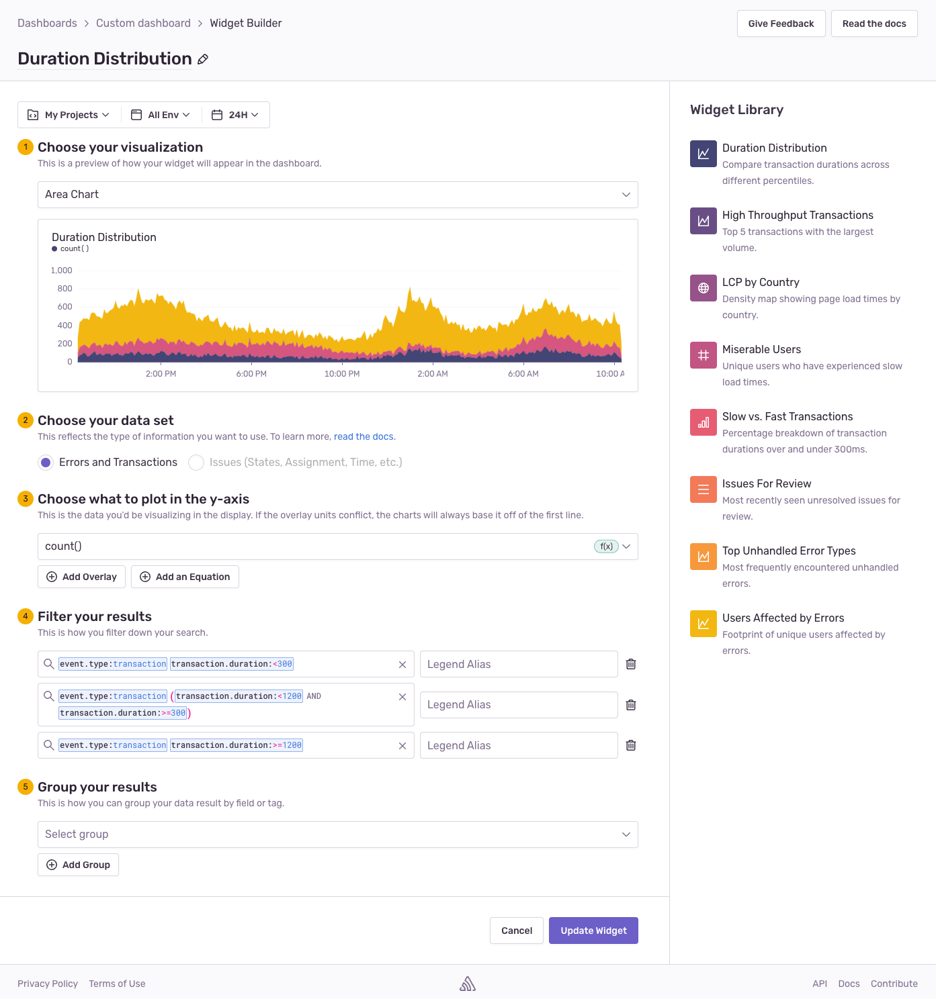

<Include name="feature-available-for-plan-trial-business.mdx" />

The widget library contains a collection of prebuilt widgets you can add to your [custom dashboards](/product/dashboards/customize-dashboards/). You can access the widget library in the right sidebar of the [widget builder](/product/dashboards/widget-builder/).

The library includes the following widgets:

- **Duration Distribution**: A multi-overlay chart visualizing the distribution of transaction duration across various percentiles (p50, p75, and p95)
- **High Throughput Transactions**: The top five transactions with the largest number of events, represented in an area chart
- **LCP by Country**: World map showing the p75 of page load times for each country
- **Miserable Users**: The total number of unique users who have experienced slow transactions (transaction duration greater than 1200ms)
- **Slow vs. Fast Transactions**: Bar chart comparing the percentage of transactions that are over 300ms (slow) and under 300ms (fast)
- **Issues For Review**: A table of unresolved issues for review, ordered by the most recently seen issues
- **Top Unhandled Error Types**: The most frequently encountered unhandled errors
- **Users Affected by Errors**: A comparison of the total number of errors and the number of unique users affected by the errors
- **Crash Rates for Recent Releases**: Percentage of crashed sessions for your recent releases
- **Session Health**: The total number of abnormal, crashed, errored, and healthy sessions

You can change the title, queries, fields, visualization types, sort order, and other fields of these prebuilt widgets to suit your use case by clicking the context menu on the widget and selecting "Edit Widget".

## Example Use Cases

### Performance across release versions

To monitor how your app is performing on a certain release, you can modify the "Duration Distribution" widget by adding the release version to the search condition:

- Search condition 1: `event.type:transaction release.version:{version}`

To compare performance with another release version, you can add another query by clicking the "Add Query" button and querying for a different release version:

- Search condition 2: `event.type:transaction release.version:{another_version}`

You can also compare performance before and after a certain version with the following conditions:

- Search condition 1: `event.type:transaction release.version:<{version}`
- Search condition 2: `event.type:transaction release.version:>={version}`

### Response thresholds

The "Duration Distribution" widget shows the spread of transaction duration times. This visualization can be modified to show if transaction durations are within certain target thresholds and present them as "satisfactory", "tolerable", or "frustrating" transactions. To create this type of visualization, change the "Visualization Display" to "Area Chart". Area charts stack results and are more appropriate for results that are cumulative:

- Visualization Display: `Area Chart`

Set one of the y-axis values to `count()` and remove the other two axes:

- Y-Axis: `count()`

To the first query, add the search condition for satisfactory transaction duration (this example uses 300ms as the satisfactory response threshold):

- Search condition 1: `event.type:transaction transaction.duration:<300`

Add another query for the tolerable condition by clicking the "Add Query" button. In this example, we're using the [Apdex](/product/performance/metrics/#apdex) definition where tolerable response times are between the satisfactory threshold and four times the satisfactory threshold:

- Search condition 2: `event.type:transaction (transaction.duration:<1200 AND transaction.duration:>=300)`

Finally, add a third query for for the frustrating transaction duration:

- Search condition 3: `event.type:transaction transaction.duration:>=1200`

The chart now shows cumulative counts at different response time thresholds.

### My top issues

You can track the impact of issues assigned to you or your team by counting the error events associated with each unique issue. Modify the "Issues For Review" widget by updating the search condition to filter for issue assignment:

- Search condition: `is:unresolved is:for_review assigned_or_suggested:me`

Update "Columns" to add `project` so you can see the associated project with each issue, and change the "Sort by" to `Events` so the widget displays issues with the most error events in descending order:

- Columns: `issue, assignee, events, title, project`
- Sort by: `Events`

### Priority issues

The [issues dataset](/product/dashboards/widget-builder/#issues) is unique in that you can add a free form [token](/product/sentry-basics/search/#syntax) to your search condition that will filter by issue titles containing the token. For example, you can search `integrity` to filter by all issue titles containing `integrity`. Update the search condition with a token of your choice:

- Search condition: `is:unresolved is:for_review {token}`

Update "Columns" to add `links` so you can see seen any external links related to the issue, such as GitHub or Jira issues. Update the "Sort by" to `Priority` so the widget displays issues that have been trending upward recently:

- Columns: `issue, assignee, events, title, links`
- Sort by: `Priority`

### Release health

To monitor the health of your releases over time, you can modify the "Session Health" widget as follows:

- Visualization Display: `Area Chart`

Add search filters to narrow the data down to a particular release:

- Search condition 1: `release:{version}`
