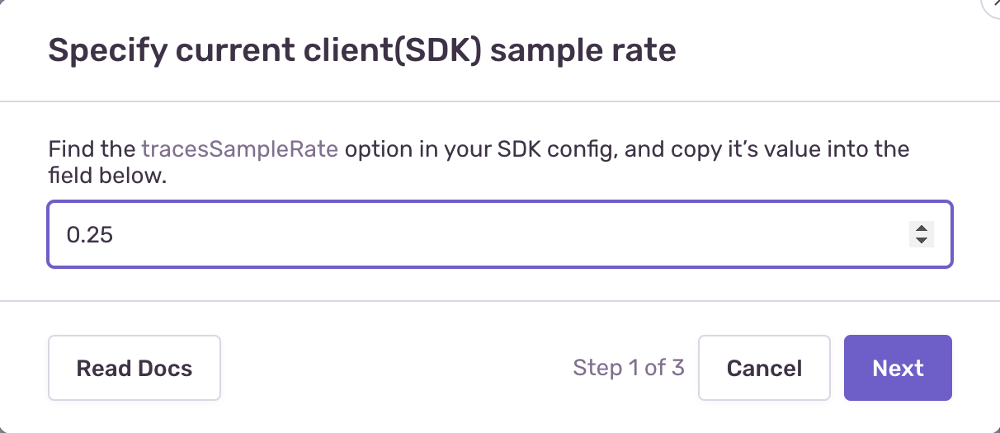
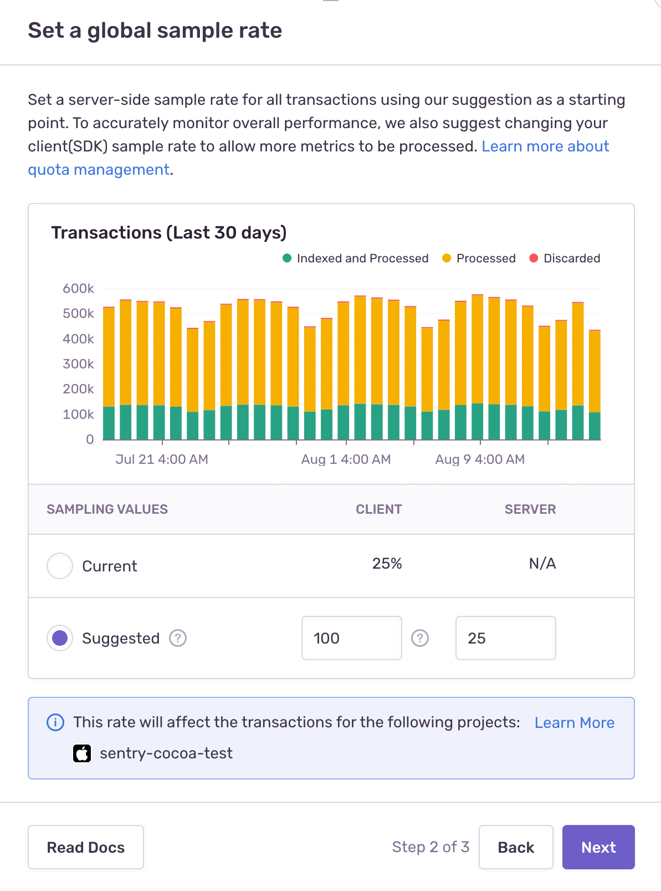
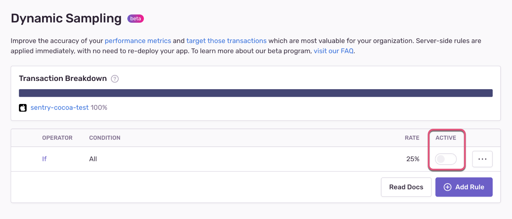
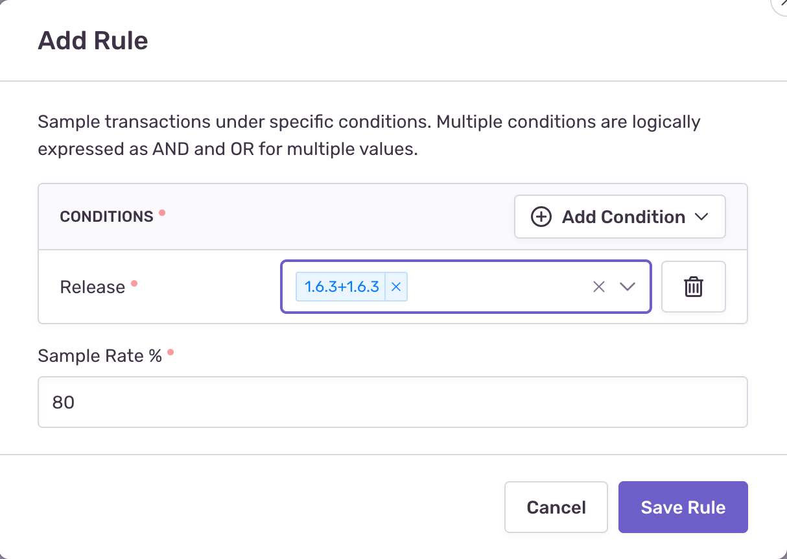

<Include name="limited-avail-note.mdx" />

<Note>

To set up or configure our **Dynamic Sampling** feature, you need to be an Owner, Manager, or Admin of your Sentry organization.

</Note>

## Current Limitations

The **Dynamic Sampling** feature is currently only available for the following SDKs:

<Include name="sampling-supported-sdks.mdx" />

If your application relies on any Sentry SDK that isn't specified above, then you won’t be able to use Sentry's **Dynamic Sampling**.

There are other limitations that you should be aware of when setting up dynamic sampling:

- [Trace rules can only select based on the attributes of the initial transaction](/product/data-management-settings/dynamic-sampling/dsla/current-limitations/#trace-rules-can-only-select-based-on-the-attributes-of-the-initial-transaction)
- [Changing trace attributes in secondary transactions](/product/data-management-settings/dynamic-sampling/dsla/current-limitations/#changing-trace-attributes-in-secondary-transactions)
- [Limited number of rule conditions](/product/data-management-settings/dynamic-sampling/dsla/current-limitations/#limited-number-of-rule-conditions)
- [Arbitrary logical composition for rule conditions](/product/data-management-settings/dynamic-sampling/dsla/current-limitations/#arbitrary-logical-composition-for-rule-conditions)

For more detailed information about each of these, check out our [full Current Limitations documentation](/product/data-management-settings/dynamic-sampling/dsla/current-limitations/).

## 1. Update Sentry SDK Versions

Once you’ve confirmed that your application only relies on [supported SDKs](#current-limitations), then the next step is to update them to the specified version or higher. Check out the migration documentation for the [SDKs](/platforms/) you’re using to learn everything you need to know to get up and running again with the latest Sentry features.

## 2. Set a Uniform Sample Rate

Next, go to **[Project] > Settings > Dynamic Sampling** in [sentry.io](https://sentry.io) and set a server-side sampling rate for all transactions: this is the number of transactions that Sentry should accept from your application.

Before you set the rate, you'll need to tell us what your current SDK (or client-side) sample rate is:

With that done, set your uniform (global) sample rate:

Your client-side sample rate determines how many transaction events are processed (all those ingested by Sentry), while the server-side sample rate determines how many transaction events are then indexed (all those retained by Sentry). We use all your processed transaction events to derive [performance metrics](/product/performance/metrics/), which makes us better able to provide you with accurate insights into the performance of your application.

Based on your quota and usage, in this step, we’ll suggest sampling rates for both Sentry servers and your Sentry SDK. However, you can enter a custom sampling rate by overriding our recommended values. For example, you can select your current sampling rates to understand how our proposed sampling configuration would impact your transaction volume within the scope of this project. Learn more about [How Sentry Samples](/product/sentry-basics/sampling/dsla/#how-sentry-samples).

The number you enter in the “Client” field does not affect your actual SDK sample rate, but if you click “Next” and save, the number you’ve entered in the “Server” field on the “Suggested” row is saved as your uniform server-side sampling rate.

Even though you’ll only set this for one project/SDK, **this rate can affect all the transactions distributed across multiple services**, including other projects set up in Sentry. That’s because server-side sampling currently samples by the context of all other transactions belonging to the same trace. Check out our [full Tracing documentation](/product/sentry-basics/tracing/) for a more detailed explanation.

If the chart displayed on screen doesn’t provide enough information for you to determine a uniform server-side sampling rate for this project, we recommend checking your **Stats** page. On the [Stats](/product/stats/) page, you can see a complete overview of how many transactions each of your projects accepts, filters, and drops rather than information for just one project.

Once you've entered a uniform sample rate for all transactions, now you need to activate it by clicking “Done” and then toggling the rule to on:

## 3. Set a Sampling Rate Based on a Condition

Now, click “Add Rule” to set more server-side sampling rules based on specific conditions. These rules will help you target the transactions you want to keep and allow you to have more of those transactions sent by the SDK.

When a rule uses multiple conditions, we use the logical expression `AND` to determine when that rule should be evaluated. Multiple values for a condition use a logical or condition for matching. Learn more about [how to create effective server-side sampling rules](/product/data-management-settings/dynamic-sampling/dsla/sampling-configurations/).

You can use the following conditions to sample transactions by:

- Environment
- Release - Allows glob pattern matching and includes the option to sample by the "Latest" release

If we've accepted a transaction which contains a key-value pair matching the above conditions in the past, Sentry will suggest values for each condition. Of course, you're free to set a custom value for each condition. Then, specify a sampling rate for that specific rule.

## 4. Increase Your SDK Transaction Sample Rate

Generally speaking, the more active sampling rules you have, the fewer transactions we'll accept. If the volume of transactions our servers are receiving is insufficient given the rules you've specified, you might need to increase the sampling rate configured for your Sentry SDK. To see what we would suggest for your SDK sample rate, go to **[Project] > Settings > Dynamic Sampling** and open the last rule in the list, which is where your uniform sample rate is set. Our suggestion is displayed there.
