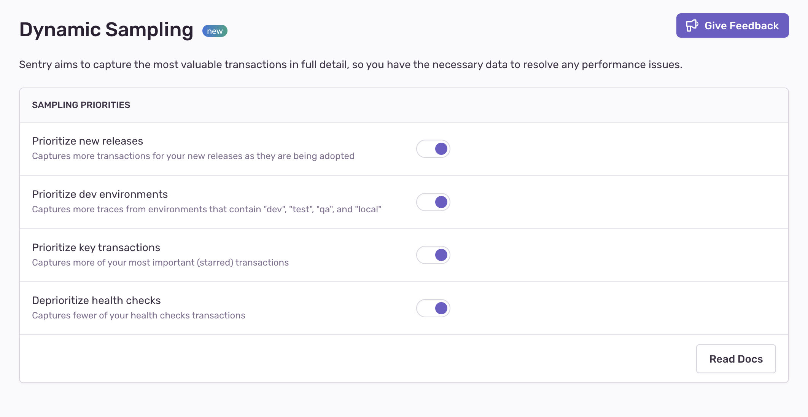

<Note>

To set up or configure our **Dynamic Sampling** feature, you need to be an Owner, Manager, or Admin of your Sentry organization.

</Note>

## Current Limitations

The **Dynamic Sampling** feature is currently only available for the following SDKs:

<Include name="sampling-supported-sdks.mdx" />

If your application relies on any Sentry SDK that isn't specified above, then you won’t be able to use Sentry's **Dynamic Sampling**.

## 1. Update Sentry SDK Versions

Once you’ve confirmed that your application only relies on [supported SDKs](#current-limitations), then the next step is to update them to the specified version or higher. Check out the migration documentation for the [SDKs](/platforms/) you’re using to learn everything you need to know to get up and running again with the latest Sentry features.

## 2. Optionally, Update Data Retention Priorities

While we do our best to provide you with the most useful transaction data, our **Dynamic Sampling** feature allows you to turn the priorities that we apply to your data retention on or off:

Because every project is different, you can set these toggles differently for different projects. For example, you may have a project where the retaining transactions from the latest release is not a priority for you.

By default, these toggles are all enabled so that Sentry's dynamic sampling priorities are applied to your data.

## 3. Increase Your SDK Transaction Sample Rate {#4-increase-your-sdk-transaction-sample-rate}

Our Dynamic Sampling works best when you send us as much data as you can (ideally 100%). As you purchase more transaction volume, however, your per-transaction pricing goes down accordingly.
