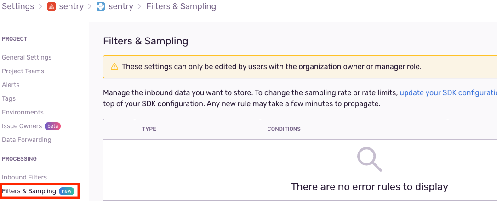
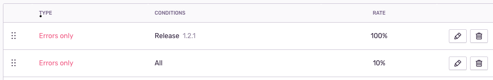

Getting started with dynamic sampling is simple, in this section we will go through setting up dynamic sampling for a project.

<Alert level="info" title="Note">

You need to have organization owner or manager role in order to edit project settings.

</Alert>

Once you have ensured that you have the appropriate rights to configure dynamic sampling, go to the project settings in the Filters & Sampling section.

On the the settings page you have two rule lists, one for error events and one for transaction events.

For now we'll just work with event rules, the top list.

Let's say we have just created a new release for our project. We would like to keep all the errors comming from programs running the new release but we only want to keep 10% of all errrors coming from older releases.

We want to create a rule that applies only to our current release (e.g. release 1.2.1) and we would like to keep all errors from it.

Select 'Add error rule', then select 'Match custom conditions' , select Category "Releases" and Matches: 1.2.1 ; set the sampling rate at 100%.

Finally we would like to create a rule that applies to all releases which keeps only 10% of the errors.

Select 'Add error rule', then select "Apply to all" and then set a sampling rate of 10%.

Now all errors originating in release 1.2.1 are going to be kept while errors for other releases will be sampled at a rate of 10%.

<Alert level="info" title="Order of Precedence">

Rules evaluate top to bottom, with the first matching rule determining the sample rate. It is important that the rule for the specific release comes before the rule for all events. If created the other way around, you can reorder by draging the rules in the list.

</Alert>

There is a lot more to dynamic sampling than what we have seen in this example, continue reading to find out how to take advantage of all the features offered by dynamic sampling.
