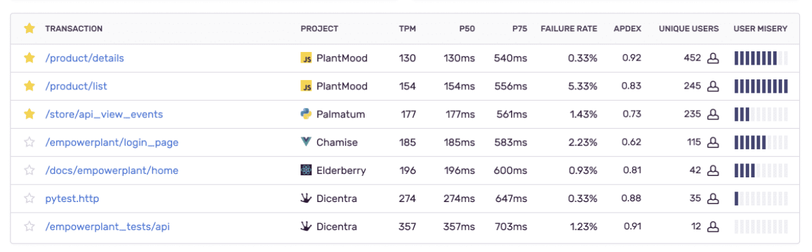

<Note>

This feature is only available on the latest version of our plans, starting from 5M reserved transactions. Anyone in your org with owner or billing-level permissions can update your plan by going to Settings > Subscription, and clicking the "Manage Subscription" button.

</Note>

Just because you don’t record a problem, that doesn’t mean it didn’t happen. Sentry ensures that you get complete insight into the performance of your application in a way that scales affordably with your traffic, so you never miss a critical issue.

When data reaches high volumes, Sentry begins to automatically prioritize retaining certain transactions, using server-side data retention strategies called **data retention priorities**. We’ll continue to provide performance metrics based on your total transactions and ensure that we can provide the right transactions in full detail so you can troubleshoot and fix any performance issue.

## Data Retention Priorities

Data retention priorities are enabled by default, but can be disabled individually in case any of the strategies does not fit to the particular customer’s needs:

<!-- prettier-ignore-start -->

| Prioritize           | Deprioritize  |
|----------------------|---------------|
| Latest Release       | Health Checks |
| Dev Environments     |               |
| Starred Transactions |               |

<!-- prettier-ignore-end -->

Because every project is different, you can set these toggles differently for different projects. For example, you may have a project where retaining transactions from the latest release is not a priority for you.

### Latest Release

When you create a new release, you'll likely want to have more visibility during the early adoption phase. To improve your ability to catch new issues as soon as your release is being adopted, we prioritize data from the latest release.

While prioritizing data from the latest release, we also take into consideration your environment because you might deploy the same release in different environments. If we see this, we'll assume you want to have more visibility for those transactions as well.

### Dev Environments

We prioritize data from development environments because these environments typically generate a relatively small number of transactions compared to your production environments. As a result, to gain meaningful insights during your testing phase, we prioritize transaction data from these environments.

### Starred Transactions

Typically, for most projects there are only a few transactions that you really care about. We prioritize [starred transactions](/product/performance/transaction-summary/#starring-key-transactions) over others, so you can have more visibility into your important data.

### Health Checks

_Health check_ type transactions, while important for checking the stability of your application, don't have any value for you beyond the task associated with them. For this reason, we keep fewer samples of these types of transactions and instead prioritize retaining more samples of your other more valuable transactions.

## Retention Priorities & SDK Sampling

<Note>

When we talk about SDK sample rates in this section, we're only referring to your transaction sample rate (or `tracesSampleRate`), not your [error sample rate](/platform-redirect/?next=/configuration/sampling/%23sampling-error-events).

</Note>

Data retention priorities and your SDK sampling configuration act independently of each other, but work best when you send us as much data as you can. The more complete a picture of your application we have, the more accurately we can monitor your application health, detect problems faster, surface issues, and make better decisions about data retention on your behalf.

If it's feasible, send us 100% of your data (that is, set your [tracesSampleRate](/platform-redirect/?next=/performance/) in the SDK to 1.0). If you can't do so initially, the system will operate on what it can see and when you purchase more transaction volume, we'll adapt automatically. As a bonus, your per-transaction pricing goes down accordingly. Learn more in [Benefits of Dynamic Sampling](/product/data-management-settings/dynamic-sampling/benefits-dynamic-sampling/).

## Next Steps

<PageGrid />
