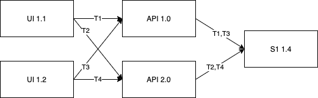

TODO -  Should we use Dynamic Sampling or something like: "Centralized Sampling" or "Server Side Sampling" (I think
that, from a user's perspective, "Dynamic Sampling" doesn't convey much information).

# Why Dynamic Sampling

You can set up sampling when you configure your SDKs by setting `traces_sample_rate` or `traces_sampler` during SDK initialization
(TODO add link to .../PerformanceMonitoring/SamplingTransactions).
While this mechanism is simple and works well in many scenarios, it has the downside of being difficult to
change for scenarios where the application is distributed and redeployment is either not an option or very
difficult (for example, in mobile applications).

Dynamic Sampling addresses the need to easily change and manage what is sampled after an application is deployed,
as an additional benefit Dynamic Sampling enables making more sophisticated sampling decisions that span multiple
transactions.

# Dynamic Sampling Types

Dynamic sampling operates on both error events and transaction events.

## Errors

Error sampling decisions are taken based on the event data.

A sampling rule is selected from the available sampling rules by going through the list of dynamic sampling rules for
errors and picking up the first matching rule that matches the event data. Rule matching is described in more details
below.

## Transactions

Transactions can be considered either as independent events or in the context of all other transactions belonging to a
trace (see TODO tracing link for more info on traces).

Sentry offers the possibility to sample transactions either independently or as part of a trace; there are different
benefits for each case.

Sampling transactions using transaction traces is advantageous when trying to understand transactions in the context
of the global system. In this case we are not interested in seeing a particular transaction, but the whole group of
transactions in a trace so sampling should occur at the trace level.

When sampling transaction traces the sampling rules are based on the transaction context, this means that the
sampling decisions are based on the information extracted from the system that initiated the transaction.
Transaction trace sample rules are based on the following attributes (all attributes belong to the initial
transaction, the transaction that started the trace):

* project id
* release
* environment
* user segment

While sampling transaction traces gives a very good view of how transactions flow through the system, sometimes we are
interested in analysing transactions from a particular service that happens not to be the initiator of transaction
(e.g. a backend server). If we are interested in creating rules based on attributes specific to our service, for
example we have a suspicion that a particular release might have some performance problems, we can sample based on
transaction event.

Individual transaction rules are based on the transaction attributes and not on the trace context attributes and
therefore can target individual services that are not initiating traces.

(TODO In the future we can say that these rules can use more attributes).

The example below illustrates when different sampling methods might be useful.
Consider we have a system Composed of a UI that calls an API backend which further calls services S1.
Our system is replicated on multiple servers running various versions of the software.
The UI clients are mobile applications running our clients' phones. We have released
two versions of our mobile application UI-1.1 and UI-1.2 and not all clients have
yet upgraded to the last version (UI-1.2).

We have recently released our new backend API, release API-2.0 which should work with both
our new and old clients. Because we are not completely sure how release API-2.0 performs under production load
we have only deployed it on one server and therefore we have servers running both release API-1.0 and release API-2.0.

Service S1 is running only on release S1-1.4 and has been stable until now.

In our example there are 4 transactions (T1..T4) generated by users. The user running UI 1.1. creates transactions T1
and T2 which happen to hit different API servers. Similarly, the user running UI 1.2 also creates two transactions T2
and T3 and again the two transactions hit different API servers. The server running S1 service is reached by all
4 transactions.

The interaction described causes the following transaction events (T) and error events (E) in the system.

|Nr.|System|Type|Tr. Id|Tr. rel.| Tr. ProjId | Ev Id| Ev rel. |Ev ProjId|
|: - :|: - :|: - :|: - :|: - :|: - :|: - :|: - :|: - :|
|1 | UI | T| T1 | UI 1.1 |  p1 | E1 | 1.1 | p1 |
|2 | API | T | T1 | UI 1.1 | p1 | E2  | API-1.0  | p2  |
|3 | S1 | T | T1 | UI 1.1 | p1 | E3 | S1-1.4 | p3 |
|4 | UI | T| T2 | UI 1.1 |  p1 | E4 | 1.1 | p1 |
|5 | API | T | T2 | UI 1.1 | p1 | E5  | API-2.0  | p2  |
|6 | API | E | T2 | UI 1.1 | p1 | E5  | API-2.0  | p2  |
|7 | S1 | T | T2 | UI 1.1 | p1 | E6 | S1-1.4 | p3 |
|8 | UI | T| T3 | UI 1.2 |  p1 | E1 | 1.1 | p1 |
|9 | API | T | T3 | UI 1.2 | p1 | E2  | API-1.0  | p2  |
|10 | S1 | T | T3 | UI 1.2 | p1 | E3 | S1-1.4 | p3 |
|11 | S1 | E | T3 | UI 1.2 | p1 | E3 | S1-1.4 | p3 |
|12 | UI | T| T4 | UI 1.2 |  p1 | E4 | 1.1 | p1 |
|13 | API | T | T4 | UI 1.2 | p1 | E5  | API-2.0  | p2  |
|14 | API | E | T4 | UI 1.2 | p1 | E5  | API-2.0  | p2  |
|15 | S1 | T | T4 | UI 1.2 | p1 | E6 | S1-1.4 | p3 |

We have used type T to denote transactions and type E to denote errors.
After releasing the API service version: API-2.0 we have introduced a regression.
Each time there is a call to the API there is an error generated, as seen by events 6 and 14.

When we release a new version of our API it would be good if we could keep all (or a large portion) of our traces
to give context to our errors. This is the case where individual transaction rules are useful. In order to select
transactions from API-2.0 we need to base our rules on the event data, since in the trace data we only have information
about the trace initiator (the UI).

A more interesting case is the error in event 11, it is an error in the service S1. Server S1 has been working fine
for a very long time and the QA team has not found any problem in testing (of course the QA team has been testing with
our most recent software UI-1.2 and API 2.0 ). This error appears in the service S1 but only when the calls originate
in UI 1.2 and go through an API service at version API 1.0, perhaps in version UI 1.2 we have introduced an additional
parameter unknown by the API 1.0, which was release before UI 1.2. The API 1.0 does not know how to handle the new
parameter and yet it passes it unprocessed downstream to S1 (because we were not very careful with our input validation
in the API layer). These types of errors which involve the interaction between multiple systems running various versions
of the software can be frustratingly difficult to understand in the absence of distributed traces. For an error like the
one in event 11 we need to have access to the whole trace to understand what is going on; this is where trace sampling
comes in. With trace sampling the sampling decision is based on the trace state and all transactions within a trace are
kept or discarded together allowing us understand the path of the request through the system.

# Dynamic Sampling and Inbound Filters

(TODO Decide if we should keep this since we'll probably remove inbound filters in the future.)

Inbound filters are a related concept, withe key differences from Dynamic Sampling. Inbound filters may be viewed as a coarse sampling technique, where only 0% and 100% sampling rates are available. The key difference between filters and sampling is that filters compose while sampling rules do not, the example provides an illustration:

With two filters defined - one that removes all requests coming from Internet Explorer 9 or lower, and one that
filters requests coming from an application with release 1.* - all  events coming either from Explorer 9 or
from a client with release 1.* will be filtered out, effectively the two filters are ORed together (TODO check
if it is proper English) .

With two sampling rules defined - first on release 1.* at 10%, and the second sampling on "prod1" environment at 20% -
the combined effect will not be  similar to the inbound filters case. A request coming for release 1.1 and prod1 will
match the first rule and will be sampled at 10% , a request for release 1.1 & prod2 will still match the first rule and
will be sampled at 10% while a request for release 2.1 and prod1 will match the second rule and will be sampled at 20%.
