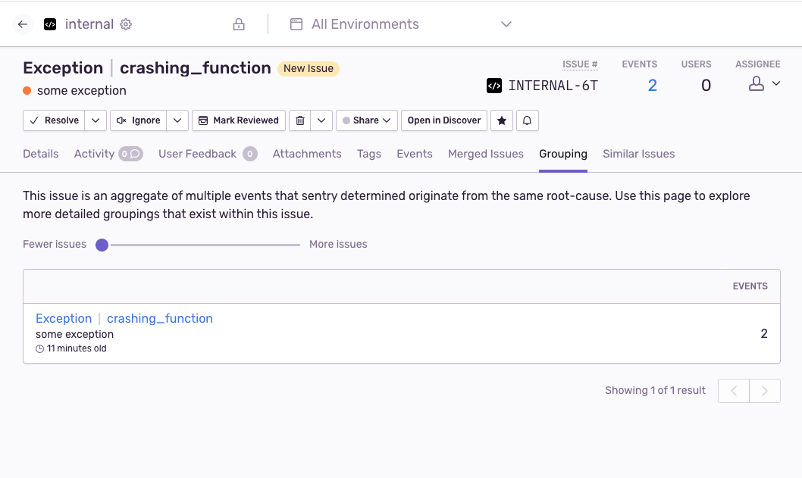
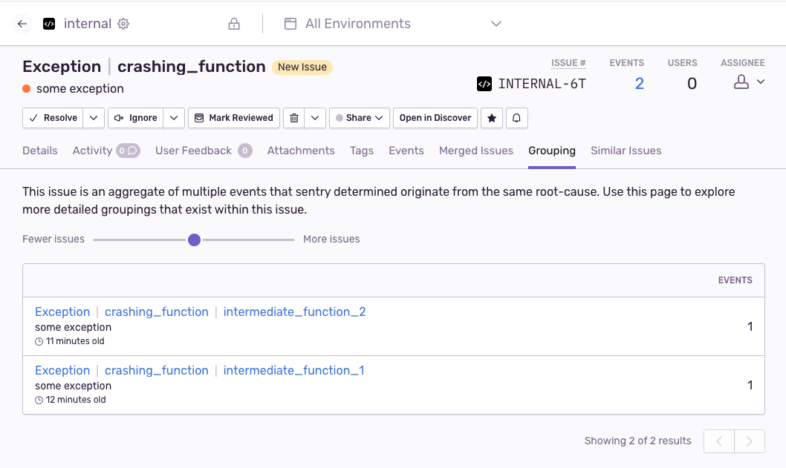
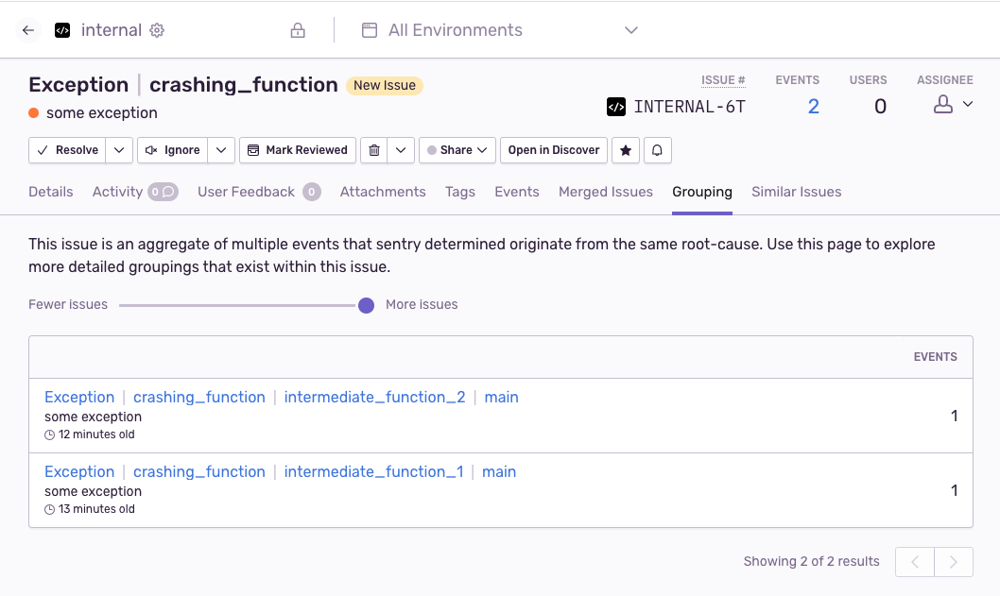
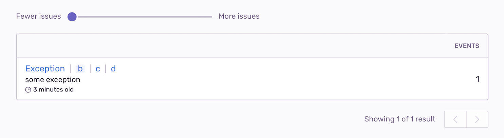
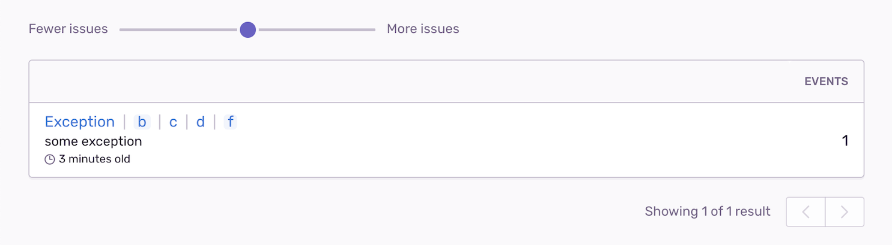
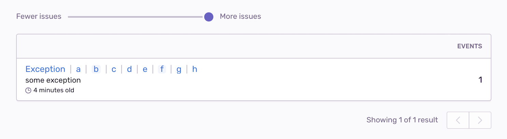

<Note>
  This feature will be deprecated on March 8th, 2023. All projects using the
  grouping breakdown will automatically transition to the latest grouping
  strategy. No action is required on your part. After the transition, the
  “grouping” tab in the UI will no longer appear.
</Note>

<Include name="feature-available-for-user-group-early-adopter.mdx" />

<Include name="only-error-issues-note.mdx" />

Sentry's current grouping algorithm puts two error events into the same issue if they have the same stack trace. This approach sometimes creates multiple distinct issues for errors with the same root cause.

If two distinct issues are created occasionally, you may be able to reduce the noise by manually [merging](/product/data-management-settings/event-grouping/merging-issues/) those issues. Alternatively, if you want coarser issue groups (thus fewer issues) by default, follow the process outlined here.

## Enable the Grouping Breakdown (beta)

Enable our newest grouping algorithm, which creates coarser (that is, fewer) issues by considering only the most relevant part of the stack trace.

1. Join our Early Adopter program by navigating to **Settings > General Settings**.

2. [Upgrade to the latest grouping algorithm](/product/data-management-settings/event-grouping#grouping-algorithms).

<Alert level="warning" title="Changing the grouping algorithm">

Upgrading the grouping algorithm cannot be undone.

</Alert>

## Use the Updated Grouping Breakdown

After enabling the updated grouping algorithm, the grouping breakdown allows you to navigate subgroups of an issue to see what events would group together if a larger part of the stack trace were to be considered. You can do this in the "Grouping" tab of an issue.

For example, if you have a crashing function called from multiple locations in your code ("intermediate function" "1" and "2"), when you move the slider all the way to the left, only the crashing frame is considered for grouping, and
all events are sorted into the same issue regardless of the calling location:



When you move the slider to the right, you can see what groups would be created
if the calling frame were also to be considered:



You can add another level by moving the slider all the way to the right. However, this does not add any new subgroups, as both calling functions are themselves called from the same location (`main`):



## Sentinel & Prefix Frames

With Grouping Breakdown enabled, Sentry groups events by identifying the most
interesting group of frames it can find in a stack trace.

To mark frames as interesting, use the `+sentinel` and `+prefix` actions in [Stack Trace Rules](/product/data-management-settings/event-grouping/stack-trace-rules). For the first level, our algorithm looks for the first frame `X` which is marked as sentinel. The fingerprint of this frame is added to the level. If `X` is also a prefix frame, the next frame `Y` is also added. If `Y` is again a prefix frame, the next frame `Z` is added, and so on.

If no sentinel frame is found, every frame that contributes to grouping according to the usual
stack trace rules (for example, `+group`) constitutes its own level of detail.

#### Example

Consider a stack trace with functions `a`, `b`, `c`, `d`, `e`, `f`, `g`, `h`, with `a` being the crashing frame
and `h` being the thread base. Imagine you have the following stack trace rules defined:

```discover {tabTitle:Sentinel & Prefix Rules}
function:b +sentinel +prefix
function:c +prefix
function:f +sentinel
```

In this case

- `b` is used for grouping because it is the first sentinel frame,
- `c` is used for grouping because `b` is a prefix frame,
- `d` is used for grouping because `c` is a prefix frame.

This becomes visible in the [Breakdown tab](/product/data-management-settings/event-grouping/grouping-breakdown):



Increasing the level adds the second sentinel:



Finally, the deepest level contains the entire stack trace, ignoring sentinel and prefix frames:


