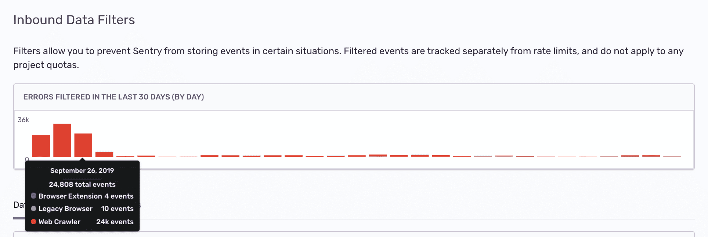

Sentry provides several methods to filter data in your project. Using sentry.io to filter events is a simple method since you don't have to <PlatformLink to="/configuration/filtering/">configure and deploy your SDK to filter projects</PlatformLink>.

## Inbound Data Filters

Inbound data filters allow you to determine which errors, if any, Sentry should ignore. Explore these by navigating to **[Project] > Project Settings > Inbound Filters.**

These filters are exclusively applied at ingest time and not later in processing. This, for instance, lets you discard an error by error message when the error is ingested through the JSON API. On the other hand, this filter doesn't apply to ingested minidumps. Filtered events do not consume quota, as discussed in [What Counts Toward My Quota](/product/accounts/quotas/#what-counts-toward-my-quota-an-overview).

Inbound filters include:

- Common browser extension errors
- Events coming from localhost
- Known legacy browsers errors
- Known web crawlers
- By their error message
- From specific release versions of your code
- From certain IP addresses

Once applied, you can track the filtered events (numbers and cause) using the graph provided at the top of the Inbound Data Filters view.

Data filters do not apply to [sessions](/product/releases/health/#session).
