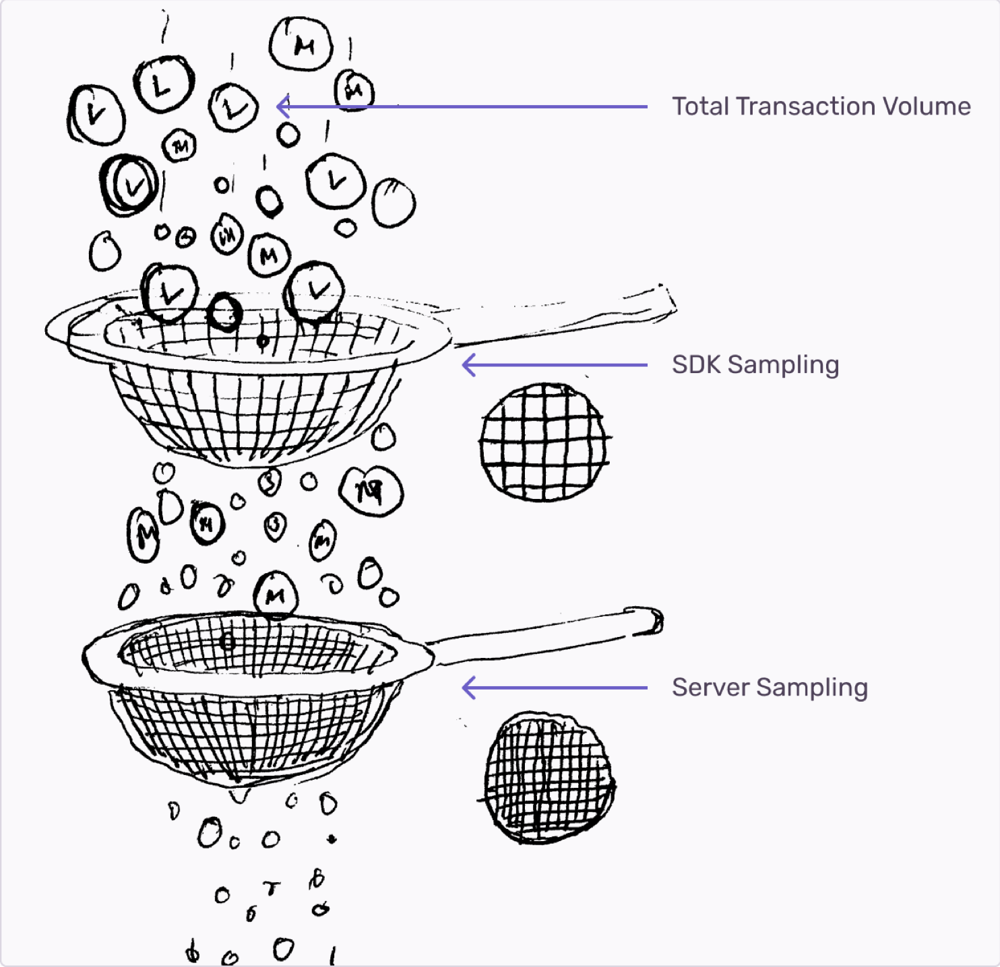

Server-side sampling lets you control what transactions Sentry retains by setting sampling rules and rates so you see more of the transactions you want to explore further, and less of the ones you don’t, without reconfiguring the SDK or redeploying your application.


<!-- replace image with optimized version -->

Because every project is different, you can set multiple sample rules with different sample rates per project. For example, you may need more events from high converting pages, critical API endpoints, or need to focus on latency issues from your latest release.

Server-side sampling also makes your SDK and server-side sampling largely independent of each other. This helps if you're building native applications with many releases active at a given time, or you've already configured server-side sampling to target specific transactions, but the SDK blocks more of those transactions being sent to our servers.

## How Sentry Samples

Let's imagine for a moment that the total number of transactions the SDK observes is a bucket of rocks. The way Sentry samples transactions is similar to a person sifting rocks: by pouring the bucket of rocks into a sieve, you're allowing rocks small enough to pass through it:



<!-- replace image with optimized version -->

In this analogy, the bucket of rocks is sifted through two sieves. Both sieves can hold the total number of rocks, but the first sieve allows more rocks to pass through because it's coarser than the second. The first sieve symbolizes the process of sampling with the SDK, which, in our example, samples half of the total number of transactions the SDK observes. Symbolizing the last sieve, server-side sampling receives the half of the total transactions and then filters for a quarter of the total transactions observed.

<!-- prettier-ignore-start -->

| Sampling Process | Rate | Count |
|------------------|------|-------|
|Total transactions observed | N/A | 1000 |
| Sentry SDK sampled | 50% | 500 |
| Sentry servers sampled | 25% | 250 |

<!-- prettier-ignore-end -->

Now in reality, transactions don't vary in size like a rock, but the sieve analogy illustrates how many accepted transactions are in the end calculated.

Below, you can see how an incorrect configuration of your SDK and server-side sampling rates would affect the transactions received. The sieves are reversed, and the SDK allows for a quarter of the total number of transactions to pass through. In this analogy, the coarser sieve now assigned for server-side sampling, wouldn't filter any more transactions because it's coarser than its counterpart. To summarize, the sampling rate configured for your SDK needs to be equal or greater than the rate set on Sentry servers.

<!-- prettier-ignore-start -->

| Sampling Process | Rate | Count |
|------------------|------|-------|
|Total transactions observed | N/A | 1000 |
| Sentry SDK sampled | 25% | 250 |
| Sentry servers sampled | 50% | 250 |

<!-- prettier-ignore-end -->

## Traces & Propagation of Sampling Decisions

TBA

## Server-Side Sampling Configurations

<!-- TO DO: Decide if this should be a child page or remain on this page -->

Now that you know how Sentry is sampling at a high-level, you can set server-side sampling rules in **[Project] > Settings > Server-side Sampling**.

### Order of Precedence

Rules evaluate from top to bottom, with the first matching rule determining the sample rate. Like with declaring a conditional statement in code, rules with the most specific conditional clauses should be evaluated first (`If`), followed by more generic ones (`Else If`). If generic rules lead the list, the more specific rules will likely never be evaluated. Setting a uniform sampling rate is equivalent to an `Else` clause which will always trail rules with conditional clauses.

The Server-side Sampling page in sentry.io allows you to change the order of your rules so you can set it effectively.

### Good Examples

**Most specific rule leads the list**

The rule with the most specific conditional clause will always be evaluated because it's first in order.

```
if (release = 3.0)  && (environment = production) {
    transactionSample = 1.0
} else if (environment = production) {
    transactionSample = 0.5
} else {
  transactionSample = 0.25
}
```

**Each rule is evaluated independently**

This configuration also works just fine because each rule will be evaluated based on entirely different conditions.

```
if (release = 3.0)  {
    transactionSample = 1.0
} else if (environment = production) {
    transactionSample = 0.5
} else {
  transactionSample = 0.25
}
```

### Poor Example

The rule with the most specific conditional clause will never be evaluated because a rule with a similar, but more generic clause precedes it.

```
if (environment = production) {
    transactionSample = 1.0
} else if (release = 3.0)  && (environment = production) {
    transactionSample = 0.5 // Will never be evaluated
} else {
  transactionSample = 0.25
}
```
