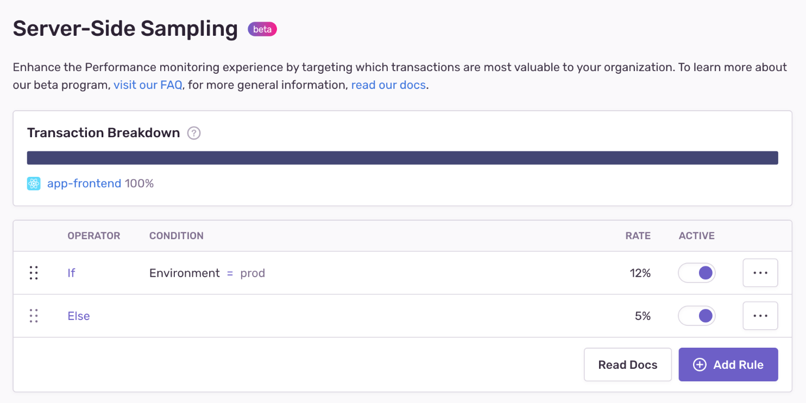
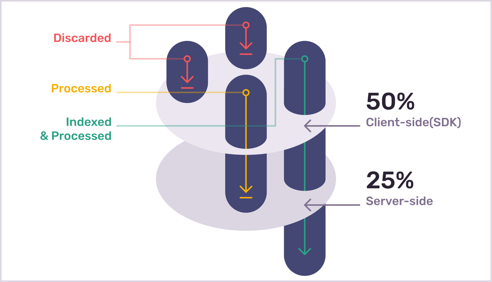

<Note>

This feature is in beta and is only available if your organization is participating in its limited release. Features in beta are still in-progress and may have bugs. We recognize the irony. If you’re interested in participating, [join the waitlist](https://sentry.io/for/performance/#updates-signup).

</Note>

Capturing a single trace involves minimal overhead, but capturing traces for every page load or every API request may add undesirable load to your system. Sampling your events allows you to better manage the number of events sent to Sentry so you can tailor your volume to your organization's needs.

_Server-side sampling_ lets you control which transactions Sentry retains by setting sampling rules and rates, so you see more of the transactions you want to explore further, and less of the ones you don’t. In contrast to [client-side sampling](/platform-redirect/?next=/configuration/sampling/), server-side sampling allows you to manage your sampling configuration centrally and lets you make changes without the need to reconfigure the SDK and redeploy your application.

> _[A trace](/product/sentry-basics/tracing/distributed-tracing/) represents the record of an entire operation you want to measure or track, like a page load, an instance of a user completing some action in your application, or a cron job in your backend. A trace consists of one or more transactions and the trace can be distributed across multiple services or projects._

Because every project is different, you can set multiple sample rules with different sample rates per project. For example, you may need more events from high converting pages, critical API endpoints, or you may need to focus on latency issues from your latest release.

Server-side sampling also makes your SDK and your sampling configuration largely independent of each other. This helps if you're building native applications with many active releases at a given time.

## How Sentry Samples

Before understanding how Sentry samples, there are some concepts you need to know:

- Total transaction volume: Total number of transactions the Sentry SDK has observed before any sampling has begun.
- Client-side (SDK) sampling: The process of selecting which transactions are discarded or sent to Sentry for processing.
- Server-side sampling: The process of selecting which transactions are indexed after being processed.

Whether you’re sampling client-side or server-side, it’s always relative to the total transaction volume. Using the first illustration below as an example, we start the process of client-side sampling with a total transaction volume of 4. The client-side sample rate is set at 50%, which leaves only 2 transactions being sent to Sentry for processing. Server-side sampling then takes these 2 processed transactions and indexes only 1 of them because it's sampling at 25% (or a quarter) of the total transaction volume.

In the next illustration, we show what would happen if the client-side sample rate was lower than the server-side rate. We again start the process of client-side sampling with a total transaction volume of 4. The client-side sample rate is lower this time, set at 25%, leaving only 1 transaction being sent to Sentry for processing. At this stage, you might be asking, “how can the server-side sample 50% of the total transaction volume when the client has already discarded 75%?”. The answer: it can’t. So even though the server-side sample rate is set to 50% of the total volume, it will only index the 1 transaction it received from the client.

Ultimately, your server-side sample rate must always be equal or lower than your client-side sample rate.

## Traces & Propagation of Sampling Decisions

When Sentry makes sampling decisions, we do so for entire traces. Instead of looking at a particular transaction, we look at the entire group of transactions in a trace. Sampling transactions using transaction traces is ideal because it allows you to understand transactions in the context of your whole system.

Since we sample traces, sampling rules are based on the trace context. This means that sampling decisions are based on the information extracted from the _system that initiated the transaction_. The head transaction in a trace determines the trace context for all following transactions in that trace. No information can be changed, added, or deleted after the first propagation. The trace context is bound to only one particular trace, and all the transactions that are part of this trace.

## Next Steps

<PageGrid />
